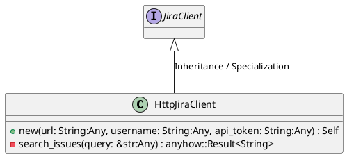
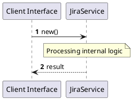

# File: jira.rs

**Source Path:** `crates/factory-infrastructure/src/jira.rs`

## Overview

### Purpose
Provides implementation for jira.rs.

### Responsibilities
* Handles logic related to jira.

### Dependencies
* async_trait::async_trait, serde_json::json, super::*, wiremock::matchers::{method, path, query_param}, wiremock::{Mock, MockServer, ResponseTemplate}

### Imported modules
* None

### Exported classes
* HttpJiraClient

### Exported interfaces
* JiraClient

### Exported functions
* None

## Public API

### Exported Classes / Structs / Interfaces

#### HttpJiraClient

**Overview:**
Why it exists:
Provides capabilities related to HttpJiraClient.

What business capability it provides:
Supports core domain concepts.

How it collaborates with other classes:
Works with related entities to process logic.

**Constructor:**

##### `new(url: String (Any), username: String (Any), api_token: String (Any))`
Parameters: url: String (Any), username: String (Any), api_token: String (Any)
Dependencies: Inherited from context
Initialization: Sets up HttpJiraClient

**Attributes:**

* `api_token` (String): Purpose - Stores api_token data. Constraints - Valid String.
* `client` (reqwest::Client): Purpose - Stores client data. Constraints - Valid reqwest::Client.
* `url` (String): Purpose - Stores url data. Constraints - Valid String.
* `username` (String): Purpose - Stores username data. Constraints - Valid String.

**Public Methods:**

None.

**Private Methods:**

* `search_issues(query: &str (Any)) -> anyhow::Result<String>`: Internal helper logic.

#### JiraClient

**Overview:**
Why it exists:
Provides capabilities related to JiraClient.

What business capability it provides:
Supports core domain concepts.

How it collaborates with other classes:
Works with related entities to process logic.

**Constructor:**

Default constructor.

**Attributes:**

None.

**Public Methods:**

None.

**Private Methods:**

None.

### Exported Functions

None.

## Internal architecture



## Execution flow & Sequence explanation



## Examples

```
// Example usage of jira.rs components
import { ... } from 'crates/factory-infrastructure/src/jira.rs';
```

## Cross References
* **Parent module:** `crates/factory-infrastructure/src`
* **Dependencies:** async_trait::async_trait, serde_json::json, super::*, wiremock::matchers::{method, path, query_param}, wiremock::{Mock, MockServer, ResponseTemplate}
