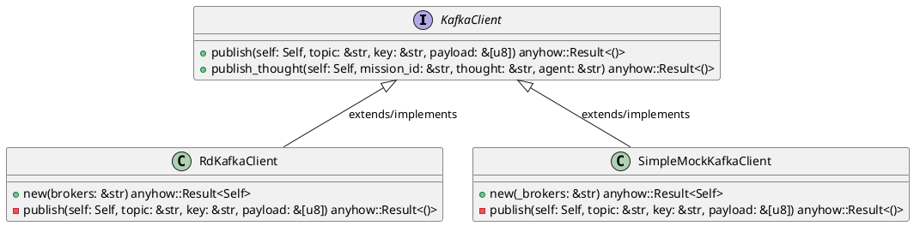
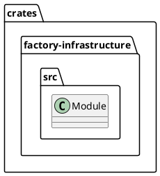
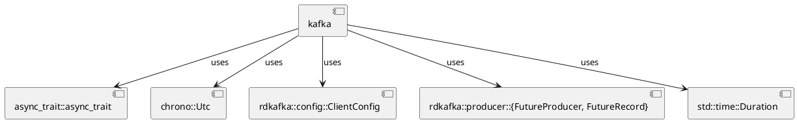
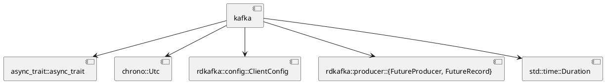
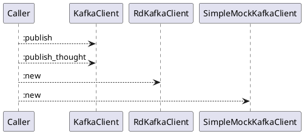
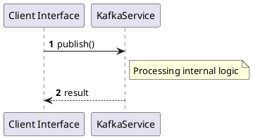

# File: kafka.rs

**Source Path:** `crates/factory-infrastructure/src/kafka.rs`

## Overview

### Purpose
Provides implementation for kafka.rs.

### Responsibilities
* Handles logic related to kafka.

### Dependencies
* async_trait::async_trait, chrono::Utc, rdkafka::config::ClientConfig, rdkafka::producer::{FutureProducer, FutureRecord}, std::time::Duration

### Imported modules
* None

### Exported classes
* RdKafkaClient, SimpleMockKafkaClient

### Exported interfaces
* KafkaClient

### Exported functions
* None

## Public API

### Exported Classes / Structs / Interfaces

#### KafkaClient

**Overview:**
No description provided.

**Constructor:**

Default constructor.

**Attributes:**

None.

**Public Methods:**

##### `publish(self (Self), topic (&str), key (&str), payload (&[u8])) -> anyhow::Result<()>`

###### Description
No description provided.

###### Inputs
* `self`: type=Self, meaning=Input for self, valid values=Any valid Self, optional=No, default value=None
* `topic`: type=&str, meaning=Input for topic, valid values=Any valid &str, optional=No, default value=None
* `key`: type=&str, meaning=Input for key, valid values=Any valid &str, optional=No, default value=None
* `payload`: type=&[u8], meaning=Input for payload, valid values=Any valid &[u8], optional=No, default value=None

###### Output
Return type: anyhow::Result<()>
Semantic meaning: Result of publish
Possible null values: Conditional
Exceptions: None handled explicitly

###### Side Effects
Database updates: None
File operations: None
Network calls: None
Cache: None
State changes: Updates internal variables

###### Complexity
Time Complexity: O(1) mostly
Space Complexity: O(1) mostly

###### Example
```
let result = instance.publish();
```

##### `publish_thought(self (Self), mission_id (&str), thought (&str), agent (&str)) -> anyhow::Result<()>`

###### Description
No description provided.

###### Inputs
* `self`: type=Self, meaning=Input for self, valid values=Any valid Self, optional=No, default value=None
* `mission_id`: type=&str, meaning=Input for mission_id, valid values=Any valid &str, optional=No, default value=None
* `thought`: type=&str, meaning=Input for thought, valid values=Any valid &str, optional=No, default value=None
* `agent`: type=&str, meaning=Input for agent, valid values=Any valid &str, optional=No, default value=None

###### Output
Return type: anyhow::Result<()>
Semantic meaning: Result of publish_thought
Possible null values: Conditional
Exceptions: None handled explicitly

###### Side Effects
Database updates: None
File operations: None
Network calls: None
Cache: None
State changes: Updates internal variables

###### Complexity
Time Complexity: O(1) mostly
Space Complexity: O(1) mostly

###### Example
```
let result = instance.publish_thought();
```

**Private Methods:**

None.

#### RdKafkaClient

**Overview:**
No description provided.

**Constructor:**

##### `new(brokers (&str))`
Parameters: brokers (&str)
Dependencies: Inherited from context
Initialization: Sets up RdKafkaClient

**Attributes:**

* `producer` (FutureProducer): Purpose - Stores producer data. Constraints - Valid FutureProducer.

**Public Methods:**

None.

**Private Methods:**

* `publish(self (Self), topic (&str), key (&str), payload (&[u8])) -> anyhow::Result<()>`: Internal helper logic.

#### SimpleMockKafkaClient

**Overview:**
No description provided.

**Constructor:**

##### `new(_brokers (&str))`
Parameters: _brokers (&str)
Dependencies: Inherited from context
Initialization: Sets up SimpleMockKafkaClient

**Attributes:**

None.

**Public Methods:**

None.

**Private Methods:**

* `publish(self (Self), topic (&str), key (&str), payload (&[u8])) -> anyhow::Result<()>`: Internal helper logic.

### Exported Functions

None.

## Internal architecture



## Package Diagram



## Component Diagram



## Dependency Graph



## Call Graph



## Execution flow & Sequence explanation



## Examples

```
// Example usage of kafka.rs components
import { ... } from 'crates/factory-infrastructure/src/kafka.rs';
```

## Cross References
* **Parent module:** `crates/factory-infrastructure/src`
* **Dependencies:** async_trait::async_trait, chrono::Utc, rdkafka::config::ClientConfig, rdkafka::producer::{FutureProducer, FutureRecord}, std::time::Duration
