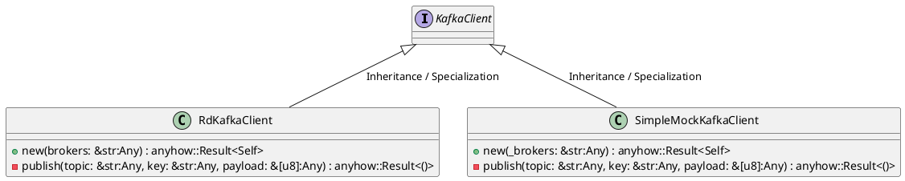
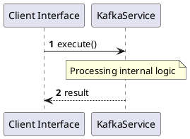

# File: kafka.rs

**Source Path:** `crates/factory-infrastructure/src/kafka.rs`

## Overview

### Purpose
Provides implementation for kafka.rs.

### Responsibilities
* Handles logic related to kafka.

### Dependencies
* async_trait::async_trait, chrono::Utc, rdkafka::config::ClientConfig, rdkafka::producer::{FutureProducer, FutureRecord}, std::time::Duration

### Imported modules
* None

### Exported classes
* RdKafkaClient, SimpleMockKafkaClient

### Exported interfaces
* KafkaClient

### Exported functions
* None

## Public API

### Exported Classes / Structs / Interfaces

#### KafkaClient

**Overview:**
Why it exists:
Provides capabilities related to KafkaClient.

What business capability it provides:
Supports core domain concepts.

How it collaborates with other classes:
Works with related entities to process logic.

**Constructor:**

Default constructor.

**Attributes:**

None.

**Public Methods:**

None.

**Private Methods:**

None.

#### RdKafkaClient

**Overview:**
Why it exists:
Provides capabilities related to RdKafkaClient.

What business capability it provides:
Supports core domain concepts.

How it collaborates with other classes:
Works with related entities to process logic.

**Constructor:**

##### `new(brokers: &str (Any))`
Parameters: brokers: &str (Any)
Dependencies: Inherited from context
Initialization: Sets up RdKafkaClient

**Attributes:**

* `producer` (FutureProducer): Purpose - Stores producer data. Constraints - Valid FutureProducer.

**Public Methods:**

None.

**Private Methods:**

* `publish(topic: &str (Any), key: &str (Any), payload: &[u8] (Any)) -> anyhow::Result<()>`: Internal helper logic.

#### SimpleMockKafkaClient

**Overview:**
Why it exists:
Provides capabilities related to SimpleMockKafkaClient.

What business capability it provides:
Supports core domain concepts.

How it collaborates with other classes:
Works with related entities to process logic.

**Constructor:**

##### `new(_brokers: &str (Any))`
Parameters: _brokers: &str (Any)
Dependencies: Inherited from context
Initialization: Sets up SimpleMockKafkaClient

**Attributes:**

None.

**Public Methods:**

None.

**Private Methods:**

* `publish(topic: &str (Any), key: &str (Any), payload: &[u8] (Any)) -> anyhow::Result<()>`: Internal helper logic.

### Exported Functions

None.

## Internal architecture



## Execution flow & Sequence explanation



## Examples

```
// Example usage of kafka.rs components
import { ... } from 'crates/factory-infrastructure/src/kafka.rs';
```

## Cross References
* **Parent module:** `crates/factory-infrastructure/src`
* **Dependencies:** async_trait::async_trait, chrono::Utc, rdkafka::config::ClientConfig, rdkafka::producer::{FutureProducer, FutureRecord}, std::time::Duration
