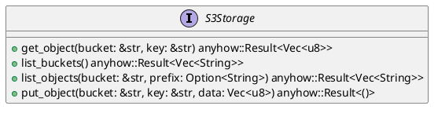
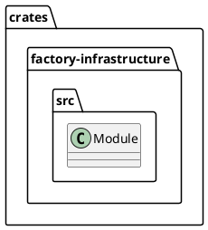
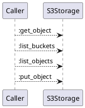
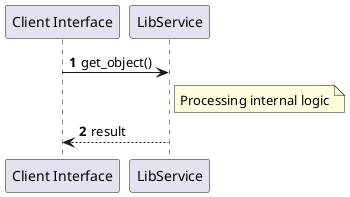

# File: lib.rs

**Source Path:** `crates/factory-infrastructure/src/lib.rs`

## Overview

### Purpose
Provides implementation for lib.rs.

### Responsibilities
* Handles logic related to lib.

### Dependencies
* pub aethalgard::MockAethalgardClient, pub aethalgard::{AethalgardClient, HttpAethalgardClient}, pub cursor_store::{CursorStore, InMemoryCursorStore, PostgresCursorStore}, pub git_poller::GitPlatformPoller, pub github::MockGithubClient, pub github::{GithubClient, GithubIssue, HttpGithubClient}, pub gitlab::MockGitlabClient, pub gitlab::{GitlabClient, GitlabIssue, HttpGitlabClient}, pub jira::MockJiraClient, pub jira::{HttpJiraClient, JiraClient}, pub kafka::{KafkaClient, RdKafkaClient, SimpleMockKafkaClient}, pub kafka::{KafkaClient, RdKafkaClient}, pub mcp_client::MockMcpClient, pub mcp_client::{McpClient, McpHttpClient, McpSseClient}, pub r2r::MockR2rClient, pub r2r::{HttpR2rClient, R2rClient}, pub s3::AwsS3Storage, pub semantica::MockSemanticaClient, pub semantica::{
    Conflict, DecisionRecord, HttpSemanticaClient, MissionPlan, ProvenanceReport, SemanticaClient,
}, pub sentry::MockSentryClient, pub sentry::{CrashEvent, HttpSentryClient, SentryClient}, pub ziti::MockZitiIdentity, pub ziti::{OpenZitiIdentity, ZitiIdentity}

### Imported modules
* None

### Exported classes
* None

### Exported interfaces
* S3Storage

### Exported functions
* None

## Public API

### Exported Classes / Structs / Interfaces

#### S3Storage

**Overview:**
No description provided.

**Constructor:**

Default constructor.

**Attributes:**

None.

**Public Methods:**

##### `get_object(bucket (&str), key (&str)) -> anyhow::Result<Vec<u8>>`

###### Description
No description provided.

###### Inputs
* `bucket`: type=&str, meaning=Input for bucket, valid values=Any valid &str, optional=No, default value=None
* `key`: type=&str, meaning=Input for key, valid values=Any valid &str, optional=No, default value=None

###### Output
Return type: anyhow::Result<Vec<u8>>
Semantic meaning: Result of get_object
Possible null values: Conditional
Exceptions: None handled explicitly

###### Side Effects
Database updates: None
File operations: None
Network calls: None
Cache: None
State changes: Updates internal variables

###### Complexity
Time Complexity: O(1) mostly
Space Complexity: O(1) mostly

###### Example
```
let result = instance.get_object();
```

##### `list_buckets() -> anyhow::Result<Vec<String>>`

###### Description
No description provided.

###### Inputs
None.

###### Output
Return type: anyhow::Result<Vec<String>>
Semantic meaning: Result of list_buckets
Possible null values: Conditional
Exceptions: None handled explicitly

###### Side Effects
Database updates: None
File operations: None
Network calls: None
Cache: None
State changes: Updates internal variables

###### Complexity
Time Complexity: O(1) mostly
Space Complexity: O(1) mostly

###### Example
```
let result = instance.list_buckets();
```

##### `list_objects(bucket (&str), prefix (Option<String>)) -> anyhow::Result<Vec<String>>`

###### Description
No description provided.

###### Inputs
* `bucket`: type=&str, meaning=Input for bucket, valid values=Any valid &str, optional=No, default value=None
* `prefix`: type=Option<String>, meaning=Input for prefix, valid values=Any valid Option<String>, optional=No, default value=None

###### Output
Return type: anyhow::Result<Vec<String>>
Semantic meaning: Result of list_objects
Possible null values: Conditional
Exceptions: None handled explicitly

###### Side Effects
Database updates: None
File operations: None
Network calls: None
Cache: None
State changes: Updates internal variables

###### Complexity
Time Complexity: O(1) mostly
Space Complexity: O(1) mostly

###### Example
```
let result = instance.list_objects();
```

##### `put_object(bucket (&str), key (&str), data (Vec<u8>)) -> anyhow::Result<()>`

###### Description
No description provided.

###### Inputs
* `bucket`: type=&str, meaning=Input for bucket, valid values=Any valid &str, optional=No, default value=None
* `key`: type=&str, meaning=Input for key, valid values=Any valid &str, optional=No, default value=None
* `data`: type=Vec<u8>, meaning=Input for data, valid values=Any valid Vec<u8>, optional=No, default value=None

###### Output
Return type: anyhow::Result<()>
Semantic meaning: Result of put_object
Possible null values: Conditional
Exceptions: None handled explicitly

###### Side Effects
Database updates: None
File operations: None
Network calls: None
Cache: None
State changes: Updates internal variables

###### Complexity
Time Complexity: O(1) mostly
Space Complexity: O(1) mostly

###### Example
```
let result = instance.put_object();
```

**Private Methods:**

None.

### Exported Functions

None.

## Internal architecture



## Package Diagram



## Component Diagram

```plantuml
@startuml
component "lib" as Main
component "pub aethalgard::MockAethalgardClient" as pub_aethalgard__MockAethalgardClient
Main --> pub_aethalgard__MockAethalgardClient : uses
component "pub aethalgard::{AethalgardClient, HttpAethalgardClient}" as pub_aethalgard___AethalgardClient__HttpAethalgardClient_
Main --> pub_aethalgard___AethalgardClient__HttpAethalgardClient_ : uses
component "pub cursor_store::{CursorStore, InMemoryCursorStore, PostgresCursorStore}" as pub_cursor_store___CursorStore__InMemoryCursorStore__PostgresCursorStore_
Main --> pub_cursor_store___CursorStore__InMemoryCursorStore__PostgresCursorStore_ : uses
component "pub git_poller::GitPlatformPoller" as pub_git_poller__GitPlatformPoller
Main --> pub_git_poller__GitPlatformPoller : uses
component "pub github::MockGithubClient" as pub_github__MockGithubClient
Main --> pub_github__MockGithubClient : uses
component "pub github::{GithubClient, GithubIssue, HttpGithubClient}" as pub_github___GithubClient__GithubIssue__HttpGithubClient_
Main --> pub_github___GithubClient__GithubIssue__HttpGithubClient_ : uses
component "pub gitlab::MockGitlabClient" as pub_gitlab__MockGitlabClient
Main --> pub_gitlab__MockGitlabClient : uses
component "pub gitlab::{GitlabClient, GitlabIssue, HttpGitlabClient}" as pub_gitlab___GitlabClient__GitlabIssue__HttpGitlabClient_
Main --> pub_gitlab___GitlabClient__GitlabIssue__HttpGitlabClient_ : uses
component "pub jira::MockJiraClient" as pub_jira__MockJiraClient
Main --> pub_jira__MockJiraClient : uses
component "pub jira::{HttpJiraClient, JiraClient}" as pub_jira___HttpJiraClient__JiraClient_
Main --> pub_jira___HttpJiraClient__JiraClient_ : uses
component "pub kafka::{KafkaClient, RdKafkaClient, SimpleMockKafkaClient}" as pub_kafka___KafkaClient__RdKafkaClient__SimpleMockKafkaClient_
Main --> pub_kafka___KafkaClient__RdKafkaClient__SimpleMockKafkaClient_ : uses
component "pub kafka::{KafkaClient, RdKafkaClient}" as pub_kafka___KafkaClient__RdKafkaClient_
Main --> pub_kafka___KafkaClient__RdKafkaClient_ : uses
component "pub mcp_client::MockMcpClient" as pub_mcp_client__MockMcpClient
Main --> pub_mcp_client__MockMcpClient : uses
component "pub mcp_client::{McpClient, McpHttpClient, McpSseClient}" as pub_mcp_client___McpClient__McpHttpClient__McpSseClient_
Main --> pub_mcp_client___McpClient__McpHttpClient__McpSseClient_ : uses
component "pub r2r::MockR2rClient" as pub_r2r__MockR2rClient
Main --> pub_r2r__MockR2rClient : uses
component "pub r2r::{HttpR2rClient, R2rClient}" as pub_r2r___HttpR2rClient__R2rClient_
Main --> pub_r2r___HttpR2rClient__R2rClient_ : uses
component "pub s3::AwsS3Storage" as pub_s3__AwsS3Storage
Main --> pub_s3__AwsS3Storage : uses
component "pub semantica::MockSemanticaClient" as pub_semantica__MockSemanticaClient
Main --> pub_semantica__MockSemanticaClient : uses
component "pub semantica::{
    Conflict, DecisionRecord, HttpSemanticaClient, MissionPlan, ProvenanceReport, SemanticaClient,
}" as pub_semantica________Conflict__DecisionRecord__HttpSemanticaClient__MissionPlan__ProvenanceReport__SemanticaClient___
Main --> pub_semantica________Conflict__DecisionRecord__HttpSemanticaClient__MissionPlan__ProvenanceReport__SemanticaClient___ : uses
component "pub sentry::MockSentryClient" as pub_sentry__MockSentryClient
Main --> pub_sentry__MockSentryClient : uses
component "pub sentry::{CrashEvent, HttpSentryClient, SentryClient}" as pub_sentry___CrashEvent__HttpSentryClient__SentryClient_
Main --> pub_sentry___CrashEvent__HttpSentryClient__SentryClient_ : uses
component "pub ziti::MockZitiIdentity" as pub_ziti__MockZitiIdentity
Main --> pub_ziti__MockZitiIdentity : uses
component "pub ziti::{OpenZitiIdentity, ZitiIdentity}" as pub_ziti___OpenZitiIdentity__ZitiIdentity_
Main --> pub_ziti___OpenZitiIdentity__ZitiIdentity_ : uses
@enduml

```

## Dependency Graph

```plantuml
@startuml
[lib]
[lib] --> [pub aethalgard::MockAethalgardClient]
[lib] --> [pub aethalgard::{AethalgardClient, HttpAethalgardClient}]
[lib] --> [pub cursor_store::{CursorStore, InMemoryCursorStore, PostgresCursorStore}]
[lib] --> [pub git_poller::GitPlatformPoller]
[lib] --> [pub github::MockGithubClient]
[lib] --> [pub github::{GithubClient, GithubIssue, HttpGithubClient}]
[lib] --> [pub gitlab::MockGitlabClient]
[lib] --> [pub gitlab::{GitlabClient, GitlabIssue, HttpGitlabClient}]
[lib] --> [pub jira::MockJiraClient]
[lib] --> [pub jira::{HttpJiraClient, JiraClient}]
[lib] --> [pub kafka::{KafkaClient, RdKafkaClient, SimpleMockKafkaClient}]
[lib] --> [pub kafka::{KafkaClient, RdKafkaClient}]
[lib] --> [pub mcp_client::MockMcpClient]
[lib] --> [pub mcp_client::{McpClient, McpHttpClient, McpSseClient}]
[lib] --> [pub r2r::MockR2rClient]
[lib] --> [pub r2r::{HttpR2rClient, R2rClient}]
[lib] --> [pub s3::AwsS3Storage]
[lib] --> [pub semantica::MockSemanticaClient]
[lib] --> [pub semantica::{
    Conflict, DecisionRecord, HttpSemanticaClient, MissionPlan, ProvenanceReport, SemanticaClient,
}]
[lib] --> [pub sentry::MockSentryClient]
[lib] --> [pub sentry::{CrashEvent, HttpSentryClient, SentryClient}]
[lib] --> [pub ziti::MockZitiIdentity]
[lib] --> [pub ziti::{OpenZitiIdentity, ZitiIdentity}]
@enduml

```

## Call Graph



## Execution flow & Sequence explanation



## Examples

```
// Example usage of lib.rs components
import { ... } from 'crates/factory-infrastructure/src/lib.rs';
```

## Cross References
* **Parent module:** `crates/factory-infrastructure/src`
* **Dependencies:** pub aethalgard::MockAethalgardClient, pub aethalgard::{AethalgardClient, HttpAethalgardClient}, pub cursor_store::{CursorStore, InMemoryCursorStore, PostgresCursorStore}, pub git_poller::GitPlatformPoller, pub github::MockGithubClient, pub github::{GithubClient, GithubIssue, HttpGithubClient}, pub gitlab::MockGitlabClient, pub gitlab::{GitlabClient, GitlabIssue, HttpGitlabClient}, pub jira::MockJiraClient, pub jira::{HttpJiraClient, JiraClient}, pub kafka::{KafkaClient, RdKafkaClient, SimpleMockKafkaClient}, pub kafka::{KafkaClient, RdKafkaClient}, pub mcp_client::MockMcpClient, pub mcp_client::{McpClient, McpHttpClient, McpSseClient}, pub r2r::MockR2rClient, pub r2r::{HttpR2rClient, R2rClient}, pub s3::AwsS3Storage, pub semantica::MockSemanticaClient, pub semantica::{
    Conflict, DecisionRecord, HttpSemanticaClient, MissionPlan, ProvenanceReport, SemanticaClient,
}, pub sentry::MockSentryClient, pub sentry::{CrashEvent, HttpSentryClient, SentryClient}, pub ziti::MockZitiIdentity, pub ziti::{OpenZitiIdentity, ZitiIdentity}
