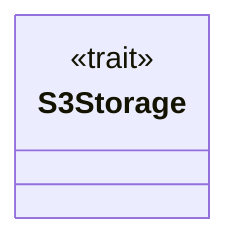
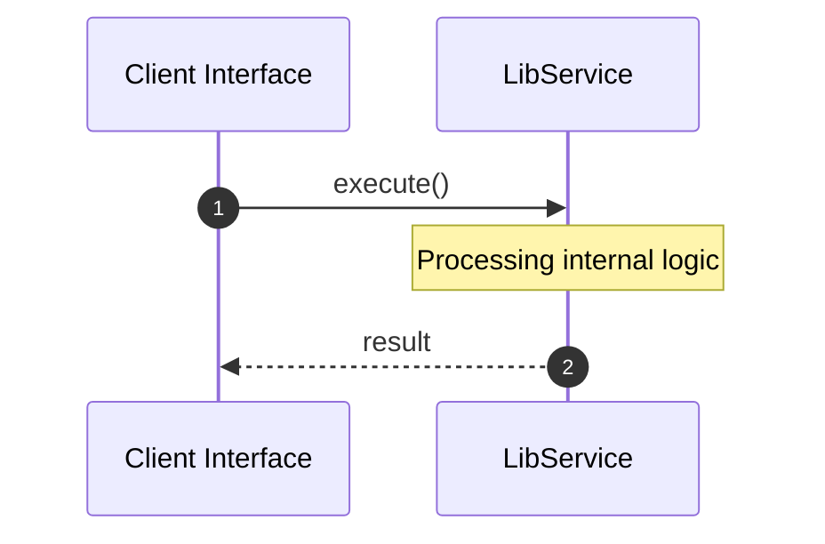
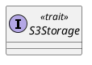
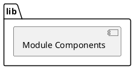
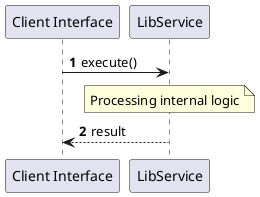
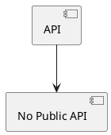

# File: lib.rs

**Source Path:** `crates/factory-infrastructure/src/lib.rs`

## Overview

### Purpose
Provides implementation for lib.rs.

### Responsibilities
* Handles logic related to lib.

### Main Workflow
* Initialization and execution of lib logic.

### Dependencies
* pub aethalgard::MockAethalgardClient, pub aethalgard::{AethalgardClient, HttpAethalgardClient}, pub gitlab::MockGitlabClient, pub gitlab::{GitlabClient, GitlabIssue, HttpGitlabClient}, pub jira::MockJiraClient, pub jira::{HttpJiraClient, JiraClient}, pub kafka::{KafkaClient, RdKafkaClient, SimpleMockKafkaClient}, pub kafka::{KafkaClient, RdKafkaClient}, pub mcp_client::MockMcpClient, pub mcp_client::{McpClient, McpHttpClient, McpSseClient}, pub r2r::MockR2rClient, pub r2r::{HttpR2rClient, R2rClient}, pub s3::AwsS3Storage, pub sentry::MockSentryClient, pub sentry::{CrashEvent, HttpSentryClient, SentryClient}, pub ziti::MockZitiIdentity, pub ziti::{OpenZitiIdentity, ZitiIdentity}

### Imported modules
* None

### Exported classes
* None

### Exported interfaces
* S3Storage

### Exported functions
* None

## Public API

### Exported Classes / Structs / Interfaces

#### S3Storage

**Overview:**
Why it exists:
Provides capabilities related to S3Storage.

What business capability it provides:
Supports core domain concepts.

How it collaborates with other classes:
Works with related entities to process logic.

**Constructor:**

Default constructor.

**Attributes:**

None.

**Public Methods:**

None.

**Private Methods:**

None.

### Exported Functions

None.

## Internal architecture



## Execution flow & Sequence explanation



## UML

### Class Diagram


### Package Diagram


### Sequence Diagram


### Component Diagram
```plantuml
@startuml
component "lib" as comp
component "pub aethalgard::MockAethalgardClient" as pub aethalgard::MockAethalgardClient
comp --> pub aethalgard::MockAethalgardClient
component "pub aethalgard::{AethalgardClient, HttpAethalgardClient}" as pub aethalgard::{AethalgardClient, HttpAethalgardClient}
comp --> pub aethalgard::{AethalgardClient, HttpAethalgardClient}
component "pub gitlab::MockGitlabClient" as pub gitlab::MockGitlabClient
comp --> pub gitlab::MockGitlabClient
component "pub gitlab::{GitlabClient, GitlabIssue, HttpGitlabClient}" as pub gitlab::{GitlabClient, GitlabIssue, HttpGitlabClient}
comp --> pub gitlab::{GitlabClient, GitlabIssue, HttpGitlabClient}
component "pub jira::MockJiraClient" as pub jira::MockJiraClient
comp --> pub jira::MockJiraClient
component "pub jira::{HttpJiraClient, JiraClient}" as pub jira::{HttpJiraClient, JiraClient}
comp --> pub jira::{HttpJiraClient, JiraClient}
component "pub kafka::{KafkaClient, RdKafkaClient, SimpleMockKafkaClient}" as pub kafka::{KafkaClient, RdKafkaClient, SimpleMockKafkaClient}
comp --> pub kafka::{KafkaClient, RdKafkaClient, SimpleMockKafkaClient}
component "pub kafka::{KafkaClient, RdKafkaClient}" as pub kafka::{KafkaClient, RdKafkaClient}
comp --> pub kafka::{KafkaClient, RdKafkaClient}
component "pub mcp_client::MockMcpClient" as pub mcp_client::MockMcpClient
comp --> pub mcp_client::MockMcpClient
component "pub mcp_client::{McpClient, McpHttpClient, McpSseClient}" as pub mcp_client::{McpClient, McpHttpClient, McpSseClient}
comp --> pub mcp_client::{McpClient, McpHttpClient, McpSseClient}
component "pub r2r::MockR2rClient" as pub r2r::MockR2rClient
comp --> pub r2r::MockR2rClient
component "pub r2r::{HttpR2rClient, R2rClient}" as pub r2r::{HttpR2rClient, R2rClient}
comp --> pub r2r::{HttpR2rClient, R2rClient}
component "pub s3::AwsS3Storage" as pub s3::AwsS3Storage
comp --> pub s3::AwsS3Storage
component "pub sentry::MockSentryClient" as pub sentry::MockSentryClient
comp --> pub sentry::MockSentryClient
component "pub sentry::{CrashEvent, HttpSentryClient, SentryClient}" as pub sentry::{CrashEvent, HttpSentryClient, SentryClient}
comp --> pub sentry::{CrashEvent, HttpSentryClient, SentryClient}
component "pub ziti::MockZitiIdentity" as pub ziti::MockZitiIdentity
comp --> pub ziti::MockZitiIdentity
component "pub ziti::{OpenZitiIdentity, ZitiIdentity}" as pub ziti::{OpenZitiIdentity, ZitiIdentity}
comp --> pub ziti::{OpenZitiIdentity, ZitiIdentity}
@enduml

```

### Dependency Graph

```plantuml
@startuml
[lib]
[lib] --> [pub aethalgard::MockAethalgardClient]
[lib] --> [pub aethalgard::{AethalgardClient, HttpAethalgardClient}]
[lib] --> [pub gitlab::MockGitlabClient]
[lib] --> [pub gitlab::{GitlabClient, GitlabIssue, HttpGitlabClient}]
[lib] --> [pub jira::MockJiraClient]
[lib] --> [pub jira::{HttpJiraClient, JiraClient}]
[lib] --> [pub kafka::{KafkaClient, RdKafkaClient, SimpleMockKafkaClient}]
[lib] --> [pub kafka::{KafkaClient, RdKafkaClient}]
[lib] --> [pub mcp_client::MockMcpClient]
[lib] --> [pub mcp_client::{McpClient, McpHttpClient, McpSseClient}]
[lib] --> [pub r2r::MockR2rClient]
[lib] --> [pub r2r::{HttpR2rClient, R2rClient}]
[lib] --> [pub s3::AwsS3Storage]
[lib] --> [pub sentry::MockSentryClient]
[lib] --> [pub sentry::{CrashEvent, HttpSentryClient, SentryClient}]
[lib] --> [pub ziti::MockZitiIdentity]
[lib] --> [pub ziti::{OpenZitiIdentity, ZitiIdentity}]
@enduml

```


### Call Graph


## Examples

```
// Example usage of lib.rs components
import { ... } from 'crates/factory-infrastructure/src/lib.rs';
```

## Cross References
* **Parent module:** `crates/factory-infrastructure/src`
* **Dependencies:** pub aethalgard::MockAethalgardClient, pub aethalgard::{AethalgardClient, HttpAethalgardClient}, pub gitlab::MockGitlabClient, pub gitlab::{GitlabClient, GitlabIssue, HttpGitlabClient}, pub jira::MockJiraClient, pub jira::{HttpJiraClient, JiraClient}, pub kafka::{KafkaClient, RdKafkaClient, SimpleMockKafkaClient}, pub kafka::{KafkaClient, RdKafkaClient}, pub mcp_client::MockMcpClient, pub mcp_client::{McpClient, McpHttpClient, McpSseClient}, pub r2r::MockR2rClient, pub r2r::{HttpR2rClient, R2rClient}, pub s3::AwsS3Storage, pub sentry::MockSentryClient, pub sentry::{CrashEvent, HttpSentryClient, SentryClient}, pub ziti::MockZitiIdentity, pub ziti::{OpenZitiIdentity, ZitiIdentity}
