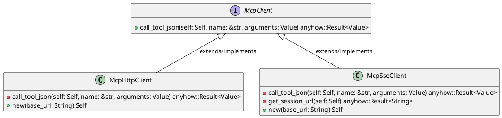
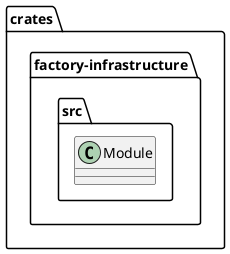
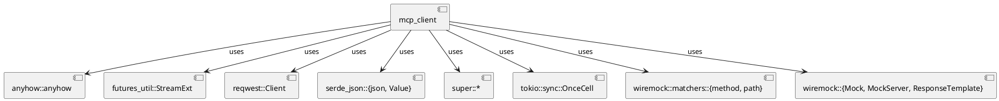
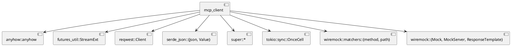
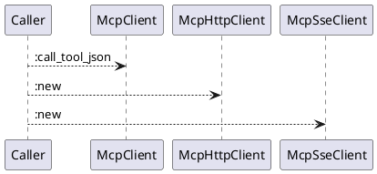
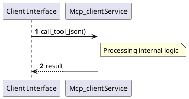

# File: mcp_client.rs

**Source Path:** `crates/factory-infrastructure/src/mcp_client.rs`

## Overview

### Purpose
Provides implementation for mcp_client.rs.

### Responsibilities
* Handles logic related to mcp_client.

### Dependencies
* anyhow::anyhow, futures_util::StreamExt, reqwest::Client, serde_json::{json, Value}, super::*, tokio::sync::OnceCell, wiremock::matchers::{method, path}, wiremock::{Mock, MockServer, ResponseTemplate}

### Imported modules
* None

### Exported classes
* McpHttpClient, McpSseClient

### Exported interfaces
* McpClient

### Exported functions
* None

## Public API

### Exported Classes / Structs / Interfaces

#### McpClient

**Overview:**
No description provided.

**Constructor:**

Default constructor.

**Attributes:**

None.

**Public Methods:**

##### `call_tool_json(self (Self), name (&str), arguments (Value)) -> anyhow::Result<Value>`

###### Description
No description provided.

###### Inputs
* `self`: type=Self, meaning=Input for self, valid values=Any valid Self, optional=No, default value=None
* `name`: type=&str, meaning=Input for name, valid values=Any valid &str, optional=No, default value=None
* `arguments`: type=Value, meaning=Input for arguments, valid values=Any valid Value, optional=No, default value=None

###### Output
Return type: anyhow::Result<Value>
Semantic meaning: Result of call_tool_json
Possible null values: Conditional
Exceptions: None handled explicitly

###### Side Effects
Database updates: None
File operations: None
Network calls: None
Cache: None
State changes: Updates internal variables

###### Complexity
Time Complexity: O(1) mostly
Space Complexity: O(1) mostly

###### Example
```
let result = instance.call_tool_json();
```

**Private Methods:**

None.

#### McpHttpClient

**Overview:**
No description provided.

**Constructor:**

##### `new(base_url (String))`
Parameters: base_url (String)
Dependencies: Inherited from context
Initialization: Sets up McpHttpClient

**Attributes:**

* `base_url` (String): Purpose - Stores base_url data. Constraints - Valid String.
* `client` (Client): Purpose - Stores client data. Constraints - Valid Client.

**Public Methods:**

None.

**Private Methods:**

* `call_tool_json(self (Self), name (&str), arguments (Value)) -> anyhow::Result<Value>`: Internal helper logic.

#### McpSseClient

**Overview:**
/// A client that uses SSE handshake to find the session endpoint

**Constructor:**

##### `new(base_url (String))`
Parameters: base_url (String)
Dependencies: Inherited from context
Initialization: Sets up McpSseClient

**Attributes:**

* `base_url` (String): Purpose - Stores base_url data. Constraints - Valid String.
* `client` (Client): Purpose - Stores client data. Constraints - Valid Client.
* `session_url` (OnceCell<String>): Purpose - Stores session_url data. Constraints - Valid OnceCell<String>.

**Public Methods:**

None.

**Private Methods:**

* `call_tool_json(self (Self), name (&str), arguments (Value)) -> anyhow::Result<Value>`: Internal helper logic.
* `get_session_url(self (Self)) -> anyhow::Result<String>`: Internal helper logic.

### Exported Functions

None.

## Internal architecture



## Package Diagram



## Component Diagram



## Dependency Graph



## Call Graph



## Execution flow & Sequence explanation



## Examples

```
// Example usage of mcp_client.rs components
import { ... } from 'crates/factory-infrastructure/src/mcp_client.rs';
```

## Cross References
* **Parent module:** `crates/factory-infrastructure/src`
* **Dependencies:** anyhow::anyhow, futures_util::StreamExt, reqwest::Client, serde_json::{json, Value}, super::*, tokio::sync::OnceCell, wiremock::matchers::{method, path}, wiremock::{Mock, MockServer, ResponseTemplate}
