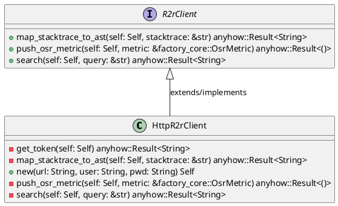
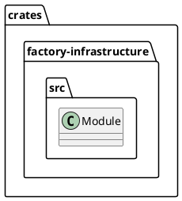
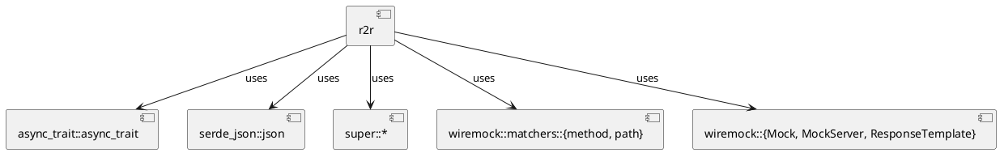
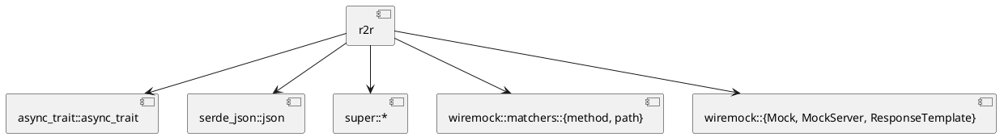
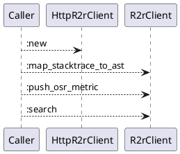
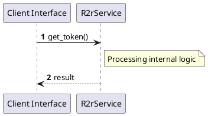

# File: r2r.rs

**Source Path:** `crates/factory-infrastructure/src/r2r.rs`

## Overview

### Purpose
Provides implementation for r2r.rs.

### Responsibilities
* Handles logic related to r2r.

### Dependencies
* async_trait::async_trait, serde_json::json, super::*, wiremock::matchers::{method, path}, wiremock::{Mock, MockServer, ResponseTemplate}

### Imported modules
* None

### Exported classes
* HttpR2rClient

### Exported interfaces
* R2rClient

### Exported functions
* None

## Public API

### Exported Classes / Structs / Interfaces

#### HttpR2rClient

**Overview:**
No description provided.

**Constructor:**

##### `new(url (String), user (String), pwd (String))`
Parameters: url (String), user (String), pwd (String)
Dependencies: Inherited from context
Initialization: Sets up HttpR2rClient

**Attributes:**

* `client` (reqwest::Client): Purpose - Stores client data. Constraints - Valid reqwest::Client.
* `pwd` (String): Purpose - Stores pwd data. Constraints - Valid String.
* `url` (String): Purpose - Stores url data. Constraints - Valid String.
* `user` (String): Purpose - Stores user data. Constraints - Valid String.

**Public Methods:**

None.

**Private Methods:**

* `get_token(self (Self)) -> anyhow::Result<String>`: Internal helper logic.
* `map_stacktrace_to_ast(self (Self), stacktrace (&str)) -> anyhow::Result<String>`: Internal helper logic.
* `push_osr_metric(self (Self), metric (&factory_core::OsrMetric)) -> anyhow::Result<()>`: Internal helper logic.
* `search(self (Self), query (&str)) -> anyhow::Result<String>`: Internal helper logic.

#### R2rClient

**Overview:**
No description provided.

**Constructor:**

Default constructor.

**Attributes:**

None.

**Public Methods:**

##### `map_stacktrace_to_ast(self (Self), stacktrace (&str)) -> anyhow::Result<String>`

###### Description
No description provided.

###### Inputs
* `self`: type=Self, meaning=Input for self, valid values=Any valid Self, optional=No, default value=None
* `stacktrace`: type=&str, meaning=Input for stacktrace, valid values=Any valid &str, optional=No, default value=None

###### Output
Return type: anyhow::Result<String>
Semantic meaning: Result of map_stacktrace_to_ast
Possible null values: Conditional
Exceptions: None handled explicitly

###### Side Effects
Database updates: None
File operations: None
Network calls: None
Cache: None
State changes: Updates internal variables

###### Complexity
Time Complexity: O(1) mostly
Space Complexity: O(1) mostly

###### Example
```
let result = instance.map_stacktrace_to_ast();
```

##### `push_osr_metric(self (Self), metric (&factory_core::OsrMetric)) -> anyhow::Result<()>`

###### Description
No description provided.

###### Inputs
* `self`: type=Self, meaning=Input for self, valid values=Any valid Self, optional=No, default value=None
* `metric`: type=&factory_core::OsrMetric, meaning=Input for metric, valid values=Any valid &factory_core::OsrMetric, optional=No, default value=None

###### Output
Return type: anyhow::Result<()>
Semantic meaning: Result of push_osr_metric
Possible null values: Conditional
Exceptions: None handled explicitly

###### Side Effects
Database updates: None
File operations: None
Network calls: None
Cache: None
State changes: Updates internal variables

###### Complexity
Time Complexity: O(1) mostly
Space Complexity: O(1) mostly

###### Example
```
let result = instance.push_osr_metric();
```

##### `search(self (Self), query (&str)) -> anyhow::Result<String>`

###### Description
No description provided.

###### Inputs
* `self`: type=Self, meaning=Input for self, valid values=Any valid Self, optional=No, default value=None
* `query`: type=&str, meaning=Input for query, valid values=Any valid &str, optional=No, default value=None

###### Output
Return type: anyhow::Result<String>
Semantic meaning: Result of search
Possible null values: Conditional
Exceptions: None handled explicitly

###### Side Effects
Database updates: None
File operations: None
Network calls: None
Cache: None
State changes: Updates internal variables

###### Complexity
Time Complexity: O(1) mostly
Space Complexity: O(1) mostly

###### Example
```
let result = instance.search();
```

**Private Methods:**

None.

### Exported Functions

None.

## Internal architecture



## Package Diagram



## Component Diagram



## Dependency Graph



## Call Graph



## Execution flow & Sequence explanation



## Examples

```
// Example usage of r2r.rs components
import { ... } from 'crates/factory-infrastructure/src/r2r.rs';
```

## Cross References
* **Parent module:** `crates/factory-infrastructure/src`
* **Dependencies:** async_trait::async_trait, serde_json::json, super::*, wiremock::matchers::{method, path}, wiremock::{Mock, MockServer, ResponseTemplate}
