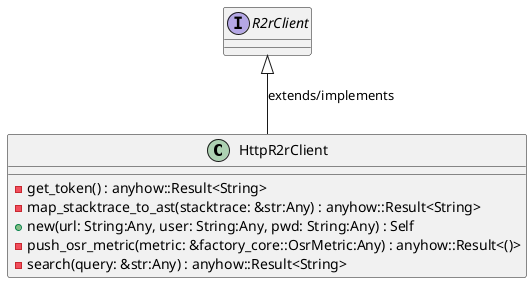
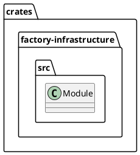
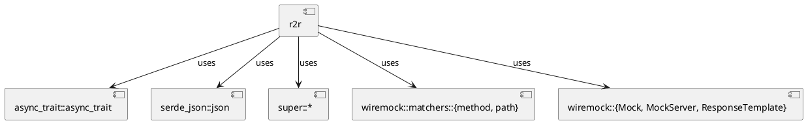
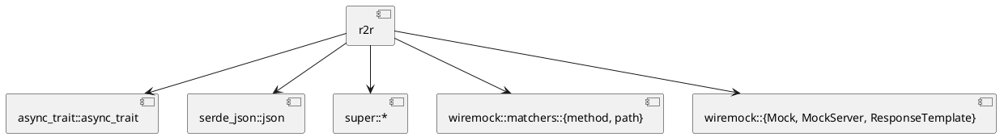
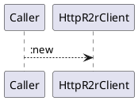
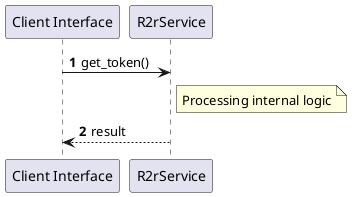

# File: r2r.rs

**Source Path:** `crates/factory-infrastructure/src/r2r.rs`

## Overview

### Purpose
Provides implementation for r2r.rs.

### Responsibilities
* Handles logic related to r2r.

### Dependencies
* async_trait::async_trait, serde_json::json, super::*, wiremock::matchers::{method, path}, wiremock::{Mock, MockServer, ResponseTemplate}

### Imported modules
* None

### Exported classes
* HttpR2rClient

### Exported interfaces
* R2rClient

### Exported functions
* None

## Public API

### Exported Classes / Structs / Interfaces

#### HttpR2rClient

**Overview:**
No description provided.

**Constructor:**

##### `new(url: String (Any), user: String (Any), pwd: String (Any))`
Parameters: url: String (Any), user: String (Any), pwd: String (Any)
Dependencies: Inherited from context
Initialization: Sets up HttpR2rClient

**Attributes:**

* `client` (reqwest::Client): Purpose - Stores client data. Constraints - Valid reqwest::Client.
* `pwd` (String): Purpose - Stores pwd data. Constraints - Valid String.
* `url` (String): Purpose - Stores url data. Constraints - Valid String.
* `user` (String): Purpose - Stores user data. Constraints - Valid String.

**Public Methods:**

None.

**Private Methods:**

* `get_token() -> anyhow::Result<String>`: Internal helper logic.
* `map_stacktrace_to_ast(stacktrace: &str (Any)) -> anyhow::Result<String>`: Internal helper logic.
* `push_osr_metric(metric: &factory_core::OsrMetric (Any)) -> anyhow::Result<()>`: Internal helper logic.
* `search(query: &str (Any)) -> anyhow::Result<String>`: Internal helper logic.

#### R2rClient

**Overview:**
No description provided.

**Constructor:**

Default constructor.

**Attributes:**

None.

**Public Methods:**

None.

**Private Methods:**

None.

### Exported Functions

None.

## Internal architecture



## Package Diagram



## Component Diagram



## Dependency Graph



## Call Graph



## Execution flow & Sequence explanation



## Examples

```
// Example usage of r2r.rs components
import { ... } from 'crates/factory-infrastructure/src/r2r.rs';
```

## Cross References
* **Parent module:** `crates/factory-infrastructure/src`
* **Dependencies:** async_trait::async_trait, serde_json::json, super::*, wiremock::matchers::{method, path}, wiremock::{Mock, MockServer, ResponseTemplate}
