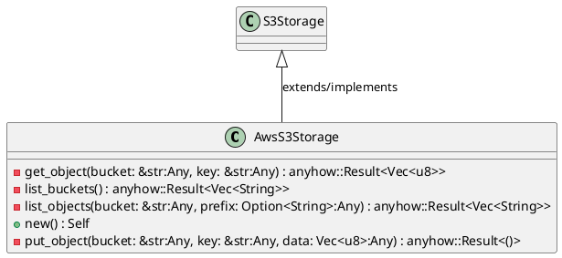
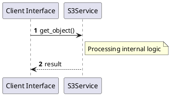

# File: s3.rs

**Source Path:** `crates/factory-infrastructure/src/s3.rs`

## Overview

### Purpose
Provides implementation for s3.rs.

### Responsibilities
* Handles logic related to s3.

### Dependencies
* async_trait::async_trait, aws_sdk_s3::Client, aws_sdk_s3::primitives::ByteStream, crate::S3Storage

### Imported modules
* None

### Exported classes
* AwsS3Storage

### Exported interfaces
* None

### Exported functions
* None

## Public API

### Exported Classes / Structs / Interfaces

#### AwsS3Storage

**Overview:**
No description provided.

**Constructor:**

##### `new()`
Parameters:
Dependencies: Inherited from context
Initialization: Sets up AwsS3Storage

**Attributes:**

* `client` (Client): Purpose - Stores client data. Constraints - Valid Client.

**Public Methods:**

None.

**Private Methods:**

* `get_object(bucket: &str (Any), key: &str (Any)) -> anyhow::Result<Vec<u8>>`: Internal helper logic.
* `list_buckets() -> anyhow::Result<Vec<String>>`: Internal helper logic.
* `list_objects(bucket: &str (Any), prefix: Option<String> (Any)) -> anyhow::Result<Vec<String>>`: Internal helper logic.
* `put_object(bucket: &str (Any), key: &str (Any), data: Vec<u8> (Any)) -> anyhow::Result<()>`: Internal helper logic.

### Exported Functions

None.

## Internal architecture



## Execution flow & Sequence explanation



## Examples

```
// Example usage of s3.rs components
import { ... } from 'crates/factory-infrastructure/src/s3.rs';
```

## Cross References
* **Parent module:** `crates/factory-infrastructure/src`
* **Dependencies:** async_trait::async_trait, aws_sdk_s3::Client, aws_sdk_s3::primitives::ByteStream, crate::S3Storage
