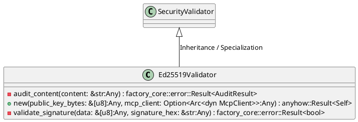
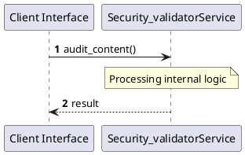

# File: security_validator.rs

**Source Path:** `crates/factory-infrastructure/src/security_validator.rs`

## Overview

### Purpose
Provides implementation for security_validator.rs.

### Responsibilities
* Handles logic related to security_validator.

### Dependencies
* async_trait::async_trait, crate::mcp_client::McpClient, ed25519_dalek::{Signature, Verifier, VerifyingKey}, ed25519_dalek::{Signer, SigningKey}, factory_core::security::{AuditResult, SecurityValidator}, rand::rngs::OsRng, std::sync::Arc, super::*

### Imported modules
* None

### Exported classes
* Ed25519Validator

### Exported interfaces
* None

### Exported functions
* None

## Public API

### Exported Classes / Structs / Interfaces

#### Ed25519Validator

**Overview:**
Why it exists:
Provides capabilities related to Ed25519Validator.

What business capability it provides:
Supports core domain concepts.

How it collaborates with other classes:
Works with related entities to process logic.

**Constructor:**

##### `new(public_key_bytes: &[u8] (Any), mcp_client: Option<Arc<dyn McpClient>> (Any))`
Parameters: public_key_bytes: &[u8] (Any), mcp_client: Option<Arc<dyn McpClient>> (Any)
Dependencies: Inherited from context
Initialization: Sets up Ed25519Validator

**Attributes:**

* `mcp_client` (Option<Arc<dyn McpClient>>): Purpose - Stores mcp_client data. Constraints - Valid Option<Arc<dyn McpClient>>.
* `public_key` (VerifyingKey): Purpose - Stores public_key data. Constraints - Valid VerifyingKey.

**Public Methods:**

None.

**Private Methods:**

* `audit_content(content: &str (Any)) -> factory_core::error::Result<AuditResult>`: Internal helper logic.
* `validate_signature(data: &[u8] (Any), signature_hex: &str (Any)) -> factory_core::error::Result<bool>`: Internal helper logic.

### Exported Functions

None.

## Internal architecture



## Execution flow & Sequence explanation



## Examples

```
// Example usage of security_validator.rs components
import { ... } from 'crates/factory-infrastructure/src/security_validator.rs';
```

## Cross References
* **Parent module:** `crates/factory-infrastructure/src`
* **Dependencies:** async_trait::async_trait, crate::mcp_client::McpClient, ed25519_dalek::{Signature, Verifier, VerifyingKey}, ed25519_dalek::{Signer, SigningKey}, factory_core::security::{AuditResult, SecurityValidator}, rand::rngs::OsRng, std::sync::Arc, super::*
