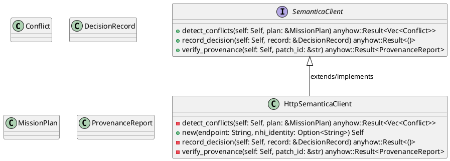
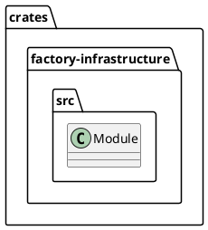
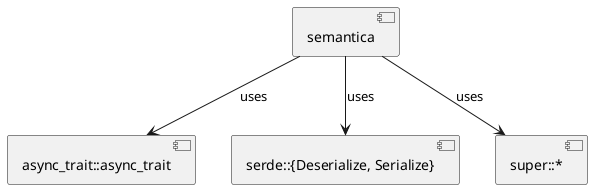
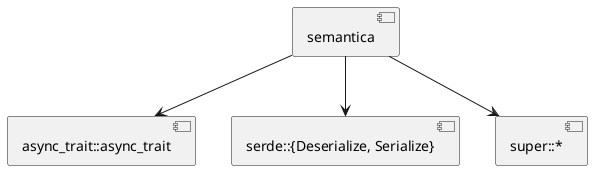
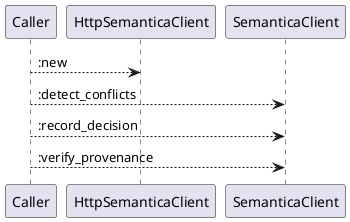
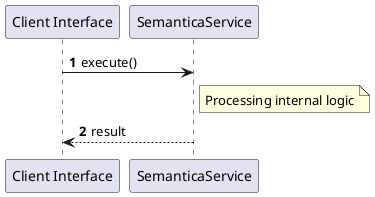

# File: semantica.rs

**Source Path:** `crates/factory-infrastructure/src/semantica.rs`

## Overview

### Purpose
Provides implementation for semantica.rs.

### Responsibilities
* Handles logic related to semantica.

### Dependencies
* async_trait::async_trait, serde::{Deserialize, Serialize}, super::*

### Imported modules
* None

### Exported classes
* Conflict, DecisionRecord, HttpSemanticaClient, MissionPlan, ProvenanceReport

### Exported interfaces
* SemanticaClient

### Exported functions
* None

## Public API

### Exported Classes / Structs / Interfaces

#### Conflict

**Overview:**
No description provided.

**Constructor:**

Default constructor.

**Attributes:**

* `conflict_id` (String): Purpose - Stores conflict_id data. Constraints - Valid String.
* `description` (String): Purpose - Stores description data. Constraints - Valid String.
* `rule_violated` (String): Purpose - Stores rule_violated data. Constraints - Valid String.
* `severity` (String): Purpose - Stores severity data. Constraints - Valid String.

**Public Methods:**

None.

**Private Methods:**

None.

#### DecisionRecord

**Overview:**
No description provided.

**Constructor:**

Default constructor.

**Attributes:**

* `agent_id` (String): Purpose - Stores agent_id data. Constraints - Valid String.
* `ast_node_ids` (Vec<String>): Purpose - Stores ast_node_ids data. Constraints - Valid Vec<String>.
* `decision_id` (String): Purpose - Stores decision_id data. Constraints - Valid String.
* `mission_id` (String): Purpose - Stores mission_id data. Constraints - Valid String.
* `reasoning` (String): Purpose - Stores reasoning data. Constraints - Valid String.
* `timestamp` (String): Purpose - Stores timestamp data. Constraints - Valid String.

**Public Methods:**

None.

**Private Methods:**

None.

#### HttpSemanticaClient

**Overview:**
No description provided.

**Constructor:**

##### `new(endpoint (String), nhi_identity (Option<String>))`
Parameters: endpoint (String), nhi_identity (Option<String>)
Dependencies: Inherited from context
Initialization: Sets up HttpSemanticaClient

**Attributes:**

* `client` (reqwest::Client): Purpose - Stores client data. Constraints - Valid reqwest::Client.
* `endpoint` (String): Purpose - Stores endpoint data. Constraints - Valid String.
* `nhi_identity` (Option<String>): Purpose - Stores nhi_identity data. Constraints - Valid Option<String>.

**Public Methods:**

None.

**Private Methods:**

* `detect_conflicts(self (Self), plan (&MissionPlan)) -> anyhow::Result<Vec<Conflict>>`: Internal helper logic.
* `record_decision(self (Self), record (&DecisionRecord)) -> anyhow::Result<()>`: Internal helper logic.
* `verify_provenance(self (Self), patch_id (&str)) -> anyhow::Result<ProvenanceReport>`: Internal helper logic.

#### MissionPlan

**Overview:**
No description provided.

**Constructor:**

Default constructor.

**Attributes:**

* `constitution_rules` (Vec<String>): Purpose - Stores constitution_rules data. Constraints - Valid Vec<String>.
* `mission_id` (String): Purpose - Stores mission_id data. Constraints - Valid String.
* `proposed_tasks` (Vec<String>): Purpose - Stores proposed_tasks data. Constraints - Valid Vec<String>.
* `spec_content` (String): Purpose - Stores spec_content data. Constraints - Valid String.
* `title` (String): Purpose - Stores title data. Constraints - Valid String.

**Public Methods:**

None.

**Private Methods:**

None.

#### ProvenanceReport

**Overview:**
No description provided.

**Constructor:**

Default constructor.

**Attributes:**

* `causal_chain` (Vec<String>): Purpose - Stores causal_chain data. Constraints - Valid Vec<String>.
* `is_valid` (bool): Purpose - Stores is_valid data. Constraints - Valid bool.
* `patch_id` (String): Purpose - Stores patch_id data. Constraints - Valid String.
* `policy_violations` (Vec<String>): Purpose - Stores policy_violations data. Constraints - Valid Vec<String>.

**Public Methods:**

None.

**Private Methods:**

None.

#### SemanticaClient

**Overview:**
No description provided.

**Constructor:**

Default constructor.

**Attributes:**

None.

**Public Methods:**

##### `detect_conflicts(self (Self), plan (&MissionPlan)) -> anyhow::Result<Vec<Conflict>>`

###### Description
No description provided.

###### Inputs
* `self`: type=Self, meaning=Input for self, valid values=Any valid Self, optional=No, default value=None
* `plan`: type=&MissionPlan, meaning=Input for plan, valid values=Any valid &MissionPlan, optional=No, default value=None

###### Output
Return type: anyhow::Result<Vec<Conflict>>
Semantic meaning: Result of detect_conflicts
Possible null values: Conditional
Exceptions: None handled explicitly

###### Side Effects
Database updates: None
File operations: None
Network calls: None
Cache: None
State changes: Updates internal variables

###### Complexity
Time Complexity: O(1) mostly
Space Complexity: O(1) mostly

###### Example
```
let result = instance.detect_conflicts();
```

##### `record_decision(self (Self), record (&DecisionRecord)) -> anyhow::Result<()>`

###### Description
No description provided.

###### Inputs
* `self`: type=Self, meaning=Input for self, valid values=Any valid Self, optional=No, default value=None
* `record`: type=&DecisionRecord, meaning=Input for record, valid values=Any valid &DecisionRecord, optional=No, default value=None

###### Output
Return type: anyhow::Result<()>
Semantic meaning: Result of record_decision
Possible null values: Conditional
Exceptions: None handled explicitly

###### Side Effects
Database updates: None
File operations: None
Network calls: None
Cache: None
State changes: Updates internal variables

###### Complexity
Time Complexity: O(1) mostly
Space Complexity: O(1) mostly

###### Example
```
let result = instance.record_decision();
```

##### `verify_provenance(self (Self), patch_id (&str)) -> anyhow::Result<ProvenanceReport>`

###### Description
No description provided.

###### Inputs
* `self`: type=Self, meaning=Input for self, valid values=Any valid Self, optional=No, default value=None
* `patch_id`: type=&str, meaning=Input for patch_id, valid values=Any valid &str, optional=No, default value=None

###### Output
Return type: anyhow::Result<ProvenanceReport>
Semantic meaning: Result of verify_provenance
Possible null values: Conditional
Exceptions: None handled explicitly

###### Side Effects
Database updates: None
File operations: None
Network calls: None
Cache: None
State changes: Updates internal variables

###### Complexity
Time Complexity: O(1) mostly
Space Complexity: O(1) mostly

###### Example
```
let result = instance.verify_provenance();
```

**Private Methods:**

None.

### Exported Functions

None.

## Internal architecture



## Package Diagram



## Component Diagram



## Dependency Graph



## Call Graph



## Execution flow & Sequence explanation



## Examples

```
// Example usage of semantica.rs components
import { ... } from 'crates/factory-infrastructure/src/semantica.rs';
```

## Cross References
* **Parent module:** `crates/factory-infrastructure/src`
* **Dependencies:** async_trait::async_trait, serde::{Deserialize, Serialize}, super::*
