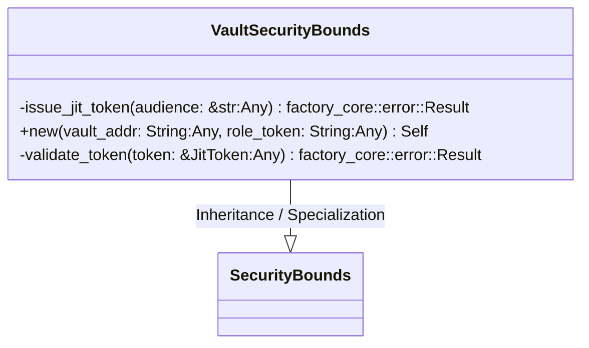
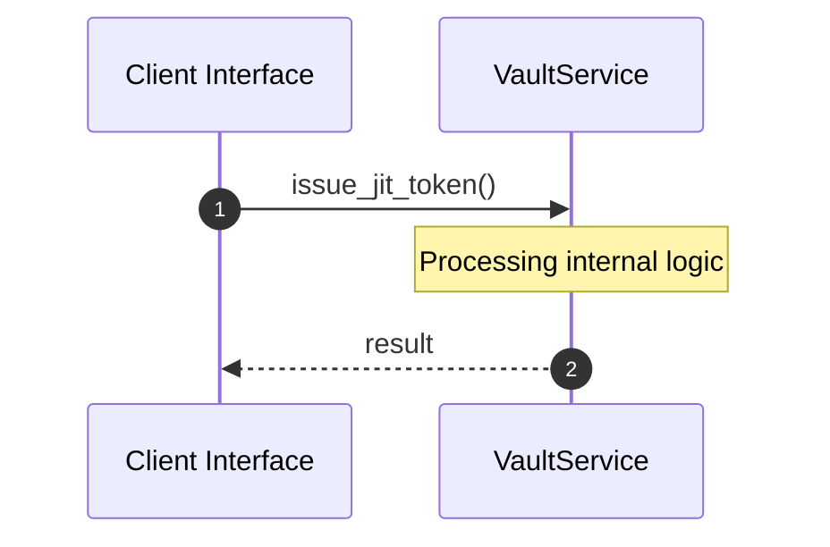
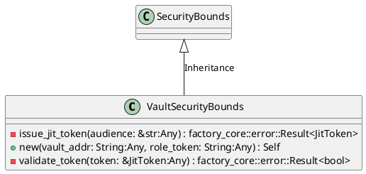
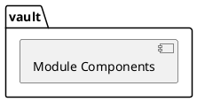
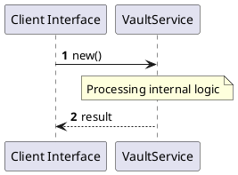
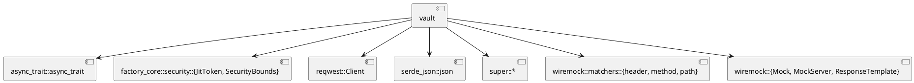
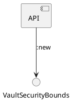

# File: vault.rs

**Source Path:** `crates/factory-infrastructure/src/vault.rs`

## Overview

### Purpose
Provides implementation for vault.rs.

### Responsibilities
* Handles logic related to vault.

### Main Workflow
* Initialization and execution of vault logic.

### Dependencies
* async_trait::async_trait, factory_core::security::{JitToken, SecurityBounds}, reqwest::Client, serde_json::json, super::*, wiremock::matchers::{header, method, path}, wiremock::{Mock, MockServer, ResponseTemplate}

### Imported modules
* None

### Exported classes
* VaultSecurityBounds

### Exported interfaces
* None

### Exported functions
* None

## Public API

### Exported Classes / Structs / Interfaces

#### VaultSecurityBounds

**Overview:**
Why it exists:
Provides capabilities related to VaultSecurityBounds.

What business capability it provides:
Supports core domain concepts.

How it collaborates with other classes:
Works with related entities to process logic.

**Constructor:**

##### `new(vault_addr: String (Any), role_token: String (Any))`
Parameters: vault_addr: String (Any), role_token: String (Any)
Dependencies: Inherited from context
Initialization: Sets up VaultSecurityBounds

**Attributes:**

* `client` (Client): Purpose - Stores client data. Constraints - Valid Client.
* `role_token` (String): Purpose - Stores role_token data. Constraints - Valid String.
* `vault_addr` (String): Purpose - Stores vault_addr data. Constraints - Valid String.

**Public Methods:**

None.

**Private Methods:**

* `issue_jit_token(audience: &str (Any)) -> factory_core::error::Result<JitToken>`: Internal helper logic.
* `validate_token(token: &JitToken (Any)) -> factory_core::error::Result<bool>`: Internal helper logic.

### Exported Functions

None.

## Internal architecture



## Execution flow & Sequence explanation



## UML

### Class Diagram


### Package Diagram


### Sequence Diagram


### Component Diagram
```plantuml
@startuml
component "vault" as comp
component "async_trait::async_trait" as async_trait::async_trait
comp --> async_trait::async_trait
component "factory_core::security::{JitToken, SecurityBounds}" as factory_core::security::{JitToken, SecurityBounds}
comp --> factory_core::security::{JitToken, SecurityBounds}
component "reqwest::Client" as reqwest::Client
comp --> reqwest::Client
component "serde_json::json" as serde_json::json
comp --> serde_json::json
component "super::*" as super::*
comp --> super::*
component "wiremock::matchers::{header, method, path}" as wiremock::matchers::{header, method, path}
comp --> wiremock::matchers::{header, method, path}
component "wiremock::{Mock, MockServer, ResponseTemplate}" as wiremock::{Mock, MockServer, ResponseTemplate}
comp --> wiremock::{Mock, MockServer, ResponseTemplate}
@enduml

```

### Dependency Graph


### Call Graph


## Examples

```
// Example usage of vault.rs components
import { ... } from 'crates/factory-infrastructure/src/vault.rs';
```

## Cross References
* **Parent module:** `crates/factory-infrastructure/src`
* **Dependencies:** async_trait::async_trait, factory_core::security::{JitToken, SecurityBounds}, reqwest::Client, serde_json::json, super::*, wiremock::matchers::{header, method, path}, wiremock::{Mock, MockServer, ResponseTemplate}
