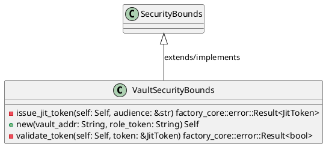
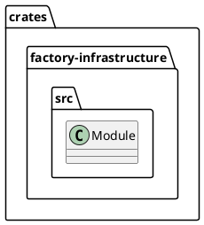
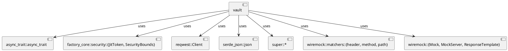
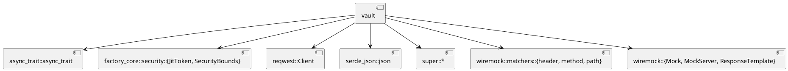
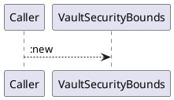
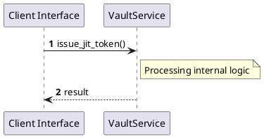

# File: vault.rs

**Source Path:** `crates/factory-infrastructure/src/vault.rs`

## Overview

### Purpose
Provides implementation for vault.rs.

### Responsibilities
* Handles logic related to vault.

### Dependencies
* async_trait::async_trait, factory_core::security::{JitToken, SecurityBounds}, reqwest::Client, serde_json::json, super::*, wiremock::matchers::{header, method, path}, wiremock::{Mock, MockServer, ResponseTemplate}

### Imported modules
* None

### Exported classes
* VaultSecurityBounds

### Exported interfaces
* None

### Exported functions
* None

## Public API

### Exported Classes / Structs / Interfaces

#### VaultSecurityBounds

**Overview:**
No description provided.

**Constructor:**

##### `new(vault_addr (String), role_token (String))`
Parameters: vault_addr (String), role_token (String)
Dependencies: Inherited from context
Initialization: Sets up VaultSecurityBounds

**Attributes:**

* `client` (Client): Purpose - Stores client data. Constraints - Valid Client.
* `role_token` (String): Purpose - Stores role_token data. Constraints - Valid String.
* `vault_addr` (String): Purpose - Stores vault_addr data. Constraints - Valid String.

**Public Methods:**

None.

**Private Methods:**

* `issue_jit_token(self (Self), audience (&str)) -> factory_core::error::Result<JitToken>`: Internal helper logic.
* `validate_token(self (Self), token (&JitToken)) -> factory_core::error::Result<bool>`: Internal helper logic.

### Exported Functions

None.

## Internal architecture



## Package Diagram



## Component Diagram



## Dependency Graph



## Call Graph



## Execution flow & Sequence explanation



## Examples

```
// Example usage of vault.rs components
import { ... } from 'crates/factory-infrastructure/src/vault.rs';
```

## Cross References
* **Parent module:** `crates/factory-infrastructure/src`
* **Dependencies:** async_trait::async_trait, factory_core::security::{JitToken, SecurityBounds}, reqwest::Client, serde_json::json, super::*, wiremock::matchers::{header, method, path}, wiremock::{Mock, MockServer, ResponseTemplate}
