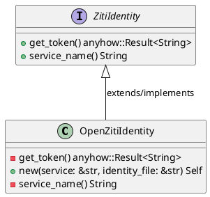
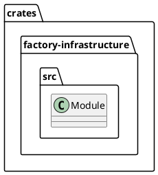
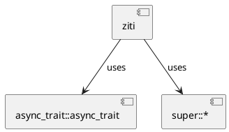
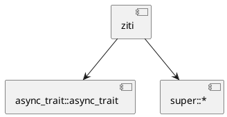
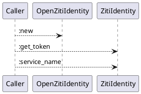
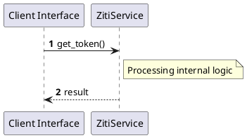

# File: ziti.rs

**Source Path:** `crates/factory-infrastructure/src/ziti.rs`

## Overview

### Purpose
Provides implementation for ziti.rs.

### Responsibilities
* Handles logic related to ziti.

### Dependencies
* async_trait::async_trait, super::*

### Imported modules
* None

### Exported classes
* OpenZitiIdentity

### Exported interfaces
* ZitiIdentity

### Exported functions
* None

## Public API

### Exported Classes / Structs / Interfaces

#### OpenZitiIdentity

**Overview:**
No description provided.

**Constructor:**

##### `new(service (&str), identity_file (&str))`
Parameters: service (&str), identity_file (&str)
Dependencies: Inherited from context
Initialization: Sets up OpenZitiIdentity

**Attributes:**

* `identity_file` (String): Purpose - Stores identity_file data. Constraints - Valid String.
* `service` (String): Purpose - Stores service data. Constraints - Valid String.

**Public Methods:**

None.

**Private Methods:**

* `get_token() -> anyhow::Result<String>`: Internal helper logic.
* `service_name() -> String`: Internal helper logic.

#### ZitiIdentity

**Overview:**
No description provided.

**Constructor:**

Default constructor.

**Attributes:**

None.

**Public Methods:**

##### `get_token() -> anyhow::Result<String>`

###### Description
No description provided.

###### Inputs
None.

###### Output
Return type: anyhow::Result<String>
Semantic meaning: Result of get_token
Possible null values: Conditional
Exceptions: None handled explicitly

###### Side Effects
Database updates: None
File operations: None
Network calls: None
Cache: None
State changes: Updates internal variables

###### Complexity
Time Complexity: O(1) mostly
Space Complexity: O(1) mostly

###### Example
```
let result = instance.get_token();
```

##### `service_name() -> String`

###### Description
No description provided.

###### Inputs
None.

###### Output
Return type: String
Semantic meaning: Result of service_name
Possible null values: Conditional
Exceptions: None handled explicitly

###### Side Effects
Database updates: None
File operations: None
Network calls: None
Cache: None
State changes: Updates internal variables

###### Complexity
Time Complexity: O(1) mostly
Space Complexity: O(1) mostly

###### Example
```
let result = instance.service_name();
```

**Private Methods:**

None.

### Exported Functions

None.

## Internal architecture



## Package Diagram



## Component Diagram



## Dependency Graph



## Call Graph



## Execution flow & Sequence explanation



## Examples

```
// Example usage of ziti.rs components
import { ... } from 'crates/factory-infrastructure/src/ziti.rs';
```

## Cross References
* **Parent module:** `crates/factory-infrastructure/src`
* **Dependencies:** async_trait::async_trait, super::*
