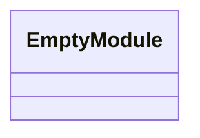
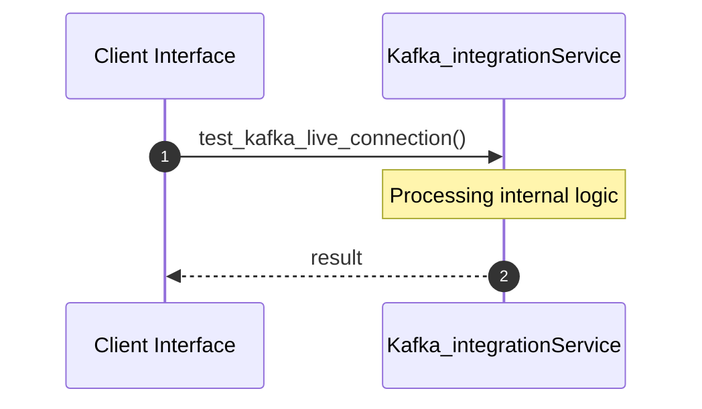
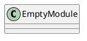
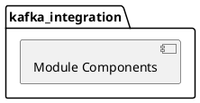
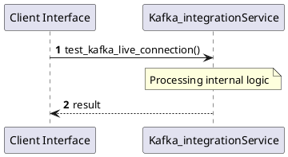
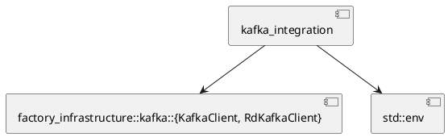
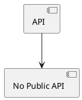

# File: kafka_integration.rs

**Source Path:** `crates/factory-infrastructure/tests/kafka_integration.rs`

## Overview

### Purpose
Provides implementation for kafka_integration.rs.

### Responsibilities
* Handles logic related to kafka_integration.

### Main Workflow
* Initialization and execution of kafka_integration logic.

### Dependencies
* factory_infrastructure::kafka::{KafkaClient, RdKafkaClient}, std::env

### Imported modules
* None

### Exported classes
* None

### Exported interfaces
* None

### Exported functions
* None

## Public API

### Exported Classes / Structs / Interfaces

### Exported Functions

None.

## Internal architecture



## Execution flow & Sequence explanation



## UML

### Class Diagram


### Package Diagram


### Sequence Diagram


### Component Diagram
```plantuml
@startuml
component "kafka_integration" as comp
component "factory_infrastructure::kafka::{KafkaClient, RdKafkaClient}" as factory_infrastructure::kafka::{KafkaClient, RdKafkaClient}
comp --> factory_infrastructure::kafka::{KafkaClient, RdKafkaClient}
component "std::env" as std::env
comp --> std::env
@enduml

```

### Dependency Graph


### Call Graph


## Examples

```
// Example usage of kafka_integration.rs components
import { ... } from 'crates/factory-infrastructure/tests/kafka_integration.rs';
```

## Cross References
* **Parent module:** `crates/factory-infrastructure/tests`
* **Dependencies:** factory_infrastructure::kafka::{KafkaClient, RdKafkaClient}, std::env
