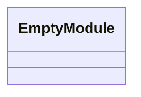
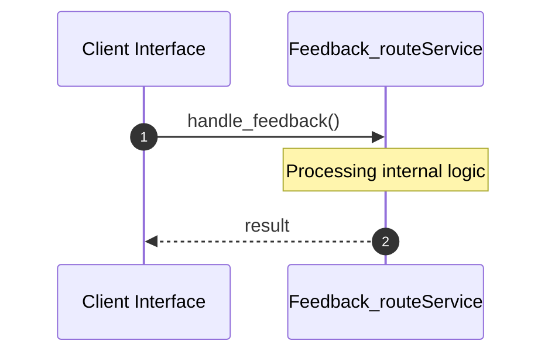
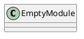
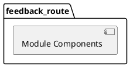
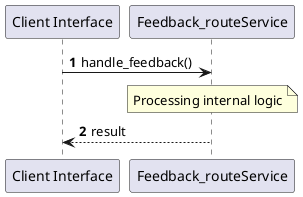
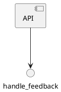

# File: feedback_route.rs

**Source Path:** `crates/factory-mcp-server/src/feedback_route.rs`

## Overview

### Purpose
Provides implementation for feedback_route.rs.

### Responsibilities
* Handles logic related to feedback_route.

### Main Workflow
* Initialization and execution of feedback_route logic.

### Dependencies
* axum::{
    extract::{Json, State},
    http::StatusCode,
    response::IntoResponse,
}, crate::McpServer, factory_core::UserFeedbackPayload, factory_infrastructure::GitlabClient, factory_infrastructure::HttpGitlabClient, std::sync::Arc

### Imported modules
* None

### Exported classes
* None

### Exported interfaces
* None

### Exported functions
* handle_feedback

## Public API

### Exported Classes / Structs / Interfaces

### Exported Functions

#### `handle_feedback(State(_server): State<Arc<McpServer>> (Any), Json(payload): Json<UserFeedbackPayload> (Any)) -> impl IntoResponse`
Executes handle_feedback.

## Internal architecture



## Execution flow & Sequence explanation



## UML

### Class Diagram


### Package Diagram


### Sequence Diagram


### Component Diagram
```plantuml
@startuml
component "feedback_route" as comp
component "axum::{
    extract::{Json, State},
    http::StatusCode,
    response::IntoResponse,
}" as axum::{
    extract::{Json, State},
    http::StatusCode,
    response::IntoResponse,
}
comp --> axum::{
    extract::{Json, State},
    http::StatusCode,
    response::IntoResponse,
}
component "crate::McpServer" as crate::McpServer
comp --> crate::McpServer
component "factory_core::UserFeedbackPayload" as factory_core::UserFeedbackPayload
comp --> factory_core::UserFeedbackPayload
component "factory_infrastructure::GitlabClient" as factory_infrastructure::GitlabClient
comp --> factory_infrastructure::GitlabClient
component "factory_infrastructure::HttpGitlabClient" as factory_infrastructure::HttpGitlabClient
comp --> factory_infrastructure::HttpGitlabClient
component "std::sync::Arc" as std::sync::Arc
comp --> std::sync::Arc
@enduml

```

### Dependency Graph
```plantuml
@startuml
[feedback_route]
[feedback_route] --> [axum::{
    extract::{Json, State},
    http::StatusCode,
    response::IntoResponse,
}]
[feedback_route] --> [crate::McpServer]
[feedback_route] --> [factory_core::UserFeedbackPayload]
[feedback_route] --> [factory_infrastructure::GitlabClient]
[feedback_route] --> [factory_infrastructure::HttpGitlabClient]
[feedback_route] --> [std::sync::Arc]
@enduml

```

### Call Graph


## Examples

```
// Example usage of feedback_route.rs components
import { ... } from 'crates/factory-mcp-server/src/feedback_route.rs';
```

## Cross References
* **Parent module:** `crates/factory-mcp-server/src`
* **Dependencies:** axum::{
    extract::{Json, State},
    http::StatusCode,
    response::IntoResponse,
}, crate::McpServer, factory_core::UserFeedbackPayload, factory_infrastructure::GitlabClient, factory_infrastructure::HttpGitlabClient, std::sync::Arc
