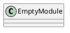
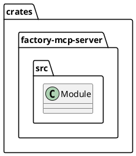
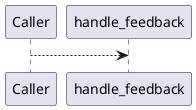
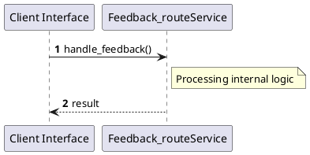

# File: feedback_route.rs

**Source Path:** `crates/factory-mcp-server/src/feedback_route.rs`

## Overview

### Purpose
Provides implementation for feedback_route.rs.

### Responsibilities
* Handles logic related to feedback_route.

### Dependencies
* axum::{
    extract::{Json, State},
    http::StatusCode,
    response::IntoResponse,
}, crate::McpServer, factory_core::UserFeedbackPayload, factory_infrastructure::GitlabClient, factory_infrastructure::HttpGitlabClient, std::sync::Arc

### Imported modules
* None

### Exported classes
* None

### Exported interfaces
* None

### Exported functions
* handle_feedback

## Public API

### Exported Classes / Structs / Interfaces

### Exported Functions

#### `handle_feedback(State(_server) (State<Arc<McpServer>>), Json(payload) (Json<UserFeedbackPayload>)) -> impl IntoResponse`
No description provided.

## Internal architecture



## Package Diagram



## Component Diagram

```plantuml
@startuml
component "feedback_route" as Main
component "axum::{
    extract::{Json, State},
    http::StatusCode,
    response::IntoResponse,
}" as axum________extract___Json__State_______http__StatusCode______response__IntoResponse___
Main --> axum________extract___Json__State_______http__StatusCode______response__IntoResponse___ : uses
component "crate::McpServer" as crate__McpServer
Main --> crate__McpServer : uses
component "factory_core::UserFeedbackPayload" as factory_core__UserFeedbackPayload
Main --> factory_core__UserFeedbackPayload : uses
component "factory_infrastructure::GitlabClient" as factory_infrastructure__GitlabClient
Main --> factory_infrastructure__GitlabClient : uses
component "factory_infrastructure::HttpGitlabClient" as factory_infrastructure__HttpGitlabClient
Main --> factory_infrastructure__HttpGitlabClient : uses
component "std::sync::Arc" as std__sync__Arc
Main --> std__sync__Arc : uses
@enduml

```

## Dependency Graph

```plantuml
@startuml
[feedback_route]
[feedback_route] --> [axum::{
    extract::{Json, State},
    http::StatusCode,
    response::IntoResponse,
}]
[feedback_route] --> [crate::McpServer]
[feedback_route] --> [factory_core::UserFeedbackPayload]
[feedback_route] --> [factory_infrastructure::GitlabClient]
[feedback_route] --> [factory_infrastructure::HttpGitlabClient]
[feedback_route] --> [std::sync::Arc]
@enduml

```

## Call Graph



## Execution flow & Sequence explanation



## Examples

```
// Example usage of feedback_route.rs components
import { ... } from 'crates/factory-mcp-server/src/feedback_route.rs';
```

## Cross References
* **Parent module:** `crates/factory-mcp-server/src`
* **Dependencies:** axum::{
    extract::{Json, State},
    http::StatusCode,
    response::IntoResponse,
}, crate::McpServer, factory_core::UserFeedbackPayload, factory_infrastructure::GitlabClient, factory_infrastructure::HttpGitlabClient, std::sync::Arc
