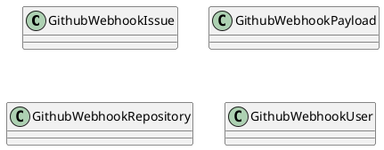
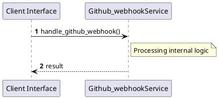

# File: github_webhook.rs

**Source Path:** `crates/factory-mcp-server/src/github_webhook.rs`

## Overview

### Purpose
Provides implementation for github_webhook.rs.

### Responsibilities
* Handles logic related to github_webhook.

### Dependencies
* axum::{
    extract::{Json, State},
    http::{HeaderMap, StatusCode},
    response::IntoResponse,
}, crate::McpServer, hmac::{Hmac, Mac}, serde::{Deserialize, Serialize}, serde_json::json, sha2::Sha256, std::env, std::sync::Arc, super::*

### Imported modules
* None

### Exported classes
* GithubWebhookIssue, GithubWebhookPayload, GithubWebhookRepository, GithubWebhookUser

### Exported interfaces
* None

### Exported functions
* handle_github_webhook, verify_github_signature

## Public API

### Exported Classes / Structs / Interfaces

#### GithubWebhookIssue

**Overview:**
No description provided.

**Constructor:**

Default constructor.

**Attributes:**

* `body` (Option<String>): Purpose - Stores body data. Constraints - Valid Option<String>.
* `html_url` (String): Purpose - Stores html_url data. Constraints - Valid String.
* `number` (u64): Purpose - Stores number data. Constraints - Valid u64.
* `title` (String): Purpose - Stores title data. Constraints - Valid String.
* `user` (Option<GithubWebhookUser>): Purpose - Stores user data. Constraints - Valid Option<GithubWebhookUser>.

**Public Methods:**

None.

**Private Methods:**

None.

#### GithubWebhookPayload

**Overview:**
No description provided.

**Constructor:**

Default constructor.

**Attributes:**

* `action` (Option<String>): Purpose - Stores action data. Constraints - Valid Option<String>.
* `issue` (Option<GithubWebhookIssue>): Purpose - Stores issue data. Constraints - Valid Option<GithubWebhookIssue>.
* `repository` (Option<GithubWebhookRepository>): Purpose - Stores repository data. Constraints - Valid Option<GithubWebhookRepository>.

**Public Methods:**

None.

**Private Methods:**

None.

#### GithubWebhookRepository

**Overview:**
No description provided.

**Constructor:**

Default constructor.

**Attributes:**

* `full_name` (String): Purpose - Stores full_name data. Constraints - Valid String.
* `html_url` (String): Purpose - Stores html_url data. Constraints - Valid String.

**Public Methods:**

None.

**Private Methods:**

None.

#### GithubWebhookUser

**Overview:**
No description provided.

**Constructor:**

Default constructor.

**Attributes:**

* `login` (String): Purpose - Stores login data. Constraints - Valid String.

**Public Methods:**

None.

**Private Methods:**

None.

### Exported Functions

#### `handle_github_webhook(State(_server): State<Arc<McpServer>> (Any), headers: HeaderMap (Any), body_bytes: axum::body::Bytes (Any)) -> impl IntoResponse`
No description provided.

#### `verify_github_signature(secret: &str (Any), signature_header: &str (Any), body_bytes: &[u8] (Any)) -> bool`
No description provided.

## Internal architecture



## Execution flow & Sequence explanation



## Examples

```
// Example usage of github_webhook.rs components
import { ... } from 'crates/factory-mcp-server/src/github_webhook.rs';
```

## Cross References
* **Parent module:** `crates/factory-mcp-server/src`
* **Dependencies:** axum::{
    extract::{Json, State},
    http::{HeaderMap, StatusCode},
    response::IntoResponse,
}, crate::McpServer, hmac::{Hmac, Mac}, serde::{Deserialize, Serialize}, serde_json::json, sha2::Sha256, std::env, std::sync::Arc, super::*
