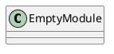
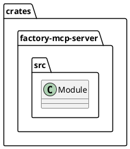
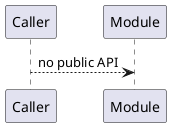
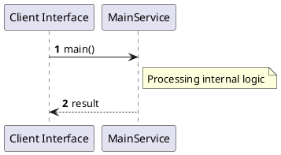

# File: main.rs

**Source Path:** `crates/factory-mcp-server/src/main.rs`

## Overview

### Purpose
Provides implementation for main.rs.

### Responsibilities
* Handles logic related to main.

### Dependencies
* axum::{
    routing::{get, post},
    Router,
}, factory_mcp_server::McpServer, std::net::SocketAddr, std::sync::Arc, tower_http::cors::CorsLayer

### Imported modules
* None

### Exported classes
* None

### Exported interfaces
* None

### Exported functions
* None

## Public API

### Exported Classes / Structs / Interfaces

### Exported Functions

None.

## Internal architecture



## Package Diagram



## Component Diagram

```plantuml
@startuml
component "main" as Main
component "axum::{
    routing::{get, post},
    Router,
}" as axum________routing___get__post_______Router___
Main --> axum________routing___get__post_______Router___ : uses
component "factory_mcp_server::McpServer" as factory_mcp_server__McpServer
Main --> factory_mcp_server__McpServer : uses
component "std::net::SocketAddr" as std__net__SocketAddr
Main --> std__net__SocketAddr : uses
component "std::sync::Arc" as std__sync__Arc
Main --> std__sync__Arc : uses
component "tower_http::cors::CorsLayer" as tower_http__cors__CorsLayer
Main --> tower_http__cors__CorsLayer : uses
@enduml

```

## Dependency Graph

```plantuml
@startuml
[main]
[main] --> [axum::{
    routing::{get, post},
    Router,
}]
[main] --> [factory_mcp_server::McpServer]
[main] --> [std::net::SocketAddr]
[main] --> [std::sync::Arc]
[main] --> [tower_http::cors::CorsLayer]
@enduml

```

## Call Graph



## Execution flow & Sequence explanation



## Examples

```
// Example usage of main.rs components
import { ... } from 'crates/factory-mcp-server/src/main.rs';
```

## Cross References
* **Parent module:** `crates/factory-mcp-server/src`
* **Dependencies:** axum::{
    routing::{get, post},
    Router,
}, factory_mcp_server::McpServer, std::net::SocketAddr, std::sync::Arc, tower_http::cors::CorsLayer
