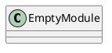
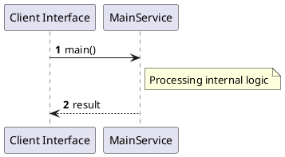

# File: main.rs

**Source Path:** `crates/factory-mcp-server/src/main.rs`

## Overview

### Purpose
Provides implementation for main.rs.

### Responsibilities
* Handles logic related to main.

### Dependencies
* axum::{
    routing::{get, post},
    Router,
}, factory_mcp_server::McpServer, std::net::SocketAddr, std::sync::Arc, tower_http::cors::CorsLayer

### Imported modules
* None

### Exported classes
* None

### Exported interfaces
* None

### Exported functions
* None

## Public API

### Exported Classes / Structs / Interfaces

### Exported Functions

None.

## Internal architecture



## Execution flow & Sequence explanation




## Examples

```
// Example usage of main.rs components
import { ... } from 'crates/factory-mcp-server/src/main.rs';
```


## Cross References
* **Parent module:** `crates/factory-mcp-server/src`
* **Dependencies:** axum::{
    routing::{get, post},
    Router,
}, factory_mcp_server::McpServer, std::net::SocketAddr, std::sync::Arc, tower_http::cors::CorsLayer
