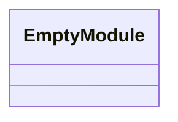
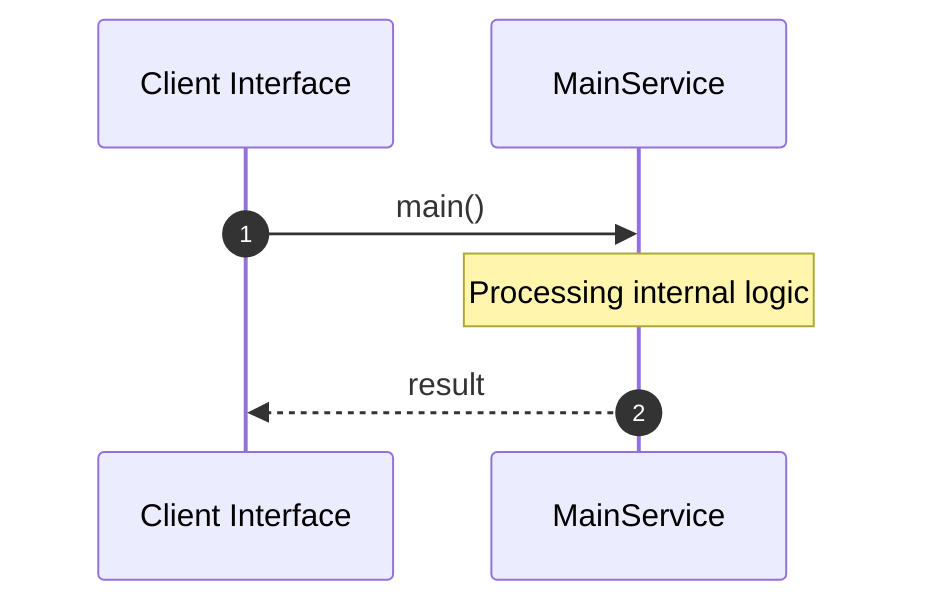
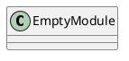
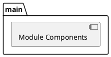
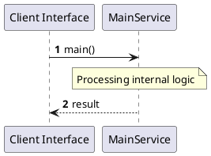
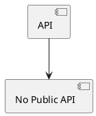

# File: main.rs

**Source Path:** `crates/factory-mcp-server/src/main.rs`

## Overview

### Purpose
Provides implementation for main.rs.

### Responsibilities
* Handles logic related to main.

### Main Workflow
* Initialization and execution of main logic.

### Dependencies
* axum::{
    routing::{get, post},
    Router,
}, factory_mcp_server::McpServer, std::net::SocketAddr, std::sync::Arc, tower_http::cors::CorsLayer

### Imported modules
* None

### Exported classes
* None

### Exported interfaces
* None

### Exported functions
* None

## Public API

### Exported Classes / Structs / Interfaces

### Exported Functions

None.

## Internal architecture



## Execution flow & Sequence explanation



## UML

### Class Diagram


### Package Diagram


### Sequence Diagram


### Component Diagram
```plantuml
@startuml
component "main" as comp
component "axum::{
    routing::{get, post},
    Router,
}" as axum::{
    routing::{get, post},
    Router,
}
comp --> axum::{
    routing::{get, post},
    Router,
}
component "factory_mcp_server::McpServer" as factory_mcp_server::McpServer
comp --> factory_mcp_server::McpServer
component "std::net::SocketAddr" as std::net::SocketAddr
comp --> std::net::SocketAddr
component "std::sync::Arc" as std::sync::Arc
comp --> std::sync::Arc
component "tower_http::cors::CorsLayer" as tower_http::cors::CorsLayer
comp --> tower_http::cors::CorsLayer
@enduml

```

### Dependency Graph
```plantuml
@startuml
[main]
[main] --> [axum::{
    routing::{get, post},
    Router,
}]
[main] --> [factory_mcp_server::McpServer]
[main] --> [std::net::SocketAddr]
[main] --> [std::sync::Arc]
[main] --> [tower_http::cors::CorsLayer]
@enduml

```

### Call Graph


## Examples

```
// Example usage of main.rs components
import { ... } from 'crates/factory-mcp-server/src/main.rs';
```

## Cross References
* **Parent module:** `crates/factory-mcp-server/src`
* **Dependencies:** axum::{
    routing::{get, post},
    Router,
}, factory_mcp_server::McpServer, std::net::SocketAddr, std::sync::Arc, tower_http::cors::CorsLayer
