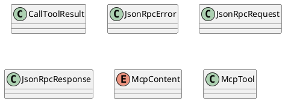
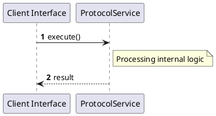

# File: protocol.rs

**Source Path:** `crates/factory-mcp-server/src/protocol.rs`

## Overview

### Purpose
Provides implementation for protocol.rs.

### Responsibilities
* Handles logic related to protocol.

### Dependencies
* serde::{Deserialize, Serialize}

### Imported modules
* None

### Exported classes
* CallToolResult, JsonRpcError, JsonRpcRequest, JsonRpcResponse, McpTool

### Exported interfaces
* None

### Exported functions
* None

## Public API

### Exported Classes / Structs / Interfaces

#### CallToolResult

**Overview:**
No description provided.

**Constructor:**

Default constructor.

**Attributes:**

* `content` (Vec<McpContent>): Purpose - Stores content data. Constraints - Valid Vec<McpContent>.
* `is_error` (bool): Purpose - Stores is_error data. Constraints - Valid bool.

**Public Methods:**

None.

**Private Methods:**

None.

#### JsonRpcError

**Overview:**
No description provided.

**Constructor:**

Default constructor.

**Attributes:**

* `code` (i32): Purpose - Stores code data. Constraints - Valid i32.
* `data` (Option<serde_json::Value>): Purpose - Stores data data. Constraints - Valid Option<serde_json::Value>.
* `message` (String): Purpose - Stores message data. Constraints - Valid String.

**Public Methods:**

None.

**Private Methods:**

None.

#### JsonRpcRequest

**Overview:**
No description provided.

**Constructor:**

Default constructor.

**Attributes:**

* `id` (Option<serde_json::Value>): Purpose - Stores id data. Constraints - Valid Option<serde_json::Value>.
* `jsonrpc` (String): Purpose - Stores jsonrpc data. Constraints - Valid String.
* `method` (String): Purpose - Stores method data. Constraints - Valid String.
* `params` (Option<serde_json::Value>): Purpose - Stores params data. Constraints - Valid Option<serde_json::Value>.

**Public Methods:**

None.

**Private Methods:**

None.

#### JsonRpcResponse

**Overview:**
No description provided.

**Constructor:**

Default constructor.

**Attributes:**

* `error` (Option<JsonRpcError>): Purpose - Stores error data. Constraints - Valid Option<JsonRpcError>.
* `id` (Option<serde_json::Value>): Purpose - Stores id data. Constraints - Valid Option<serde_json::Value>.
* `jsonrpc` (String): Purpose - Stores jsonrpc data. Constraints - Valid String.
* `result` (Option<serde_json::Value>): Purpose - Stores result data. Constraints - Valid Option<serde_json::Value>.

**Public Methods:**

None.

**Private Methods:**

None.

#### McpContent

**Overview:**
No description provided.

**Constructor:**

Default constructor.

**Attributes:**

None.

**Public Methods:**

None.

**Private Methods:**

None.

#### McpTool

**Overview:**
No description provided.

**Constructor:**

Default constructor.

**Attributes:**

* `description` (String): Purpose - Stores description data. Constraints - Valid String.
* `input_schema` (serde_json::Value): Purpose - Stores input_schema data. Constraints - Valid serde_json::Value.
* `name` (String): Purpose - Stores name data. Constraints - Valid String.

**Public Methods:**

None.

**Private Methods:**

None.

### Exported Functions

None.

## Internal architecture



## Execution flow & Sequence explanation



## Examples

```
// Example usage of protocol.rs components
import { ... } from 'crates/factory-mcp-server/src/protocol.rs';
```

## Cross References
* **Parent module:** `crates/factory-mcp-server/src`
* **Dependencies:** serde::{Deserialize, Serialize}
