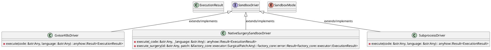
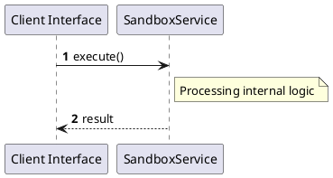

# File: sandbox.rs

**Source Path:** `crates/factory-mcp-server/src/sandbox.rs`

## Overview

### Purpose
Provides implementation for sandbox.rs.

### Responsibilities
* Handles logic related to sandbox.

### Dependencies
* async_trait::async_trait, crate::tools::Tool, crate::tools::launch_sandbox_pod::LaunchSandboxPodTool, serde::{Deserialize, Serialize}, serde_json::json, std::time::Duration, super::*, tokio::process::Command, tokio::time::timeout

### Imported modules
* None

### Exported classes
* ExecutionResult, GvisorK8sDriver, NativeSurgerySandboxDriver, SubprocessDriver

### Exported interfaces
* SandboxDriver

### Exported functions
* None

## Public API

### Exported Classes / Structs / Interfaces

#### ExecutionResult

**Overview:**
No description provided.

**Constructor:**

Default constructor.

**Attributes:**

* `exit_code` (Option<i32>): Purpose - Stores exit_code data. Constraints - Valid Option<i32>.
* `is_success` (bool): Purpose - Stores is_success data. Constraints - Valid bool.
* `stderr` (String): Purpose - Stores stderr data. Constraints - Valid String.
* `stdout` (String): Purpose - Stores stdout data. Constraints - Valid String.

**Public Methods:**

None.

**Private Methods:**

None.

#### GvisorK8sDriver

**Overview:**
No description provided.

**Constructor:**

Default constructor.

**Attributes:**

None.

**Public Methods:**

None.

**Private Methods:**

* `execute(code: &str (Any), language: &str (Any)) -> anyhow::Result<ExecutionResult>`: Internal helper logic.

#### NativeSurgerySandboxDriver

**Overview:**
No description provided.

**Constructor:**

Default constructor.

**Attributes:**

* `execution_engine` (std::sync::Arc<dyn factory_core::executor::CodeSurgeryExecutor>): Purpose - Stores execution_engine data. Constraints - Valid std::sync::Arc<dyn factory_core::executor::CodeSurgeryExecutor>.

**Public Methods:**

None.

**Private Methods:**

* `execute(_code: &str (Any), _language: &str (Any)) -> anyhow::Result<ExecutionResult>`: Internal helper logic.
* `execute_surgery(id: &str (Any), patch: &factory_core::executor::SurgicalPatch (Any)) -> factory_core::error::Result<factory_core::executor::ExecutionResult>`: Internal helper logic.

#### SandboxDriver

**Overview:**
No description provided.

**Constructor:**

Default constructor.

**Attributes:**

None.

**Public Methods:**

None.

**Private Methods:**

None.

#### SandboxMode

**Overview:**
No description provided.

**Constructor:**

Default constructor.

**Attributes:**

None.

**Public Methods:**

None.

**Private Methods:**

None.

#### SubprocessDriver

**Overview:**
No description provided.

**Constructor:**

Default constructor.

**Attributes:**

None.

**Public Methods:**

None.

**Private Methods:**

* `execute(code: &str (Any), language: &str (Any)) -> anyhow::Result<ExecutionResult>`: Internal helper logic.

### Exported Functions

None.

## Internal architecture



## Execution flow & Sequence explanation




## Examples

```
// Example usage of sandbox.rs components
import { ... } from 'crates/factory-mcp-server/src/sandbox.rs';
```


## Cross References
* **Parent module:** `crates/factory-mcp-server/src`
* **Dependencies:** async_trait::async_trait, crate::tools::Tool, crate::tools::launch_sandbox_pod::LaunchSandboxPodTool, serde::{Deserialize, Serialize}, serde_json::json, std::time::Duration, super::*, tokio::process::Command, tokio::time::timeout
