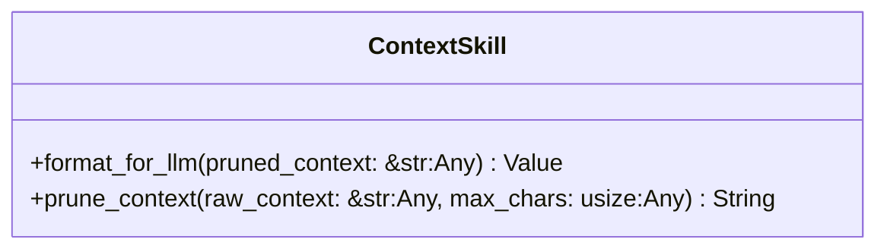
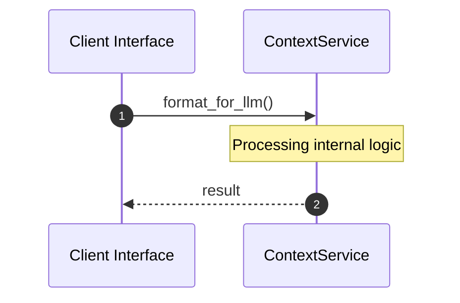

# File: context.rs

**Source Path:** `crates/factory-mcp-server/src/skills/context.rs`

## Overview

### Purpose
Provides implementation for context.rs.

### Responsibilities
* Handles logic related to context.

### Dependencies
* serde_json::{json, Value}, super::*

### Imported modules
* None

### Exported classes
* ContextSkill

### Exported interfaces
* None

### Exported functions
* None

## Public API

### Exported Classes / Structs / Interfaces

#### ContextSkill

**Overview:**
Why it exists:
Provides capabilities related to ContextSkill.

What business capability it provides:
Supports core domain concepts.

How it collaborates with other classes:
Works with related entities to process logic.

**Constructor:**

Default constructor.

**Attributes:**

None.

**Public Methods:**

##### `format_for_llm(pruned_context: &str (Any)) -> Value`

###### Description
Executes format_for_llm.

###### Inputs
* `pruned_context: &str`: type=Any, meaning=Input for pruned_context: &str, valid values=Any valid Any, optional=No, default value=None

###### Output
Return type: Value
Semantic meaning: Result of format_for_llm
Possible null values: Conditional
Exceptions: None handled explicitly

###### Side Effects
Database updates: None
File operations: None
Network calls: None
Cache: None
State changes: Updates internal variables

###### Complexity
Time Complexity: O(1) mostly
Space Complexity: O(1) mostly

###### Example
```
let result = instance.format_for_llm();
```

##### `prune_context(raw_context: &str (Any), max_chars: usize (Any)) -> String`

###### Description
Executes prune_context.

###### Inputs
* `raw_context: &str`: type=Any, meaning=Input for raw_context: &str, valid values=Any valid Any, optional=No, default value=None
* `max_chars: usize`: type=Any, meaning=Input for max_chars: usize, valid values=Any valid Any, optional=No, default value=None

###### Output
Return type: String
Semantic meaning: Result of prune_context
Possible null values: Conditional
Exceptions: None handled explicitly

###### Side Effects
Database updates: None
File operations: None
Network calls: None
Cache: None
State changes: Updates internal variables

###### Complexity
Time Complexity: O(1) mostly
Space Complexity: O(1) mostly

###### Example
```
let result = instance.prune_context();
```

**Private Methods:**

None.

### Exported Functions

None.

## Internal architecture



## Execution flow & Sequence explanation



## Examples

```
// Example usage of context.rs components
import { ... } from 'crates/factory-mcp-server/src/skills/context.rs';
```

## Cross References
* **Parent module:** `crates/factory-mcp-server/src/skills`
* **Dependencies:** serde_json::{json, Value}, super::*
