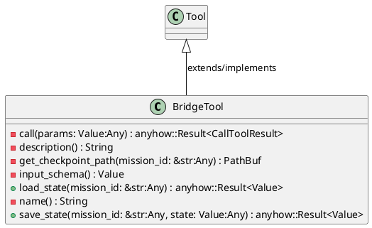
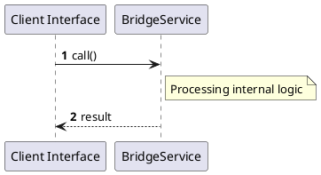

# File: bridge.rs

**Source Path:** `crates/factory-mcp-server/src/tools/bridge.rs`

## Overview

### Purpose
Provides implementation for bridge.rs.

### Responsibilities
* Handles logic related to bridge.

### Dependencies
* async_trait::async_trait, crate::protocol::CallToolResult, crate::tools::Tool, serde_json::{json, Value}, std::fs, std::path::PathBuf

### Imported modules
* None

### Exported classes
* BridgeTool

### Exported interfaces
* None

### Exported functions
* None

## Public API

### Exported Classes / Structs / Interfaces

#### BridgeTool

**Overview:**
No description provided.

**Constructor:**

Default constructor.

**Attributes:**

None.

**Public Methods:**

##### `load_state(mission_id: &str (Any)) -> anyhow::Result<Value>`

###### Description
No description provided.

###### Inputs
* `mission_id: &str`: type=Any, meaning=Input for mission_id: &str, valid values=Any valid Any, optional=No, default value=None

###### Output
Return type: anyhow::Result<Value>
Semantic meaning: Result of load_state
Possible null values: Conditional
Exceptions: None handled explicitly

###### Side Effects
Database updates: None
File operations: None
Network calls: None
Cache: None
State changes: Updates internal variables

###### Complexity
Time Complexity: O(1) mostly
Space Complexity: O(1) mostly

###### Example
```
let result = instance.load_state();
```

##### `save_state(mission_id: &str (Any), state: Value (Any)) -> anyhow::Result<Value>`

###### Description
No description provided.

###### Inputs
* `mission_id: &str`: type=Any, meaning=Input for mission_id: &str, valid values=Any valid Any, optional=No, default value=None
* `state: Value`: type=Any, meaning=Input for state: Value, valid values=Any valid Any, optional=No, default value=None

###### Output
Return type: anyhow::Result<Value>
Semantic meaning: Result of save_state
Possible null values: Conditional
Exceptions: None handled explicitly

###### Side Effects
Database updates: None
File operations: None
Network calls: None
Cache: None
State changes: Updates internal variables

###### Complexity
Time Complexity: O(1) mostly
Space Complexity: O(1) mostly

###### Example
```
let result = instance.save_state();
```

**Private Methods:**

* `call(params: Value (Any)) -> anyhow::Result<CallToolResult>`: Internal helper logic.
* `description() -> String`: Internal helper logic.
* `get_checkpoint_path(mission_id: &str (Any)) -> PathBuf`: Internal helper logic.
* `input_schema() -> Value`: Internal helper logic.
* `name() -> String`: Internal helper logic.

### Exported Functions

None.

## Internal architecture



## Execution flow & Sequence explanation



## Examples

```
// Example usage of bridge.rs components
import { ... } from 'crates/factory-mcp-server/src/tools/bridge.rs';
```

## Cross References
* **Parent module:** `crates/factory-mcp-server/src/tools`
* **Dependencies:** async_trait::async_trait, crate::protocol::CallToolResult, crate::tools::Tool, serde_json::{json, Value}, std::fs, std::path::PathBuf
