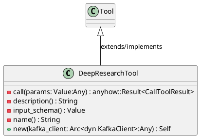
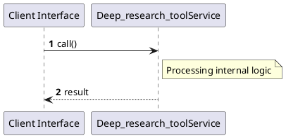

# File: deep_research_tool.rs

**Source Path:** `crates/factory-mcp-server/src/tools/deep_research_tool.rs`

## Overview

### Purpose
Provides implementation for deep_research_tool.rs.

### Responsibilities
* Handles logic related to deep_research_tool.

### Dependencies
* async_trait::async_trait, crate::protocol::{CallToolResult, McpContent}, crate::tools::Tool, factory_infrastructure::KafkaClient, serde_json::{json, Value}, std::sync::Arc, uuid::Uuid

### Imported modules
* None

### Exported classes
* DeepResearchTool

### Exported interfaces
* None

### Exported functions
* None

## Public API

### Exported Classes / Structs / Interfaces

#### DeepResearchTool

**Overview:**
No description provided.

**Constructor:**

##### `new(kafka_client: Arc<dyn KafkaClient> (Any))`
Parameters: kafka_client: Arc<dyn KafkaClient> (Any)
Dependencies: Inherited from context
Initialization: Sets up DeepResearchTool

**Attributes:**

* `kafka_client` (Arc<dyn KafkaClient>): Purpose - Stores kafka_client data. Constraints - Valid Arc<dyn KafkaClient>.

**Public Methods:**

None.

**Private Methods:**

* `call(params: Value (Any)) -> anyhow::Result<CallToolResult>`: Internal helper logic.
* `description() -> String`: Internal helper logic.
* `input_schema() -> Value`: Internal helper logic.
* `name() -> String`: Internal helper logic.

### Exported Functions

None.

## Internal architecture



## Execution flow & Sequence explanation



## Examples

```
// Example usage of deep_research_tool.rs components
import { ... } from 'crates/factory-mcp-server/src/tools/deep_research_tool.rs';
```

## Cross References
* **Parent module:** `crates/factory-mcp-server/src/tools`
* **Dependencies:** async_trait::async_trait, crate::protocol::{CallToolResult, McpContent}, crate::tools::Tool, factory_infrastructure::KafkaClient, serde_json::{json, Value}, std::sync::Arc, uuid::Uuid
