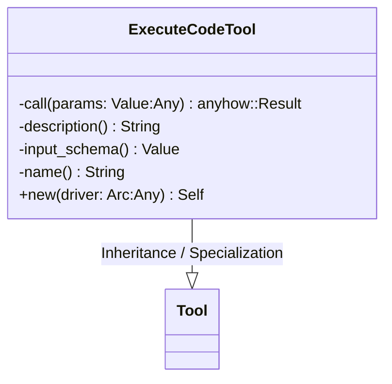
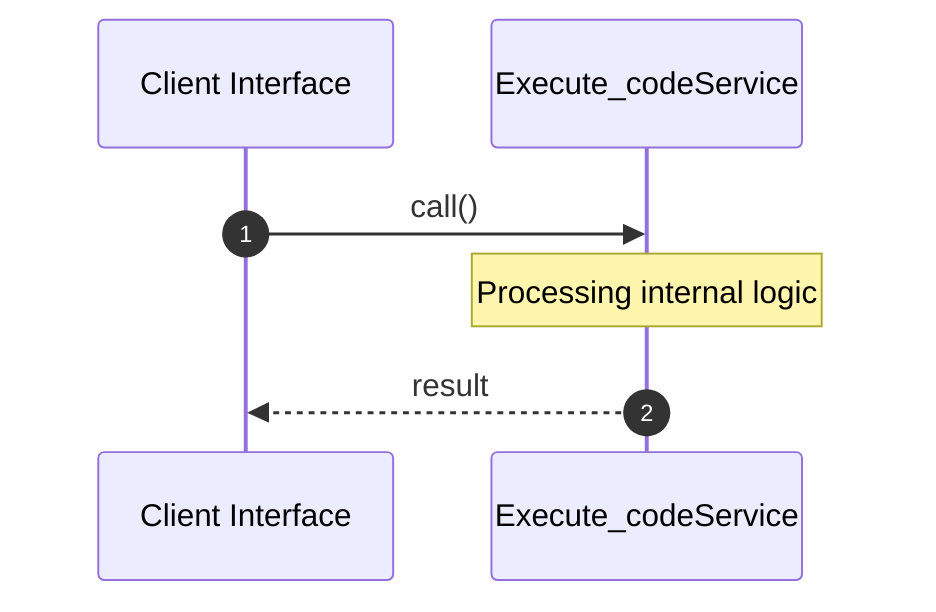
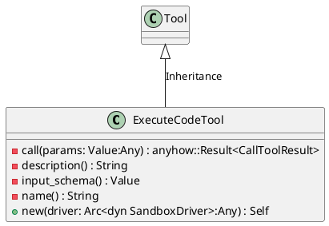
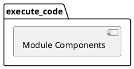
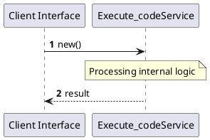
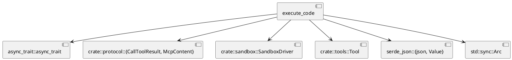
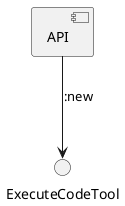

# File: execute_code.rs

**Source Path:** `crates/factory-mcp-server/src/tools/execute_code.rs`

## Overview

### Purpose
Provides implementation for execute_code.rs.

### Responsibilities
* Handles logic related to execute_code.

### Main Workflow
* Initialization and execution of execute_code logic.

### Dependencies
* async_trait::async_trait, crate::protocol::{CallToolResult, McpContent}, crate::sandbox::SandboxDriver, crate::tools::Tool, serde_json::{json, Value}, std::sync::Arc

### Imported modules
* None

### Exported classes
* ExecuteCodeTool

### Exported interfaces
* None

### Exported functions
* None

## Public API

### Exported Classes / Structs / Interfaces

#### ExecuteCodeTool

**Overview:**
Why it exists:
Provides capabilities related to ExecuteCodeTool.

What business capability it provides:
Supports core domain concepts.

How it collaborates with other classes:
Works with related entities to process logic.

**Constructor:**

##### `new(driver: Arc<dyn SandboxDriver> (Any))`
Parameters: driver: Arc<dyn SandboxDriver> (Any)
Dependencies: Inherited from context
Initialization: Sets up ExecuteCodeTool

**Attributes:**

* `driver` (Arc<dyn SandboxDriver>): Purpose - Stores driver data. Constraints - Valid Arc<dyn SandboxDriver>.

**Public Methods:**

None.

**Private Methods:**

* `call(params: Value (Any)) -> anyhow::Result<CallToolResult>`: Internal helper logic.
* `description() -> String`: Internal helper logic.
* `input_schema() -> Value`: Internal helper logic.
* `name() -> String`: Internal helper logic.

### Exported Functions

None.

## Internal architecture



## Execution flow & Sequence explanation



## UML

### Class Diagram


### Package Diagram


### Sequence Diagram


### Component Diagram
```plantuml
@startuml
component "execute_code" as comp
component "async_trait::async_trait" as async_trait::async_trait
comp --> async_trait::async_trait
component "crate::protocol::{CallToolResult, McpContent}" as crate::protocol::{CallToolResult, McpContent}
comp --> crate::protocol::{CallToolResult, McpContent}
component "crate::sandbox::SandboxDriver" as crate::sandbox::SandboxDriver
comp --> crate::sandbox::SandboxDriver
component "crate::tools::Tool" as crate::tools::Tool
comp --> crate::tools::Tool
component "serde_json::{json, Value}" as serde_json::{json, Value}
comp --> serde_json::{json, Value}
component "std::sync::Arc" as std::sync::Arc
comp --> std::sync::Arc
@enduml

```

### Dependency Graph


### Call Graph


## Examples

```
// Example usage of execute_code.rs components
import { ... } from 'crates/factory-mcp-server/src/tools/execute_code.rs';
```

## Cross References
* **Parent module:** `crates/factory-mcp-server/src/tools`
* **Dependencies:** async_trait::async_trait, crate::protocol::{CallToolResult, McpContent}, crate::sandbox::SandboxDriver, crate::tools::Tool, serde_json::{json, Value}, std::sync::Arc
