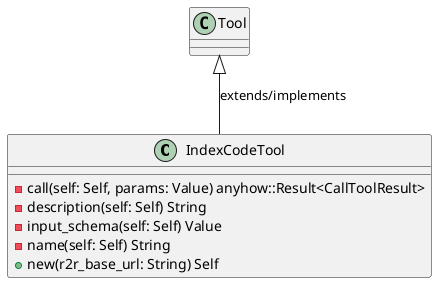
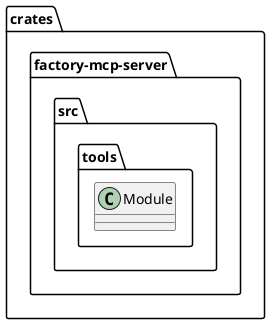
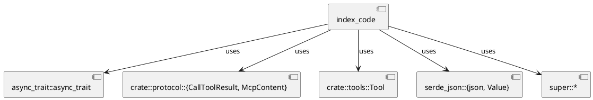
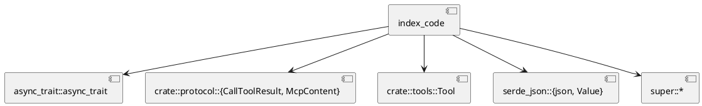
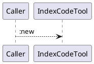
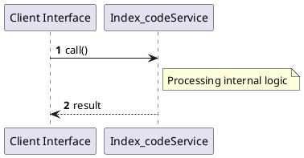

# File: index_code.rs

**Source Path:** `crates/factory-mcp-server/src/tools/index_code.rs`

## Overview

### Purpose
Provides implementation for index_code.rs.

### Responsibilities
* Handles logic related to index_code.

### Dependencies
* async_trait::async_trait, crate::protocol::{CallToolResult, McpContent}, crate::tools::Tool, serde_json::{json, Value}, super::*

### Imported modules
* None

### Exported classes
* IndexCodeTool

### Exported interfaces
* None

### Exported functions
* None

## Public API

### Exported Classes / Structs / Interfaces

#### IndexCodeTool

**Overview:**
No description provided.

**Constructor:**

##### `new(r2r_base_url (String))`
Parameters: r2r_base_url (String)
Dependencies: Inherited from context
Initialization: Sets up IndexCodeTool

**Attributes:**

* `http_client` (reqwest::Client): Purpose - Stores http_client data. Constraints - Valid reqwest::Client.
* `r2r_base_url` (String): Purpose - Stores r2r_base_url data. Constraints - Valid String.

**Public Methods:**

None.

**Private Methods:**

* `call(self (Self), params (Value)) -> anyhow::Result<CallToolResult>`: Internal helper logic.
* `description(self (Self)) -> String`: Internal helper logic.
* `input_schema(self (Self)) -> Value`: Internal helper logic.
* `name(self (Self)) -> String`: Internal helper logic.

### Exported Functions

None.

## Internal architecture



## Package Diagram



## Component Diagram



## Dependency Graph



## Call Graph



## Execution flow & Sequence explanation



## Examples

```
// Example usage of index_code.rs components
import { ... } from 'crates/factory-mcp-server/src/tools/index_code.rs';
```

## Cross References
* **Parent module:** `crates/factory-mcp-server/src/tools`
* **Dependencies:** async_trait::async_trait, crate::protocol::{CallToolResult, McpContent}, crate::tools::Tool, serde_json::{json, Value}, super::*
