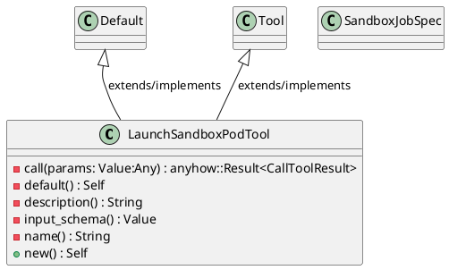
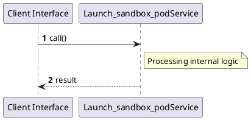

# File: launch_sandbox_pod.rs

**Source Path:** `crates/factory-mcp-server/src/tools/launch_sandbox_pod.rs`

## Overview

### Purpose
Provides implementation for launch_sandbox_pod.rs.

### Responsibilities
* Handles logic related to launch_sandbox_pod.

### Dependencies
* async_trait::async_trait, crate::protocol::{CallToolResult, McpContent}, crate::tools::Tool, k8s_openapi::api::batch::v1::Job, kube::Client, kube::api::{Api, DeleteParams, ListParams, PostParams}, serde::{Deserialize, Serialize}, serde_json::{json, Value}, tokio::time::{sleep, Duration}

### Imported modules
* None

### Exported classes
* LaunchSandboxPodTool, SandboxJobSpec

### Exported interfaces
* None

### Exported functions
* None

## Public API

### Exported Classes / Structs / Interfaces

#### LaunchSandboxPodTool

**Overview:**
No description provided.

**Constructor:**

##### `new()`
Parameters:
Dependencies: Inherited from context
Initialization: Sets up LaunchSandboxPodTool

**Attributes:**

None.

**Public Methods:**

None.

**Private Methods:**

* `call(params: Value (Any)) -> anyhow::Result<CallToolResult>`: Internal helper logic.
* `default() -> Self`: Internal helper logic.
* `description() -> String`: Internal helper logic.
* `input_schema() -> Value`: Internal helper logic.
* `name() -> String`: Internal helper logic.

#### SandboxJobSpec

**Overview:**
No description provided.

**Constructor:**

Default constructor.

**Attributes:**

* `code` (String): Purpose - Stores code data. Constraints - Valid String.
* `language` (String): Purpose - Stores language data. Constraints - Valid String.

**Public Methods:**

None.

**Private Methods:**

None.

### Exported Functions

None.

## Internal architecture



## Execution flow & Sequence explanation




## Examples

```
// Example usage of launch_sandbox_pod.rs components
import { ... } from 'crates/factory-mcp-server/src/tools/launch_sandbox_pod.rs';
```


## Cross References
* **Parent module:** `crates/factory-mcp-server/src/tools`
* **Dependencies:** async_trait::async_trait, crate::protocol::{CallToolResult, McpContent}, crate::tools::Tool, k8s_openapi::api::batch::v1::Job, kube::Client, kube::api::{Api, DeleteParams, ListParams, PostParams}, serde::{Deserialize, Serialize}, serde_json::{json, Value}, tokio::time::{sleep, Duration}
