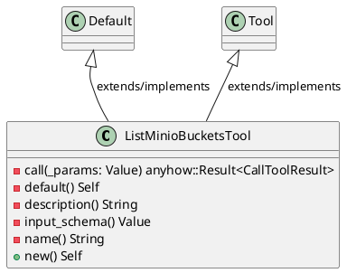
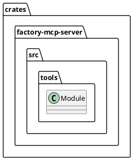
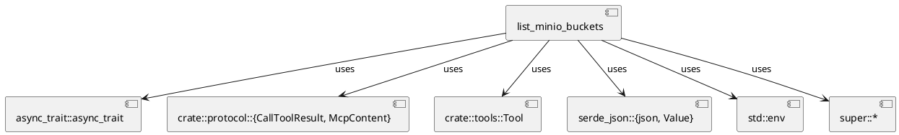
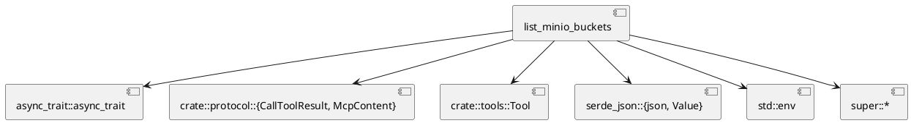
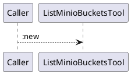
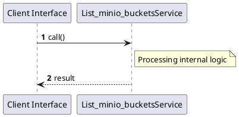

# File: list_minio_buckets.rs

**Source Path:** `crates/factory-mcp-server/src/tools/list_minio_buckets.rs`

## Overview

### Purpose
Provides implementation for list_minio_buckets.rs.

### Responsibilities
* Handles logic related to list_minio_buckets.

### Dependencies
* async_trait::async_trait, crate::protocol::{CallToolResult, McpContent}, crate::tools::Tool, serde_json::{json, Value}, std::env, super::*

### Imported modules
* None

### Exported classes
* ListMinioBucketsTool

### Exported interfaces
* None

### Exported functions
* None

## Public API

### Exported Classes / Structs / Interfaces

#### ListMinioBucketsTool

**Overview:**
No description provided.

**Constructor:**

##### `new()`
Parameters:
Dependencies: Inherited from context
Initialization: Sets up ListMinioBucketsTool

**Attributes:**

None.

**Public Methods:**

None.

**Private Methods:**

* `call(_params (Value)) -> anyhow::Result<CallToolResult>`: Internal helper logic.
* `default() -> Self`: Internal helper logic.
* `description() -> String`: Internal helper logic.
* `input_schema() -> Value`: Internal helper logic.
* `name() -> String`: Internal helper logic.

### Exported Functions

None.

## Internal architecture



## Package Diagram



## Component Diagram



## Dependency Graph



## Call Graph



## Execution flow & Sequence explanation



## Examples

```
// Example usage of list_minio_buckets.rs components
import { ... } from 'crates/factory-mcp-server/src/tools/list_minio_buckets.rs';
```

## Cross References
* **Parent module:** `crates/factory-mcp-server/src/tools`
* **Dependencies:** async_trait::async_trait, crate::protocol::{CallToolResult, McpContent}, crate::tools::Tool, serde_json::{json, Value}, std::env, super::*
