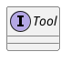
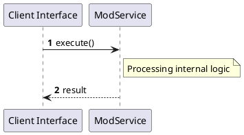

# File: mod.rs

**Source Path:** `crates/factory-mcp-server/src/tools/mod.rs`

## Overview

### Purpose
Provides implementation for mod.rs.

### Responsibilities
* Handles logic related to mod.

### Dependencies
* async_trait::async_trait, crate::protocol::CallToolResult, pub bridge::BridgeTool, pub deep_research_tool::DeepResearchTool, pub execute_code::ExecuteCodeTool, pub get_factory_status::GetFactoryStatusTool, pub index_code::IndexCodeTool, pub inspect_kafka_topic::InspectKafkaTopicTool, pub launch_sandbox_pod::LaunchSandboxPodTool, pub list_minio_buckets::ListMinioBucketsTool, pub list_minio_objects::ListMinioObjectsTool, pub plan_mission::PlanMissionTool, pub retrieve_context::RetrieveContextTool, pub run_tests::RunTestsTool, pub search_jira::SearchJiraTool, pub security_review::SecurityReviewTool, pub spec_kit_tasks_to_issues::SpecKitTasksToIssuesTool, pub spec_kit_tool::SpecKitTool, pub update_mission_status::UpdateMissionStatusTool, serde_json::Value

### Imported modules
* None

### Exported classes
* None

### Exported interfaces
* Tool

### Exported functions
* None

## Public API

### Exported Classes / Structs / Interfaces

#### Tool

**Overview:**
No description provided.

**Constructor:**

Default constructor.

**Attributes:**

None.

**Public Methods:**

None.

**Private Methods:**

None.

### Exported Functions

None.

## Internal architecture



## Execution flow & Sequence explanation




## Examples

```
// Example usage of mod.rs components
import { ... } from 'crates/factory-mcp-server/src/tools/mod.rs';
```


## Cross References
* **Parent module:** `crates/factory-mcp-server/src/tools`
* **Dependencies:** async_trait::async_trait, crate::protocol::CallToolResult, pub bridge::BridgeTool, pub deep_research_tool::DeepResearchTool, pub execute_code::ExecuteCodeTool, pub get_factory_status::GetFactoryStatusTool, pub index_code::IndexCodeTool, pub inspect_kafka_topic::InspectKafkaTopicTool, pub launch_sandbox_pod::LaunchSandboxPodTool, pub list_minio_buckets::ListMinioBucketsTool, pub list_minio_objects::ListMinioObjectsTool, pub plan_mission::PlanMissionTool, pub retrieve_context::RetrieveContextTool, pub run_tests::RunTestsTool, pub search_jira::SearchJiraTool, pub security_review::SecurityReviewTool, pub spec_kit_tasks_to_issues::SpecKitTasksToIssuesTool, pub spec_kit_tool::SpecKitTool, pub update_mission_status::UpdateMissionStatusTool, serde_json::Value
