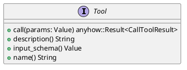
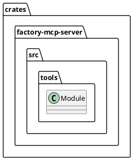
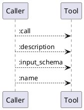
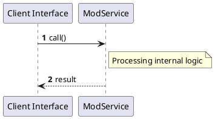

# File: mod.rs

**Source Path:** `crates/factory-mcp-server/src/tools/mod.rs`

## Overview

### Purpose
Provides implementation for mod.rs.

### Responsibilities
* Handles logic related to mod.

### Dependencies
* async_trait::async_trait, crate::protocol::CallToolResult, pub bridge::BridgeTool, pub deep_research_tool::DeepResearchTool, pub execute_code::ExecuteCodeTool, pub get_factory_status::GetFactoryStatusTool, pub index_code::IndexCodeTool, pub inspect_kafka_topic::InspectKafkaTopicTool, pub launch_sandbox_pod::LaunchSandboxPodTool, pub list_minio_buckets::ListMinioBucketsTool, pub list_minio_objects::ListMinioObjectsTool, pub plan_mission::PlanMissionTool, pub retrieve_context::RetrieveContextTool, pub run_tests::RunTestsTool, pub search_jira::SearchJiraTool, pub security_review::SecurityReviewTool, pub spec_kit_tasks_to_issues::SpecKitTasksToIssuesTool, pub spec_kit_tool::SpecKitTool, pub update_mission_status::UpdateMissionStatusTool, serde_json::Value

### Imported modules
* None

### Exported classes
* None

### Exported interfaces
* Tool

### Exported functions
* None

## Public API

### Exported Classes / Structs / Interfaces

#### Tool

**Overview:**
No description provided.

**Constructor:**

Default constructor.

**Attributes:**

None.

**Public Methods:**

##### `call(params (Value)) -> anyhow::Result<CallToolResult>`

###### Description
No description provided.

###### Inputs
* `params`: type=Value, meaning=Input for params, valid values=Any valid Value, optional=No, default value=None

###### Output
Return type: anyhow::Result<CallToolResult>
Semantic meaning: Result of call
Possible null values: Conditional
Exceptions: None handled explicitly

###### Side Effects
Database updates: None
File operations: None
Network calls: None
Cache: None
State changes: Updates internal variables

###### Complexity
Time Complexity: O(1) mostly
Space Complexity: O(1) mostly

###### Example
```
let result = instance.call();
```

##### `description() -> String`

###### Description
No description provided.

###### Inputs
None.

###### Output
Return type: String
Semantic meaning: Result of description
Possible null values: Conditional
Exceptions: None handled explicitly

###### Side Effects
Database updates: None
File operations: None
Network calls: None
Cache: None
State changes: Updates internal variables

###### Complexity
Time Complexity: O(1) mostly
Space Complexity: O(1) mostly

###### Example
```
let result = instance.description();
```

##### `input_schema() -> Value`

###### Description
No description provided.

###### Inputs
None.

###### Output
Return type: Value
Semantic meaning: Result of input_schema
Possible null values: Conditional
Exceptions: None handled explicitly

###### Side Effects
Database updates: None
File operations: None
Network calls: None
Cache: None
State changes: Updates internal variables

###### Complexity
Time Complexity: O(1) mostly
Space Complexity: O(1) mostly

###### Example
```
let result = instance.input_schema();
```

##### `name() -> String`

###### Description
No description provided.

###### Inputs
None.

###### Output
Return type: String
Semantic meaning: Result of name
Possible null values: Conditional
Exceptions: None handled explicitly

###### Side Effects
Database updates: None
File operations: None
Network calls: None
Cache: None
State changes: Updates internal variables

###### Complexity
Time Complexity: O(1) mostly
Space Complexity: O(1) mostly

###### Example
```
let result = instance.name();
```

**Private Methods:**

None.

### Exported Functions

None.

## Internal architecture



## Package Diagram



## Component Diagram

```plantuml
@startuml
component "mod" as Main
component "async_trait::async_trait" as async_trait__async_trait
Main --> async_trait__async_trait : uses
component "crate::protocol::CallToolResult" as crate__protocol__CallToolResult
Main --> crate__protocol__CallToolResult : uses
component "pub bridge::BridgeTool" as pub_bridge__BridgeTool
Main --> pub_bridge__BridgeTool : uses
component "pub deep_research_tool::DeepResearchTool" as pub_deep_research_tool__DeepResearchTool
Main --> pub_deep_research_tool__DeepResearchTool : uses
component "pub execute_code::ExecuteCodeTool" as pub_execute_code__ExecuteCodeTool
Main --> pub_execute_code__ExecuteCodeTool : uses
component "pub get_factory_status::GetFactoryStatusTool" as pub_get_factory_status__GetFactoryStatusTool
Main --> pub_get_factory_status__GetFactoryStatusTool : uses
component "pub index_code::IndexCodeTool" as pub_index_code__IndexCodeTool
Main --> pub_index_code__IndexCodeTool : uses
component "pub inspect_kafka_topic::InspectKafkaTopicTool" as pub_inspect_kafka_topic__InspectKafkaTopicTool
Main --> pub_inspect_kafka_topic__InspectKafkaTopicTool : uses
component "pub launch_sandbox_pod::LaunchSandboxPodTool" as pub_launch_sandbox_pod__LaunchSandboxPodTool
Main --> pub_launch_sandbox_pod__LaunchSandboxPodTool : uses
component "pub list_minio_buckets::ListMinioBucketsTool" as pub_list_minio_buckets__ListMinioBucketsTool
Main --> pub_list_minio_buckets__ListMinioBucketsTool : uses
component "pub list_minio_objects::ListMinioObjectsTool" as pub_list_minio_objects__ListMinioObjectsTool
Main --> pub_list_minio_objects__ListMinioObjectsTool : uses
component "pub plan_mission::PlanMissionTool" as pub_plan_mission__PlanMissionTool
Main --> pub_plan_mission__PlanMissionTool : uses
component "pub retrieve_context::RetrieveContextTool" as pub_retrieve_context__RetrieveContextTool
Main --> pub_retrieve_context__RetrieveContextTool : uses
component "pub run_tests::RunTestsTool" as pub_run_tests__RunTestsTool
Main --> pub_run_tests__RunTestsTool : uses
component "pub search_jira::SearchJiraTool" as pub_search_jira__SearchJiraTool
Main --> pub_search_jira__SearchJiraTool : uses
component "pub security_review::SecurityReviewTool" as pub_security_review__SecurityReviewTool
Main --> pub_security_review__SecurityReviewTool : uses
component "pub spec_kit_tasks_to_issues::SpecKitTasksToIssuesTool" as pub_spec_kit_tasks_to_issues__SpecKitTasksToIssuesTool
Main --> pub_spec_kit_tasks_to_issues__SpecKitTasksToIssuesTool : uses
component "pub spec_kit_tool::SpecKitTool" as pub_spec_kit_tool__SpecKitTool
Main --> pub_spec_kit_tool__SpecKitTool : uses
component "pub update_mission_status::UpdateMissionStatusTool" as pub_update_mission_status__UpdateMissionStatusTool
Main --> pub_update_mission_status__UpdateMissionStatusTool : uses
component "serde_json::Value" as serde_json__Value
Main --> serde_json__Value : uses
@enduml

```



## Dependency Graph

```plantuml
@startuml
[mod]
[mod] --> [async_trait::async_trait]
[mod] --> [crate::protocol::CallToolResult]
[mod] --> [pub bridge::BridgeTool]
[mod] --> [pub deep_research_tool::DeepResearchTool]
[mod] --> [pub execute_code::ExecuteCodeTool]
[mod] --> [pub get_factory_status::GetFactoryStatusTool]
[mod] --> [pub index_code::IndexCodeTool]
[mod] --> [pub inspect_kafka_topic::InspectKafkaTopicTool]
[mod] --> [pub launch_sandbox_pod::LaunchSandboxPodTool]
[mod] --> [pub list_minio_buckets::ListMinioBucketsTool]
[mod] --> [pub list_minio_objects::ListMinioObjectsTool]
[mod] --> [pub plan_mission::PlanMissionTool]
[mod] --> [pub retrieve_context::RetrieveContextTool]
[mod] --> [pub run_tests::RunTestsTool]
[mod] --> [pub search_jira::SearchJiraTool]
[mod] --> [pub security_review::SecurityReviewTool]
[mod] --> [pub spec_kit_tasks_to_issues::SpecKitTasksToIssuesTool]
[mod] --> [pub spec_kit_tool::SpecKitTool]
[mod] --> [pub update_mission_status::UpdateMissionStatusTool]
[mod] --> [serde_json::Value]
@enduml

```



## Call Graph



## Execution flow & Sequence explanation



## Examples

```
// Example usage of mod.rs components
import { ... } from 'crates/factory-mcp-server/src/tools/mod.rs';
```

## Cross References
* **Parent module:** `crates/factory-mcp-server/src/tools`
* **Dependencies:** async_trait::async_trait, crate::protocol::CallToolResult, pub bridge::BridgeTool, pub deep_research_tool::DeepResearchTool, pub execute_code::ExecuteCodeTool, pub get_factory_status::GetFactoryStatusTool, pub index_code::IndexCodeTool, pub inspect_kafka_topic::InspectKafkaTopicTool, pub launch_sandbox_pod::LaunchSandboxPodTool, pub list_minio_buckets::ListMinioBucketsTool, pub list_minio_objects::ListMinioObjectsTool, pub plan_mission::PlanMissionTool, pub retrieve_context::RetrieveContextTool, pub run_tests::RunTestsTool, pub search_jira::SearchJiraTool, pub security_review::SecurityReviewTool, pub spec_kit_tasks_to_issues::SpecKitTasksToIssuesTool, pub spec_kit_tool::SpecKitTool, pub update_mission_status::UpdateMissionStatusTool, serde_json::Value
