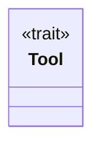
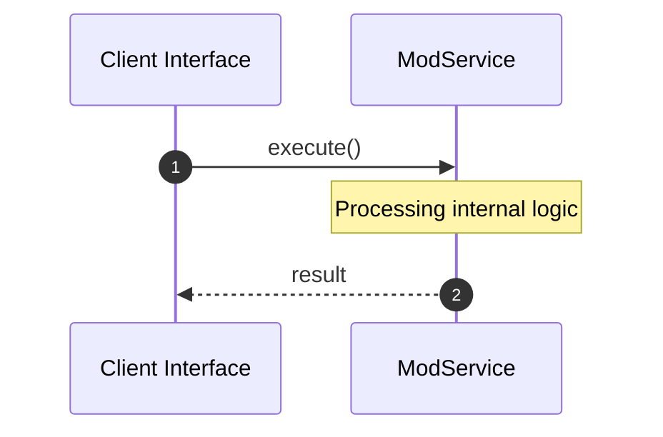
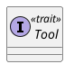
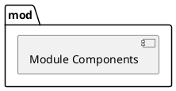
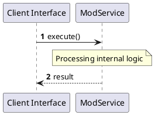
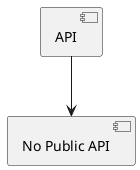

# File: mod.rs

**Source Path:** `crates/factory-mcp-server/src/tools/mod.rs`

## Overview

### Purpose
Provides implementation for mod.rs.

### Responsibilities
* Handles logic related to mod.

### Main Workflow
* Initialization and execution of mod logic.

### Dependencies
* async_trait::async_trait, crate::protocol::CallToolResult, pub bridge::BridgeTool, pub execute_code::ExecuteCodeTool, pub index_code::IndexCodeTool, pub launch_sandbox_pod::LaunchSandboxPodTool, pub plan_mission::PlanMissionTool, pub retrieve_context::RetrieveContextTool, pub run_tests::RunTestsTool, pub search_jira::SearchJiraTool, pub security_review::SecurityReviewTool, pub spec_kit_tasks_to_issues::SpecKitTasksToIssuesTool, pub spec_kit_tool::SpecKitTool, pub update_mission_status::UpdateMissionStatusTool, serde_json::Value

### Imported modules
* None

### Exported classes
* None

### Exported interfaces
* Tool

### Exported functions
* None

## Public API

### Exported Classes / Structs / Interfaces

#### Tool

**Overview:**
Why it exists:
Provides capabilities related to Tool.

What business capability it provides:
Supports core domain concepts.

How it collaborates with other classes:
Works with related entities to process logic.

**Constructor:**

Default constructor.

**Attributes:**

None.

**Public Methods:**

None.

**Private Methods:**

None.

### Exported Functions

None.

## Internal architecture



## Execution flow & Sequence explanation



## UML

### Class Diagram


### Package Diagram


### Sequence Diagram


### Component Diagram
```plantuml
@startuml
component "mod" as comp
component "async_trait::async_trait" as async_trait::async_trait
comp --> async_trait::async_trait
component "crate::protocol::CallToolResult" as crate::protocol::CallToolResult
comp --> crate::protocol::CallToolResult
component "pub bridge::BridgeTool" as pub bridge::BridgeTool
comp --> pub bridge::BridgeTool
component "pub execute_code::ExecuteCodeTool" as pub execute_code::ExecuteCodeTool
comp --> pub execute_code::ExecuteCodeTool
component "pub index_code::IndexCodeTool" as pub index_code::IndexCodeTool
comp --> pub index_code::IndexCodeTool
component "pub launch_sandbox_pod::LaunchSandboxPodTool" as pub launch_sandbox_pod::LaunchSandboxPodTool
comp --> pub launch_sandbox_pod::LaunchSandboxPodTool
component "pub plan_mission::PlanMissionTool" as pub plan_mission::PlanMissionTool
comp --> pub plan_mission::PlanMissionTool
component "pub retrieve_context::RetrieveContextTool" as pub retrieve_context::RetrieveContextTool
comp --> pub retrieve_context::RetrieveContextTool
component "pub run_tests::RunTestsTool" as pub run_tests::RunTestsTool
comp --> pub run_tests::RunTestsTool
component "pub search_jira::SearchJiraTool" as pub search_jira::SearchJiraTool
comp --> pub search_jira::SearchJiraTool
component "pub security_review::SecurityReviewTool" as pub security_review::SecurityReviewTool
comp --> pub security_review::SecurityReviewTool
component "pub spec_kit_tasks_to_issues::SpecKitTasksToIssuesTool" as pub spec_kit_tasks_to_issues::SpecKitTasksToIssuesTool
comp --> pub spec_kit_tasks_to_issues::SpecKitTasksToIssuesTool
component "pub spec_kit_tool::SpecKitTool" as pub spec_kit_tool::SpecKitTool
comp --> pub spec_kit_tool::SpecKitTool
component "pub update_mission_status::UpdateMissionStatusTool" as pub update_mission_status::UpdateMissionStatusTool
comp --> pub update_mission_status::UpdateMissionStatusTool
component "serde_json::Value" as serde_json::Value
comp --> serde_json::Value
@enduml

```

### Dependency Graph

```plantuml
@startuml
[mod]
[mod] --> [async_trait::async_trait]
[mod] --> [crate::protocol::CallToolResult]
[mod] --> [pub bridge::BridgeTool]
[mod] --> [pub execute_code::ExecuteCodeTool]
[mod] --> [pub index_code::IndexCodeTool]
[mod] --> [pub launch_sandbox_pod::LaunchSandboxPodTool]
[mod] --> [pub plan_mission::PlanMissionTool]
[mod] --> [pub retrieve_context::RetrieveContextTool]
[mod] --> [pub run_tests::RunTestsTool]
[mod] --> [pub search_jira::SearchJiraTool]
[mod] --> [pub security_review::SecurityReviewTool]
[mod] --> [pub spec_kit_tasks_to_issues::SpecKitTasksToIssuesTool]
[mod] --> [pub spec_kit_tool::SpecKitTool]
[mod] --> [pub update_mission_status::UpdateMissionStatusTool]
[mod] --> [serde_json::Value]
@enduml

```


### Call Graph


## Examples

```
// Example usage of mod.rs components
import { ... } from 'crates/factory-mcp-server/src/tools/mod.rs';
```

## Cross References
* **Parent module:** `crates/factory-mcp-server/src/tools`
* **Dependencies:** async_trait::async_trait, crate::protocol::CallToolResult, pub bridge::BridgeTool, pub execute_code::ExecuteCodeTool, pub index_code::IndexCodeTool, pub launch_sandbox_pod::LaunchSandboxPodTool, pub plan_mission::PlanMissionTool, pub retrieve_context::RetrieveContextTool, pub run_tests::RunTestsTool, pub search_jira::SearchJiraTool, pub security_review::SecurityReviewTool, pub spec_kit_tasks_to_issues::SpecKitTasksToIssuesTool, pub spec_kit_tool::SpecKitTool, pub update_mission_status::UpdateMissionStatusTool, serde_json::Value
