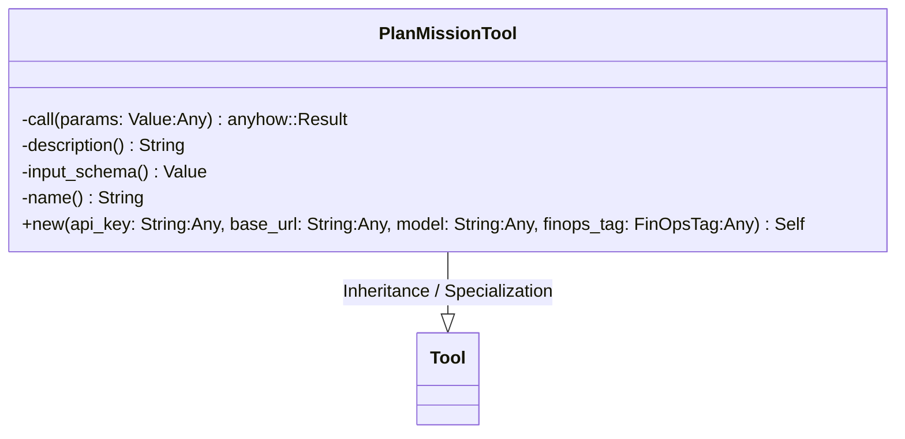
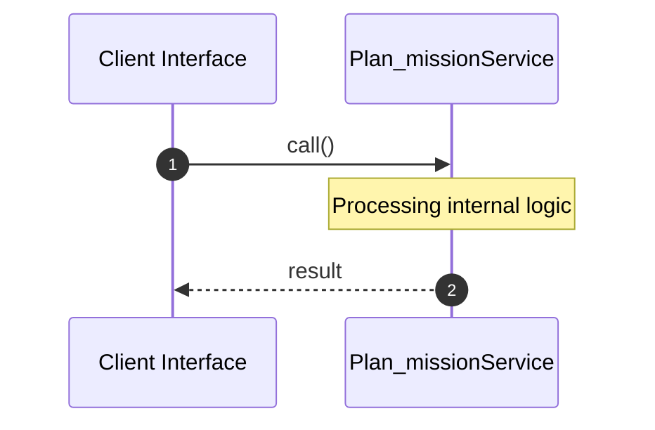
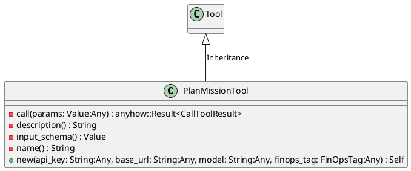
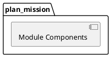
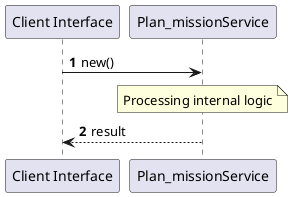
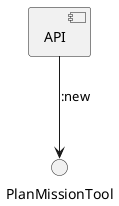

# File: plan_mission.rs

**Source Path:** `crates/factory-mcp-server/src/tools/plan_mission.rs`

## Overview

### Purpose
Provides implementation for plan_mission.rs.

### Responsibilities
* Handles logic related to plan_mission.

### Main Workflow
* Initialization and execution of plan_mission logic.

### Dependencies
* async_openai::{
    types::{
        ChatCompletionRequestSystemMessageArgs, ChatCompletionRequestUserMessageArgs,
        ChatCompletionResponseFormat, ChatCompletionResponseFormatType,
        CreateChatCompletionRequestArgs,
    },
    Client,
}, async_trait::async_trait, crate::protocol::{CallToolResult, McpContent}, crate::tools::Tool, factory_core::FinOpsTag, reqwest::header::{HeaderMap, HeaderValue}, serde_json::{json, Value}

### Imported modules
* None

### Exported classes
* PlanMissionTool

### Exported interfaces
* None

### Exported functions
* None

## Public API

### Exported Classes / Structs / Interfaces

#### PlanMissionTool

**Overview:**
Why it exists:
Provides capabilities related to PlanMissionTool.

What business capability it provides:
Supports core domain concepts.

How it collaborates with other classes:
Works with related entities to process logic.

**Constructor:**

##### `new(api_key: String (Any), base_url: String (Any), model: String (Any), finops_tag: FinOpsTag (Any))`
Parameters: api_key: String (Any), base_url: String (Any), model: String (Any), finops_tag: FinOpsTag (Any)
Dependencies: Inherited from context
Initialization: Sets up PlanMissionTool

**Attributes:**

* `client` (Client<async_openai::config::OpenAIConfig>): Purpose - Stores client data. Constraints - Valid Client<async_openai::config::OpenAIConfig>.
* `model` (String): Purpose - Stores model data. Constraints - Valid String.

**Public Methods:**

None.

**Private Methods:**

* `call(params: Value (Any)) -> anyhow::Result<CallToolResult>`: Internal helper logic.
* `description() -> String`: Internal helper logic.
* `input_schema() -> Value`: Internal helper logic.
* `name() -> String`: Internal helper logic.

### Exported Functions

None.

## Internal architecture



## Execution flow & Sequence explanation



## UML

### Class Diagram


### Package Diagram


### Sequence Diagram


### Component Diagram
```plantuml
@startuml
component "plan_mission" as comp
component "async_openai::{
    types::{
        ChatCompletionRequestSystemMessageArgs, ChatCompletionRequestUserMessageArgs,
        ChatCompletionResponseFormat, ChatCompletionResponseFormatType,
        CreateChatCompletionRequestArgs,
    },
    Client,
}" as async_openai::{
    types::{
        ChatCompletionRequestSystemMessageArgs, ChatCompletionRequestUserMessageArgs,
        ChatCompletionResponseFormat, ChatCompletionResponseFormatType,
        CreateChatCompletionRequestArgs,
    },
    Client,
}
comp --> async_openai::{
    types::{
        ChatCompletionRequestSystemMessageArgs, ChatCompletionRequestUserMessageArgs,
        ChatCompletionResponseFormat, ChatCompletionResponseFormatType,
        CreateChatCompletionRequestArgs,
    },
    Client,
}
component "async_trait::async_trait" as async_trait::async_trait
comp --> async_trait::async_trait
component "crate::protocol::{CallToolResult, McpContent}" as crate::protocol::{CallToolResult, McpContent}
comp --> crate::protocol::{CallToolResult, McpContent}
component "crate::tools::Tool" as crate::tools::Tool
comp --> crate::tools::Tool
component "factory_core::FinOpsTag" as factory_core::FinOpsTag
comp --> factory_core::FinOpsTag
component "reqwest::header::{HeaderMap, HeaderValue}" as reqwest::header::{HeaderMap, HeaderValue}
comp --> reqwest::header::{HeaderMap, HeaderValue}
component "serde_json::{json, Value}" as serde_json::{json, Value}
comp --> serde_json::{json, Value}
@enduml

```

### Dependency Graph
```plantuml
@startuml
[plan_mission]
[plan_mission] --> [async_openai::{
    types::{
        ChatCompletionRequestSystemMessageArgs, ChatCompletionRequestUserMessageArgs,
        ChatCompletionResponseFormat, ChatCompletionResponseFormatType,
        CreateChatCompletionRequestArgs,
    },
    Client,
}]
[plan_mission] --> [async_trait::async_trait]
[plan_mission] --> [crate::protocol::{CallToolResult, McpContent}]
[plan_mission] --> [crate::tools::Tool]
[plan_mission] --> [factory_core::FinOpsTag]
[plan_mission] --> [reqwest::header::{HeaderMap, HeaderValue}]
[plan_mission] --> [serde_json::{json, Value}]
@enduml

```

### Call Graph


## Examples

```
// Example usage of plan_mission.rs components
import { ... } from 'crates/factory-mcp-server/src/tools/plan_mission.rs';
```

## Cross References
* **Parent module:** `crates/factory-mcp-server/src/tools`
* **Dependencies:** async_openai::{
    types::{
        ChatCompletionRequestSystemMessageArgs, ChatCompletionRequestUserMessageArgs,
        ChatCompletionResponseFormat, ChatCompletionResponseFormatType,
        CreateChatCompletionRequestArgs,
    },
    Client,
}, async_trait::async_trait, crate::protocol::{CallToolResult, McpContent}, crate::tools::Tool, factory_core::FinOpsTag, reqwest::header::{HeaderMap, HeaderValue}, serde_json::{json, Value}
