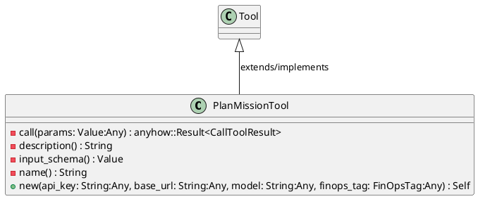
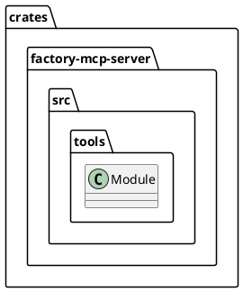
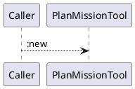
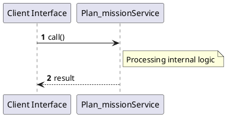

# File: plan_mission.rs

**Source Path:** `crates/factory-mcp-server/src/tools/plan_mission.rs`

## Overview

### Purpose
Provides implementation for plan_mission.rs.

### Responsibilities
* Handles logic related to plan_mission.

### Dependencies
* async_openai::{
    types::{
        ChatCompletionRequestSystemMessageArgs, ChatCompletionRequestUserMessageArgs,
        ChatCompletionResponseFormat, ChatCompletionResponseFormatType,
        CreateChatCompletionRequestArgs,
    },
    Client,
}, async_trait::async_trait, crate::protocol::{CallToolResult, McpContent}, crate::tools::Tool, factory_core::FinOpsTag, reqwest::header::{HeaderMap, HeaderValue}, serde_json::{json, Value}

### Imported modules
* None

### Exported classes
* PlanMissionTool

### Exported interfaces
* None

### Exported functions
* None

## Public API

### Exported Classes / Structs / Interfaces

#### PlanMissionTool

**Overview:**
No description provided.

**Constructor:**

##### `new(api_key: String (Any), base_url: String (Any), model: String (Any), finops_tag: FinOpsTag (Any))`
Parameters: api_key: String (Any), base_url: String (Any), model: String (Any), finops_tag: FinOpsTag (Any)
Dependencies: Inherited from context
Initialization: Sets up PlanMissionTool

**Attributes:**

* `client` (Client<async_openai::config::OpenAIConfig>): Purpose - Stores client data. Constraints - Valid Client<async_openai::config::OpenAIConfig>.
* `model` (String): Purpose - Stores model data. Constraints - Valid String.

**Public Methods:**

None.

**Private Methods:**

* `call(params: Value (Any)) -> anyhow::Result<CallToolResult>`: Internal helper logic.
* `description() -> String`: Internal helper logic.
* `input_schema() -> Value`: Internal helper logic.
* `name() -> String`: Internal helper logic.

### Exported Functions

None.

## Internal architecture



## Package Diagram



## Component Diagram

```plantuml
@startuml
component "plan_mission" as Main
component "async_openai::{
    types::{
        ChatCompletionRequestSystemMessageArgs, ChatCompletionRequestUserMessageArgs,
        ChatCompletionResponseFormat, ChatCompletionResponseFormatType,
        CreateChatCompletionRequestArgs,
    },
    Client,
}" as async_openai________types____________ChatCompletionRequestSystemMessageArgs__ChatCompletionRequestUserMessageArgs__________ChatCompletionResponseFormat__ChatCompletionResponseFormatType__________CreateChatCompletionRequestArgs_____________Client___
Main --> async_openai________types____________ChatCompletionRequestSystemMessageArgs__ChatCompletionRequestUserMessageArgs__________ChatCompletionResponseFormat__ChatCompletionResponseFormatType__________CreateChatCompletionRequestArgs_____________Client___ : uses
component "async_trait::async_trait" as async_trait__async_trait
Main --> async_trait__async_trait : uses
component "crate::protocol::{CallToolResult, McpContent}" as crate__protocol___CallToolResult__McpContent_
Main --> crate__protocol___CallToolResult__McpContent_ : uses
component "crate::tools::Tool" as crate__tools__Tool
Main --> crate__tools__Tool : uses
component "factory_core::FinOpsTag" as factory_core__FinOpsTag
Main --> factory_core__FinOpsTag : uses
component "reqwest::header::{HeaderMap, HeaderValue}" as reqwest__header___HeaderMap__HeaderValue_
Main --> reqwest__header___HeaderMap__HeaderValue_ : uses
component "serde_json::{json, Value}" as serde_json___json__Value_
Main --> serde_json___json__Value_ : uses
@enduml

```

## Dependency Graph

```plantuml
@startuml
[plan_mission]
[plan_mission] --> [async_openai::{
    types::{
        ChatCompletionRequestSystemMessageArgs, ChatCompletionRequestUserMessageArgs,
        ChatCompletionResponseFormat, ChatCompletionResponseFormatType,
        CreateChatCompletionRequestArgs,
    },
    Client,
}]
[plan_mission] --> [async_trait::async_trait]
[plan_mission] --> [crate::protocol::{CallToolResult, McpContent}]
[plan_mission] --> [crate::tools::Tool]
[plan_mission] --> [factory_core::FinOpsTag]
[plan_mission] --> [reqwest::header::{HeaderMap, HeaderValue}]
[plan_mission] --> [serde_json::{json, Value}]
@enduml

```

## Call Graph



## Execution flow & Sequence explanation



## Examples

```
// Example usage of plan_mission.rs components
import { ... } from 'crates/factory-mcp-server/src/tools/plan_mission.rs';
```

## Cross References
* **Parent module:** `crates/factory-mcp-server/src/tools`
* **Dependencies:** async_openai::{
    types::{
        ChatCompletionRequestSystemMessageArgs, ChatCompletionRequestUserMessageArgs,
        ChatCompletionResponseFormat, ChatCompletionResponseFormatType,
        CreateChatCompletionRequestArgs,
    },
    Client,
}, async_trait::async_trait, crate::protocol::{CallToolResult, McpContent}, crate::tools::Tool, factory_core::FinOpsTag, reqwest::header::{HeaderMap, HeaderValue}, serde_json::{json, Value}
