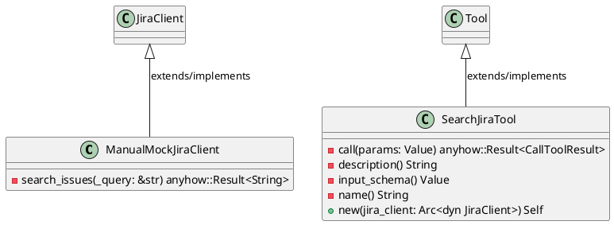
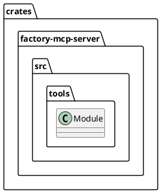
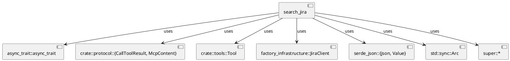
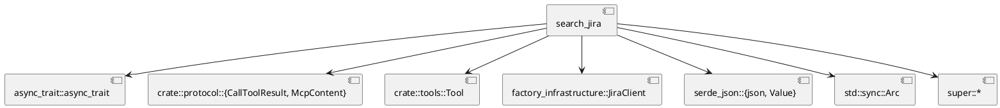
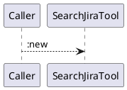
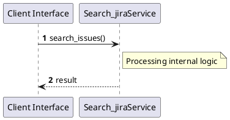

# File: search_jira.rs

**Source Path:** `crates/factory-mcp-server/src/tools/search_jira.rs`

## Overview

### Purpose
Provides implementation for search_jira.rs.

### Responsibilities
* Handles logic related to search_jira.

### Dependencies
* async_trait::async_trait, crate::protocol::{CallToolResult, McpContent}, crate::tools::Tool, factory_infrastructure::JiraClient, serde_json::{json, Value}, std::sync::Arc, super::*

### Imported modules
* None

### Exported classes
* ManualMockJiraClient, SearchJiraTool

### Exported interfaces
* None

### Exported functions
* None

## Public API

### Exported Classes / Structs / Interfaces

#### ManualMockJiraClient

**Overview:**
No description provided.

**Constructor:**

Default constructor.

**Attributes:**

* `should_fail` (bool): Purpose - Stores should_fail data. Constraints - Valid bool.

**Public Methods:**

None.

**Private Methods:**

* `search_issues(_query (&str)) -> anyhow::Result<String>`: Internal helper logic.

#### SearchJiraTool

**Overview:**
No description provided.

**Constructor:**

##### `new(jira_client (Arc<dyn JiraClient>))`
Parameters: jira_client (Arc<dyn JiraClient>)
Dependencies: Inherited from context
Initialization: Sets up SearchJiraTool

**Attributes:**

* `jira_client` (Arc<dyn JiraClient>): Purpose - Stores jira_client data. Constraints - Valid Arc<dyn JiraClient>.

**Public Methods:**

None.

**Private Methods:**

* `call(params (Value)) -> anyhow::Result<CallToolResult>`: Internal helper logic.
* `description() -> String`: Internal helper logic.
* `input_schema() -> Value`: Internal helper logic.
* `name() -> String`: Internal helper logic.

### Exported Functions

None.

## Internal architecture



## Package Diagram



## Component Diagram



## Dependency Graph



## Call Graph



## Execution flow & Sequence explanation



## Examples

```
// Example usage of search_jira.rs components
import { ... } from 'crates/factory-mcp-server/src/tools/search_jira.rs';
```

## Cross References
* **Parent module:** `crates/factory-mcp-server/src/tools`
* **Dependencies:** async_trait::async_trait, crate::protocol::{CallToolResult, McpContent}, crate::tools::Tool, factory_infrastructure::JiraClient, serde_json::{json, Value}, std::sync::Arc, super::*
