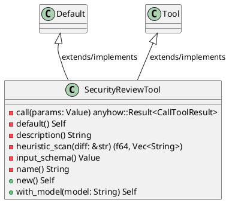
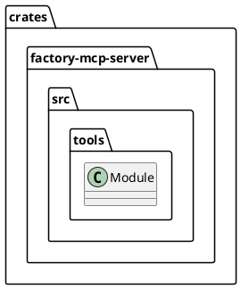
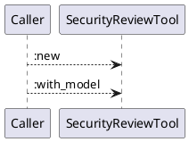
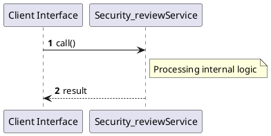

# File: security_review.rs

**Source Path:** `crates/factory-mcp-server/src/tools/security_review.rs`

## Overview

### Purpose
Provides implementation for security_review.rs.

### Responsibilities
* Handles logic related to security_review.

### Dependencies
* async_openai::Client, async_openai::config::OpenAIConfig, async_openai::types::{
    ChatCompletionRequestSystemMessageArgs, ChatCompletionRequestUserMessageArgs,
    ChatCompletionResponseFormat, ChatCompletionResponseFormatType,
    CreateChatCompletionRequestArgs,
}, async_trait::async_trait, crate::protocol::{CallToolResult, McpContent}, crate::tools::Tool, serde_json::{json, Value}, std::env, super::*

### Imported modules
* None

### Exported classes
* SecurityReviewTool

### Exported interfaces
* None

### Exported functions
* None

## Public API

### Exported Classes / Structs / Interfaces

#### SecurityReviewTool

**Overview:**
No description provided.

**Constructor:**

##### `new()`
Parameters:
Dependencies: Inherited from context
Initialization: Sets up SecurityReviewTool

**Attributes:**

* `client` (Client<OpenAIConfig>): Purpose - Stores client data. Constraints - Valid Client<OpenAIConfig>.
* `model` (String): Purpose - Stores model data. Constraints - Valid String.

**Public Methods:**

##### `with_model(model (String)) -> Self`

###### Description
No description provided.

###### Inputs
* `model`: type=String, meaning=Input for model, valid values=Any valid String, optional=No, default value=None

###### Output
Return type: Self
Semantic meaning: Result of with_model
Possible null values: Conditional
Exceptions: None handled explicitly

###### Side Effects
Database updates: None
File operations: None
Network calls: None
Cache: None
State changes: Updates internal variables

###### Complexity
Time Complexity: O(1) mostly
Space Complexity: O(1) mostly

###### Example
```
let result = instance.with_model();
```

**Private Methods:**

* `call(params (Value)) -> anyhow::Result<CallToolResult>`: Internal helper logic.
* `default() -> Self`: Internal helper logic.
* `description() -> String`: Internal helper logic.
* `heuristic_scan(diff (&str)) -> (f64, Vec<String>)`: Internal helper logic.
* `input_schema() -> Value`: Internal helper logic.
* `name() -> String`: Internal helper logic.

### Exported Functions

None.

## Internal architecture



## Package Diagram



## Component Diagram

```plantuml
@startuml
component "security_review" as Main
component "async_openai::Client" as async_openai__Client
Main --> async_openai__Client : uses
component "async_openai::config::OpenAIConfig" as async_openai__config__OpenAIConfig
Main --> async_openai__config__OpenAIConfig : uses
component "async_openai::types::{
    ChatCompletionRequestSystemMessageArgs, ChatCompletionRequestUserMessageArgs,
    ChatCompletionResponseFormat, ChatCompletionResponseFormatType,
    CreateChatCompletionRequestArgs,
}" as async_openai__types________ChatCompletionRequestSystemMessageArgs__ChatCompletionRequestUserMessageArgs______ChatCompletionResponseFormat__ChatCompletionResponseFormatType______CreateChatCompletionRequestArgs___
Main --> async_openai__types________ChatCompletionRequestSystemMessageArgs__ChatCompletionRequestUserMessageArgs______ChatCompletionResponseFormat__ChatCompletionResponseFormatType______CreateChatCompletionRequestArgs___ : uses
component "async_trait::async_trait" as async_trait__async_trait
Main --> async_trait__async_trait : uses
component "crate::protocol::{CallToolResult, McpContent}" as crate__protocol___CallToolResult__McpContent_
Main --> crate__protocol___CallToolResult__McpContent_ : uses
component "crate::tools::Tool" as crate__tools__Tool
Main --> crate__tools__Tool : uses
component "serde_json::{json, Value}" as serde_json___json__Value_
Main --> serde_json___json__Value_ : uses
component "std::env" as std__env
Main --> std__env : uses
component "super::*" as super___
Main --> super___ : uses
@enduml

```

## Dependency Graph

```plantuml
@startuml
[security_review]
[security_review] --> [async_openai::Client]
[security_review] --> [async_openai::config::OpenAIConfig]
[security_review] --> [async_openai::types::{
    ChatCompletionRequestSystemMessageArgs, ChatCompletionRequestUserMessageArgs,
    ChatCompletionResponseFormat, ChatCompletionResponseFormatType,
    CreateChatCompletionRequestArgs,
}]
[security_review] --> [async_trait::async_trait]
[security_review] --> [crate::protocol::{CallToolResult, McpContent}]
[security_review] --> [crate::tools::Tool]
[security_review] --> [serde_json::{json, Value}]
[security_review] --> [std::env]
[security_review] --> [super::*]
@enduml

```

## Call Graph



## Execution flow & Sequence explanation



## Examples

```
// Example usage of security_review.rs components
import { ... } from 'crates/factory-mcp-server/src/tools/security_review.rs';
```

## Cross References
* **Parent module:** `crates/factory-mcp-server/src/tools`
* **Dependencies:** async_openai::Client, async_openai::config::OpenAIConfig, async_openai::types::{
    ChatCompletionRequestSystemMessageArgs, ChatCompletionRequestUserMessageArgs,
    ChatCompletionResponseFormat, ChatCompletionResponseFormatType,
    CreateChatCompletionRequestArgs,
}, async_trait::async_trait, crate::protocol::{CallToolResult, McpContent}, crate::tools::Tool, serde_json::{json, Value}, std::env, super::*
