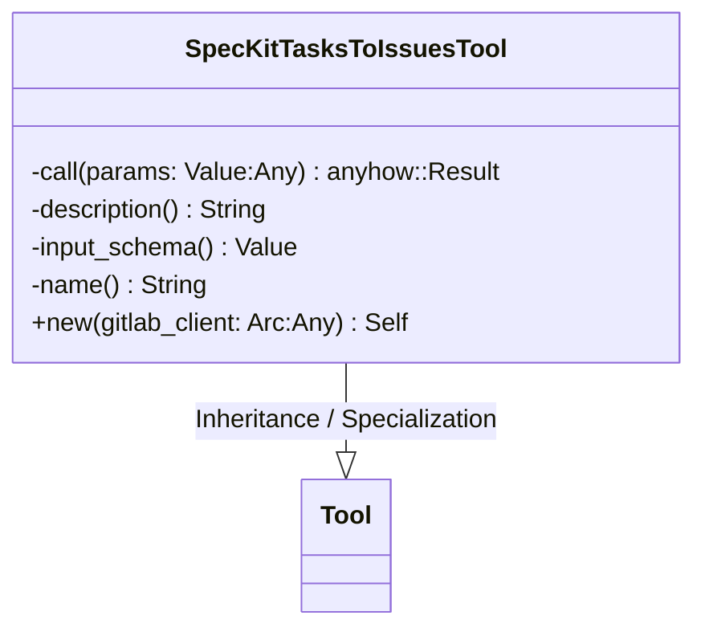
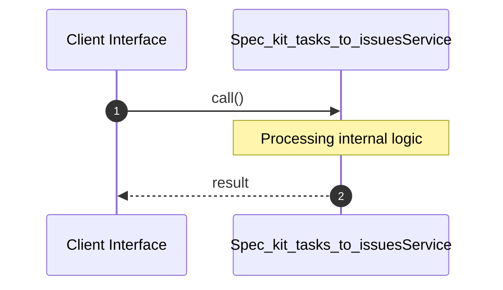

# File: spec_kit_tasks_to_issues.rs

**Source Path:** `crates/factory-mcp-server/src/tools/spec_kit_tasks_to_issues.rs`

## Overview

### Purpose
Provides implementation for spec_kit_tasks_to_issues.rs.

### Responsibilities
* Handles logic related to spec_kit_tasks_to_issues.

### Dependencies
* async_trait::async_trait, crate::protocol::CallToolResult, crate::tools::Tool, factory_infrastructure::GitlabClient, serde_json::{json, Value}, std::sync::Arc

### Imported modules
* None

### Exported classes
* SpecKitTasksToIssuesTool

### Exported interfaces
* None

### Exported functions
* None

## Public API

### Exported Classes / Structs / Interfaces

#### SpecKitTasksToIssuesTool

**Overview:**
Why it exists:
Provides capabilities related to SpecKitTasksToIssuesTool.

What business capability it provides:
Supports core domain concepts.

How it collaborates with other classes:
Works with related entities to process logic.

**Constructor:**

##### `new(gitlab_client: Arc<dyn GitlabClient> (Any))`
Parameters: gitlab_client: Arc<dyn GitlabClient> (Any)
Dependencies: Inherited from context
Initialization: Sets up SpecKitTasksToIssuesTool

**Attributes:**

* `gitlab_client` (Arc<dyn GitlabClient>): Purpose - Stores gitlab_client data. Constraints - Valid Arc<dyn GitlabClient>.

**Public Methods:**

None.

**Private Methods:**

* `call(params: Value (Any)) -> anyhow::Result<CallToolResult>`: Internal helper logic.
* `description() -> String`: Internal helper logic.
* `input_schema() -> Value`: Internal helper logic.
* `name() -> String`: Internal helper logic.

### Exported Functions

None.

## Internal architecture



## Execution flow & Sequence explanation




## Examples

```
// Example usage of spec_kit_tasks_to_issues.rs components
import { ... } from 'crates/factory-mcp-server/src/tools/spec_kit_tasks_to_issues.rs';
```


## Cross References
* **Parent module:** `crates/factory-mcp-server/src/tools`
* **Dependencies:** async_trait::async_trait, crate::protocol::CallToolResult, crate::tools::Tool, factory_infrastructure::GitlabClient, serde_json::{json, Value}, std::sync::Arc
