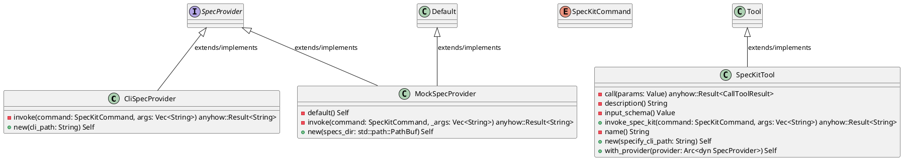
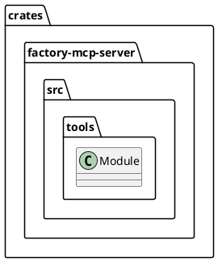
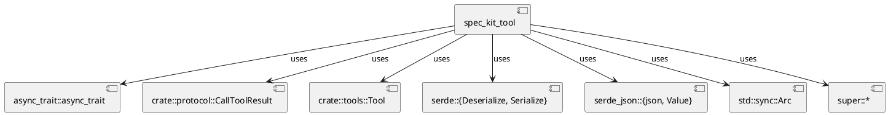
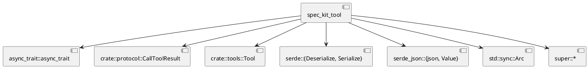
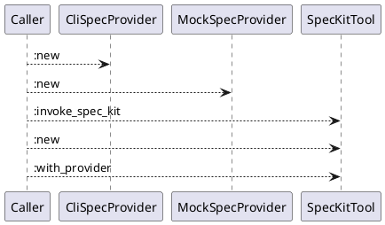
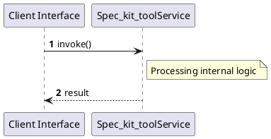

# File: spec_kit_tool.rs

**Source Path:** `crates/factory-mcp-server/src/tools/spec_kit_tool.rs`

## Overview

### Purpose
Provides implementation for spec_kit_tool.rs.

### Responsibilities
* Handles logic related to spec_kit_tool.

### Dependencies
* async_trait::async_trait, crate::protocol::CallToolResult, crate::tools::Tool, serde::{Deserialize, Serialize}, serde_json::{json, Value}, std::sync::Arc, super::*

### Imported modules
* None

### Exported classes
* CliSpecProvider, MockSpecProvider, SpecKitTool

### Exported interfaces
* SpecProvider

### Exported functions
* None

## Public API

### Exported Classes / Structs / Interfaces

#### CliSpecProvider

**Overview:**
No description provided.

**Constructor:**

##### `new(cli_path (String))`
Parameters: cli_path (String)
Dependencies: Inherited from context
Initialization: Sets up CliSpecProvider

**Attributes:**

* `cli_path` (String): Purpose - Stores cli_path data. Constraints - Valid String.
* `fallback` (MockSpecProvider): Purpose - Stores fallback data. Constraints - Valid MockSpecProvider.

**Public Methods:**

None.

**Private Methods:**

* `invoke(command (SpecKitCommand), args (Vec<String>)) -> anyhow::Result<String>`: Internal helper logic.

#### MockSpecProvider

**Overview:**
No description provided.

**Constructor:**

##### `new(specs_dir (std::path::PathBuf))`
Parameters: specs_dir (std::path::PathBuf)
Dependencies: Inherited from context
Initialization: Sets up MockSpecProvider

**Attributes:**

* `specs_dir` (std::path::PathBuf): Purpose - Stores specs_dir data. Constraints - Valid std::path::PathBuf.

**Public Methods:**

None.

**Private Methods:**

* `default() -> Self`: Internal helper logic.
* `invoke(command (SpecKitCommand), _args (Vec<String>)) -> anyhow::Result<String>`: Internal helper logic.

#### SpecKitCommand

**Overview:**
No description provided.

**Constructor:**

Default constructor.

**Attributes:**

None.

**Public Methods:**

None.

**Private Methods:**

None.

#### SpecKitTool

**Overview:**
No description provided.

**Constructor:**

##### `new(specify_cli_path (String))`
Parameters: specify_cli_path (String)
Dependencies: Inherited from context
Initialization: Sets up SpecKitTool

**Attributes:**

* `provider` (Arc<dyn SpecProvider>): Purpose - Stores provider data. Constraints - Valid Arc<dyn SpecProvider>.

**Public Methods:**

##### `invoke_spec_kit(command (SpecKitCommand), args (Vec<String>)) -> anyhow::Result<String>`

###### Description
No description provided.

###### Inputs
* `command`: type=SpecKitCommand, meaning=Input for command, valid values=Any valid SpecKitCommand, optional=No, default value=None
* `args`: type=Vec<String>, meaning=Input for args, valid values=Any valid Vec<String>, optional=No, default value=None

###### Output
Return type: anyhow::Result<String>
Semantic meaning: Result of invoke_spec_kit
Possible null values: Conditional
Exceptions: None handled explicitly

###### Side Effects
Database updates: None
File operations: None
Network calls: None
Cache: None
State changes: Updates internal variables

###### Complexity
Time Complexity: O(1) mostly
Space Complexity: O(1) mostly

###### Example
```
let result = instance.invoke_spec_kit();
```

##### `with_provider(provider (Arc<dyn SpecProvider>)) -> Self`

###### Description
No description provided.

###### Inputs
* `provider`: type=Arc<dyn SpecProvider>, meaning=Input for provider, valid values=Any valid Arc<dyn SpecProvider>, optional=No, default value=None

###### Output
Return type: Self
Semantic meaning: Result of with_provider
Possible null values: Conditional
Exceptions: None handled explicitly

###### Side Effects
Database updates: None
File operations: None
Network calls: None
Cache: None
State changes: Updates internal variables

###### Complexity
Time Complexity: O(1) mostly
Space Complexity: O(1) mostly

###### Example
```
let result = instance.with_provider();
```

**Private Methods:**

* `call(params (Value)) -> anyhow::Result<CallToolResult>`: Internal helper logic.
* `description() -> String`: Internal helper logic.
* `input_schema() -> Value`: Internal helper logic.
* `name() -> String`: Internal helper logic.

#### SpecProvider

**Overview:**
No description provided.

**Constructor:**

Default constructor.

**Attributes:**

None.

**Public Methods:**

None.

**Private Methods:**

None.

### Exported Functions

None.

## Internal architecture



## Package Diagram



## Component Diagram



## Dependency Graph



## Call Graph



## Execution flow & Sequence explanation



## Examples

```
// Example usage of spec_kit_tool.rs components
import { ... } from 'crates/factory-mcp-server/src/tools/spec_kit_tool.rs';
```

## Cross References
* **Parent module:** `crates/factory-mcp-server/src/tools`
* **Dependencies:** async_trait::async_trait, crate::protocol::CallToolResult, crate::tools::Tool, serde::{Deserialize, Serialize}, serde_json::{json, Value}, std::sync::Arc, super::*
