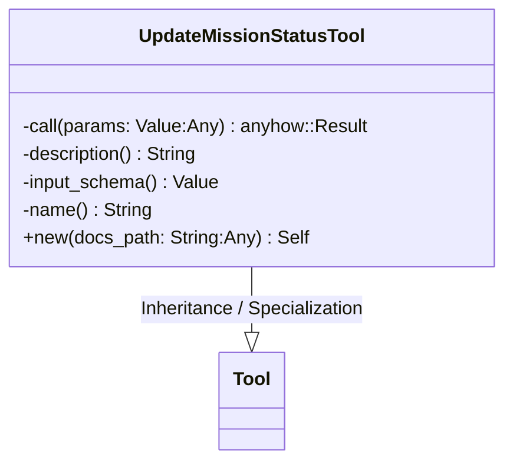
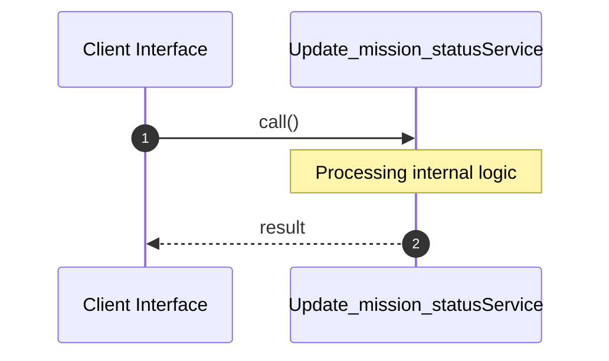
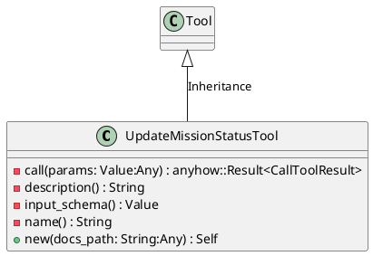
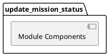
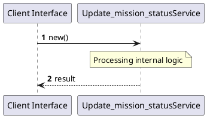
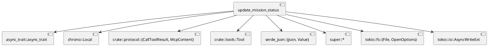
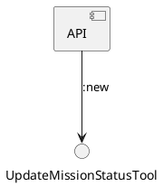

# File: update_mission_status.rs

**Source Path:** `crates/factory-mcp-server/src/tools/update_mission_status.rs`

## Overview

### Purpose
Provides implementation for update_mission_status.rs.

### Responsibilities
* Handles logic related to update_mission_status.

### Main Workflow
* Initialization and execution of update_mission_status logic.

### Dependencies
* async_trait::async_trait, chrono::Local, crate::protocol::{CallToolResult, McpContent}, crate::tools::Tool, serde_json::{json, Value}, super::*, tokio::fs::{File, OpenOptions}, tokio::io::AsyncWriteExt

### Imported modules
* None

### Exported classes
* UpdateMissionStatusTool

### Exported interfaces
* None

### Exported functions
* None

## Public API

### Exported Classes / Structs / Interfaces

#### UpdateMissionStatusTool

**Overview:**
Why it exists:
Provides capabilities related to UpdateMissionStatusTool.

What business capability it provides:
Supports core domain concepts.

How it collaborates with other classes:
Works with related entities to process logic.

**Constructor:**

##### `new(docs_path: String (Any))`
Parameters: docs_path: String (Any)
Dependencies: Inherited from context
Initialization: Sets up UpdateMissionStatusTool

**Attributes:**

* `docs_path` (String): Purpose - Stores docs_path data. Constraints - Valid String.

**Public Methods:**

None.

**Private Methods:**

* `call(params: Value (Any)) -> anyhow::Result<CallToolResult>`: Internal helper logic.
* `description() -> String`: Internal helper logic.
* `input_schema() -> Value`: Internal helper logic.
* `name() -> String`: Internal helper logic.

### Exported Functions

None.

## Internal architecture



## Execution flow & Sequence explanation



## UML

### Class Diagram


### Package Diagram


### Sequence Diagram


### Component Diagram
```plantuml
@startuml
component "update_mission_status" as comp
component "async_trait::async_trait" as async_trait::async_trait
comp --> async_trait::async_trait
component "chrono::Local" as chrono::Local
comp --> chrono::Local
component "crate::protocol::{CallToolResult, McpContent}" as crate::protocol::{CallToolResult, McpContent}
comp --> crate::protocol::{CallToolResult, McpContent}
component "crate::tools::Tool" as crate::tools::Tool
comp --> crate::tools::Tool
component "serde_json::{json, Value}" as serde_json::{json, Value}
comp --> serde_json::{json, Value}
component "super::*" as super::*
comp --> super::*
component "tokio::fs::{File, OpenOptions}" as tokio::fs::{File, OpenOptions}
comp --> tokio::fs::{File, OpenOptions}
component "tokio::io::AsyncWriteExt" as tokio::io::AsyncWriteExt
comp --> tokio::io::AsyncWriteExt
@enduml

```

### Dependency Graph


### Call Graph


## Examples

```
// Example usage of update_mission_status.rs components
import { ... } from 'crates/factory-mcp-server/src/tools/update_mission_status.rs';
```

## Cross References
* **Parent module:** `crates/factory-mcp-server/src/tools`
* **Dependencies:** async_trait::async_trait, chrono::Local, crate::protocol::{CallToolResult, McpContent}, crate::tools::Tool, serde_json::{json, Value}, super::*, tokio::fs::{File, OpenOptions}, tokio::io::AsyncWriteExt
