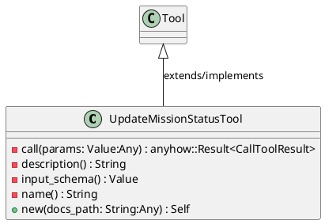
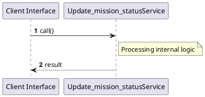

# File: update_mission_status.rs

**Source Path:** `crates/factory-mcp-server/src/tools/update_mission_status.rs`

## Overview

### Purpose
Provides implementation for update_mission_status.rs.

### Responsibilities
* Handles logic related to update_mission_status.

### Dependencies
* async_trait::async_trait, chrono::Local, crate::protocol::{CallToolResult, McpContent}, crate::tools::Tool, serde_json::{json, Value}, super::*, tokio::fs::{File, OpenOptions}, tokio::io::AsyncWriteExt

### Imported modules
* None

### Exported classes
* UpdateMissionStatusTool

### Exported interfaces
* None

### Exported functions
* None

## Public API

### Exported Classes / Structs / Interfaces

#### UpdateMissionStatusTool

**Overview:**
No description provided.

**Constructor:**

##### `new(docs_path: String (Any))`
Parameters: docs_path: String (Any)
Dependencies: Inherited from context
Initialization: Sets up UpdateMissionStatusTool

**Attributes:**

* `docs_path` (String): Purpose - Stores docs_path data. Constraints - Valid String.

**Public Methods:**

None.

**Private Methods:**

* `call(params: Value (Any)) -> anyhow::Result<CallToolResult>`: Internal helper logic.
* `description() -> String`: Internal helper logic.
* `input_schema() -> Value`: Internal helper logic.
* `name() -> String`: Internal helper logic.

### Exported Functions

None.

## Internal architecture



## Execution flow & Sequence explanation



## Examples

```
// Example usage of update_mission_status.rs components
import { ... } from 'crates/factory-mcp-server/src/tools/update_mission_status.rs';
```

## Cross References
* **Parent module:** `crates/factory-mcp-server/src/tools`
* **Dependencies:** async_trait::async_trait, chrono::Local, crate::protocol::{CallToolResult, McpContent}, crate::tools::Tool, serde_json::{json, Value}, super::*, tokio::fs::{File, OpenOptions}, tokio::io::AsyncWriteExt
