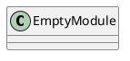
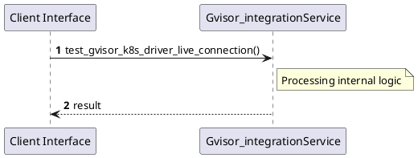

# File: gvisor_integration.rs

**Source Path:** `crates/factory-mcp-server/tests/gvisor_integration.rs`

## Overview

### Purpose
Provides implementation for gvisor_integration.rs.

### Responsibilities
* Handles logic related to gvisor_integration.

### Dependencies
* factory_mcp_server::sandbox::{GvisorK8sDriver, SandboxDriver}, k8s_openapi::api::core::v1::Namespace, kube::{
    api::{Api, PostParams},
    Client,
}, serde_json::json

### Imported modules
* None

### Exported classes
* None

### Exported interfaces
* None

### Exported functions
* None

## Public API

### Exported Classes / Structs / Interfaces

### Exported Functions

None.

## Internal architecture



## Execution flow & Sequence explanation




## Examples

```
// Example usage of gvisor_integration.rs components
import { ... } from 'crates/factory-mcp-server/tests/gvisor_integration.rs';
```


## Cross References
* **Parent module:** `crates/factory-mcp-server/tests`
* **Dependencies:** factory_mcp_server::sandbox::{GvisorK8sDriver, SandboxDriver}, k8s_openapi::api::core::v1::Namespace, kube::{
    api::{Api, PostParams},
    Client,
}, serde_json::json
