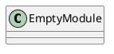
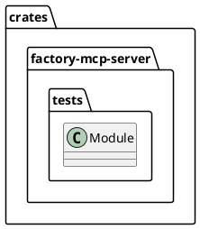
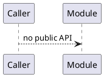
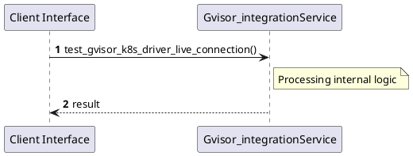

# File: gvisor_integration.rs

**Source Path:** `crates/factory-mcp-server/tests/gvisor_integration.rs`

## Overview

### Purpose
Provides implementation for gvisor_integration.rs.

### Responsibilities
* Handles logic related to gvisor_integration.

### Dependencies
* factory_mcp_server::sandbox::{GvisorK8sDriver, SandboxDriver}, k8s_openapi::api::core::v1::Namespace, kube::{
    api::{Api, PostParams},
    Client,
}, serde_json::json

### Imported modules
* None

### Exported classes
* None

### Exported interfaces
* None

### Exported functions
* None

## Public API

### Exported Classes / Structs / Interfaces

### Exported Functions

None.

## Internal architecture



## Package Diagram



## Component Diagram

```plantuml
@startuml
component "gvisor_integration" as Main
component "factory_mcp_server::sandbox::{GvisorK8sDriver, SandboxDriver}" as factory_mcp_server__sandbox___GvisorK8sDriver__SandboxDriver_
Main --> factory_mcp_server__sandbox___GvisorK8sDriver__SandboxDriver_ : uses
component "k8s_openapi::api::core::v1::Namespace" as k8s_openapi__api__core__v1__Namespace
Main --> k8s_openapi__api__core__v1__Namespace : uses
component "kube::{
    api::{Api, PostParams},
    Client,
}" as kube________api___Api__PostParams_______Client___
Main --> kube________api___Api__PostParams_______Client___ : uses
component "serde_json::json" as serde_json__json
Main --> serde_json__json : uses
@enduml

```

## Dependency Graph

```plantuml
@startuml
[gvisor_integration]
[gvisor_integration] --> [factory_mcp_server::sandbox::{GvisorK8sDriver, SandboxDriver}]
[gvisor_integration] --> [k8s_openapi::api::core::v1::Namespace]
[gvisor_integration] --> [kube::{
    api::{Api, PostParams},
    Client,
}]
[gvisor_integration] --> [serde_json::json]
@enduml

```

## Call Graph



## Execution flow & Sequence explanation



## Examples

```
// Example usage of gvisor_integration.rs components
import { ... } from 'crates/factory-mcp-server/tests/gvisor_integration.rs';
```

## Cross References
* **Parent module:** `crates/factory-mcp-server/tests`
* **Dependencies:** factory_mcp_server::sandbox::{GvisorK8sDriver, SandboxDriver}, k8s_openapi::api::core::v1::Namespace, kube::{
    api::{Api, PostParams},
    Client,
}, serde_json::json
