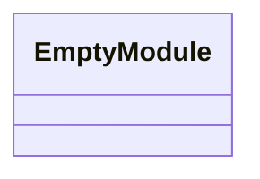
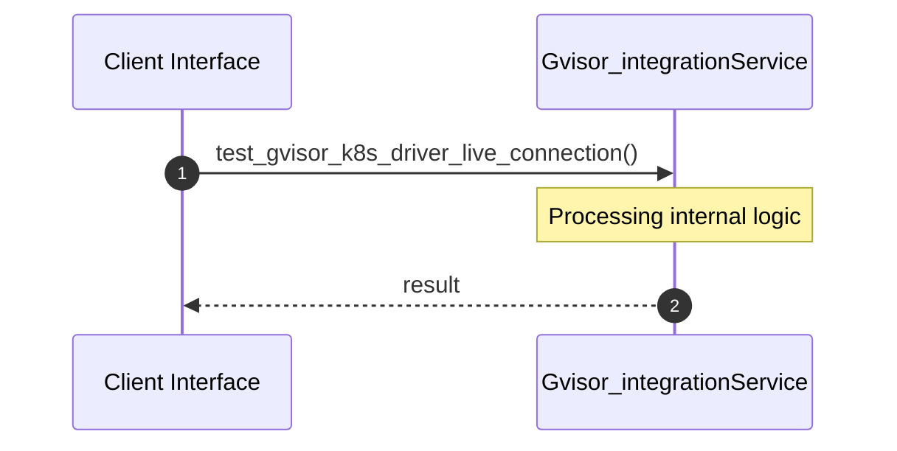
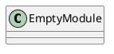
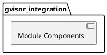
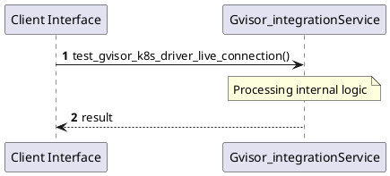
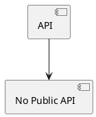

# File: gvisor_integration.rs

**Source Path:** `crates/factory-mcp-server/tests/gvisor_integration.rs`

## Overview

### Purpose
Provides implementation for gvisor_integration.rs.

### Responsibilities
* Handles logic related to gvisor_integration.

### Main Workflow
* Initialization and execution of gvisor_integration logic.

### Dependencies
* factory_mcp_server::sandbox::{GvisorK8sDriver, SandboxDriver}, k8s_openapi::api::core::v1::Namespace, kube::{
    api::{Api, PostParams},
    Client,
}, serde_json::json

### Imported modules
* None

### Exported classes
* None

### Exported interfaces
* None

### Exported functions
* None

## Public API

### Exported Classes / Structs / Interfaces

### Exported Functions

None.

## Internal architecture



## Execution flow & Sequence explanation



## UML

### Class Diagram


### Package Diagram


### Sequence Diagram


### Component Diagram
```plantuml
@startuml
component "gvisor_integration" as comp
component "factory_mcp_server::sandbox::{GvisorK8sDriver, SandboxDriver}" as factory_mcp_server::sandbox::{GvisorK8sDriver, SandboxDriver}
comp --> factory_mcp_server::sandbox::{GvisorK8sDriver, SandboxDriver}
component "k8s_openapi::api::core::v1::Namespace" as k8s_openapi::api::core::v1::Namespace
comp --> k8s_openapi::api::core::v1::Namespace
component "kube::{
    api::{Api, PostParams},
    Client,
}" as kube::{
    api::{Api, PostParams},
    Client,
}
comp --> kube::{
    api::{Api, PostParams},
    Client,
}
component "serde_json::json" as serde_json::json
comp --> serde_json::json
@enduml

```

### Dependency Graph
```plantuml
@startuml
[gvisor_integration]
[gvisor_integration] --> [factory_mcp_server::sandbox::{GvisorK8sDriver, SandboxDriver}]
[gvisor_integration] --> [k8s_openapi::api::core::v1::Namespace]
[gvisor_integration] --> [kube::{
    api::{Api, PostParams},
    Client,
}]
[gvisor_integration] --> [serde_json::json]
@enduml

```

### Call Graph


## Examples

```
// Example usage of gvisor_integration.rs components
import { ... } from 'crates/factory-mcp-server/tests/gvisor_integration.rs';
```

## Cross References
* **Parent module:** `crates/factory-mcp-server/tests`
* **Dependencies:** factory_mcp_server::sandbox::{GvisorK8sDriver, SandboxDriver}, k8s_openapi::api::core::v1::Namespace, kube::{
    api::{Api, PostParams},
    Client,
}, serde_json::json
