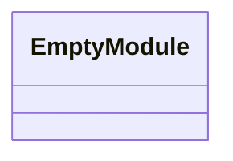
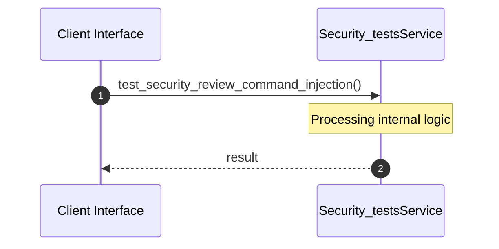
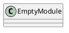
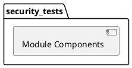
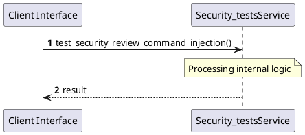
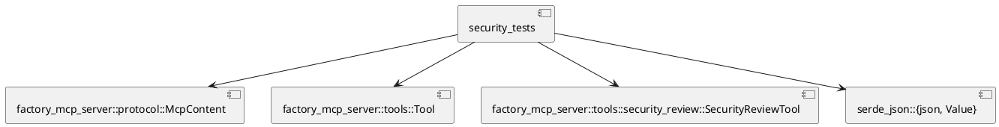
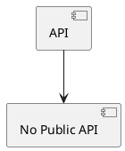

# File: security_tests.rs

**Source Path:** `crates/factory-mcp-server/tests/security_tests.rs`

## Overview

### Purpose
Provides implementation for security_tests.rs.

### Responsibilities
* Handles logic related to security_tests.

### Main Workflow
* Initialization and execution of security_tests logic.

### Dependencies
* factory_mcp_server::protocol::McpContent, factory_mcp_server::tools::Tool, factory_mcp_server::tools::security_review::SecurityReviewTool, serde_json::{json, Value}

### Imported modules
* None

### Exported classes
* None

### Exported interfaces
* None

### Exported functions
* None

## Public API

### Exported Classes / Structs / Interfaces

### Exported Functions

None.

## Internal architecture



## Execution flow & Sequence explanation



## UML

### Class Diagram


### Package Diagram


### Sequence Diagram


### Component Diagram
```plantuml
@startuml
component "security_tests" as comp
component "factory_mcp_server::protocol::McpContent" as factory_mcp_server::protocol::McpContent
comp --> factory_mcp_server::protocol::McpContent
component "factory_mcp_server::tools::Tool" as factory_mcp_server::tools::Tool
comp --> factory_mcp_server::tools::Tool
component "factory_mcp_server::tools::security_review::SecurityReviewTool" as factory_mcp_server::tools::security_review::SecurityReviewTool
comp --> factory_mcp_server::tools::security_review::SecurityReviewTool
component "serde_json::{json, Value}" as serde_json::{json, Value}
comp --> serde_json::{json, Value}
@enduml

```

### Dependency Graph


### Call Graph


## Examples

```
// Example usage of security_tests.rs components
import { ... } from 'crates/factory-mcp-server/tests/security_tests.rs';
```

## Cross References
* **Parent module:** `crates/factory-mcp-server/tests`
* **Dependencies:** factory_mcp_server::protocol::McpContent, factory_mcp_server::tools::Tool, factory_mcp_server::tools::security_review::SecurityReviewTool, serde_json::{json, Value}
