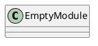
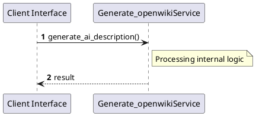

# File: generate_openwiki.py

**Source Path:** `generate_openwiki.py`

## Overview

### Purpose
Provides implementation for generate_openwiki.py.

### Responsibilities
* Handles logic related to generate_openwiki.

### Dependencies
* datetime, json, os, re, shutil, subprocess, sys

### Imported modules
* None

### Exported classes
* None

### Exported interfaces
* None

### Exported functions
* generate_ai_description, generate_indexes, generate_plantuml_classes, generate_plantuml_sequence, get_git_hash, main, parse_file, setup_okf_structure, validate_links, write_file_doc

## Public API

### Exported Classes / Structs / Interfaces

### Exported Functions

#### `generate_ai_description(entity_name (Any), file_name (Any), entity_type (Any)) -> None`
No description provided.

#### `generate_indexes(now (Any)) -> None`
No description provided.

#### `generate_plantuml_classes(classes (Any)) -> None`
No description provided.

#### `generate_plantuml_sequence(module_name (Any), classes (Any), free_functions (Any)) -> None`
No description provided.

#### `get_git_hash() -> None`
No description provided.

#### `main() -> None`
No description provided.

#### `parse_file(filepath (Any)) -> None`
No description provided.

#### `setup_okf_structure() -> None`
No description provided.

#### `validate_links() -> None`
No description provided.

#### `write_file_doc(file_path (Any), parsed (Any), now (Any)) -> None`
No description provided.

## Internal architecture



## Execution flow & Sequence explanation




## Examples

```
// Example usage of generate_openwiki.py components
import { ... } from 'generate_openwiki.py';
```


## Cross References
* **Parent module:** ``
* **Dependencies:** datetime, json, os, re, shutil, subprocess, sys
