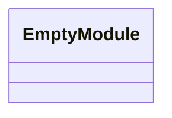
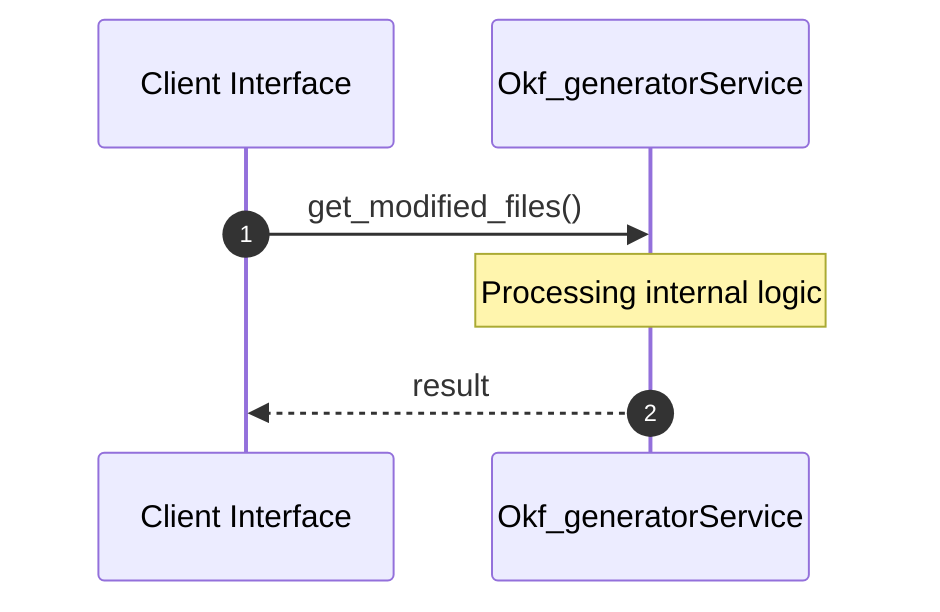

# File: okf_generator.py

**Source Path:** `.agents/tools/okf_generator.py`

## Overview

### Purpose
Provides implementation for okf_generator.py.

### Responsibilities
* Handles logic related to okf_generator.

### Dependencies
* subprocess, re, sys, os

## Public API & Architecture

### Exported Classes / Structs / Interfaces

### Exported Functions

#### `get_modified_files() -> None`
Executes get_modified_files.

#### `get_git_hash() -> None`
Executes get_git_hash.

#### `generate_mermaid_class_diagram(content (Any)) -> None`
Executes generate_mermaid_class_diagram.

#### `process_file(file_path (Any)) -> None`
Executes process_file.

#### `update_index(new_wiki_names (Any)) -> None`
Executes update_index.

## Internal Architecture & Execution Flow

### Sequence Explanation

## Cross References
* **Parent module:** `.agents/tools`
* **Dependencies:** subprocess, re, sys, os
