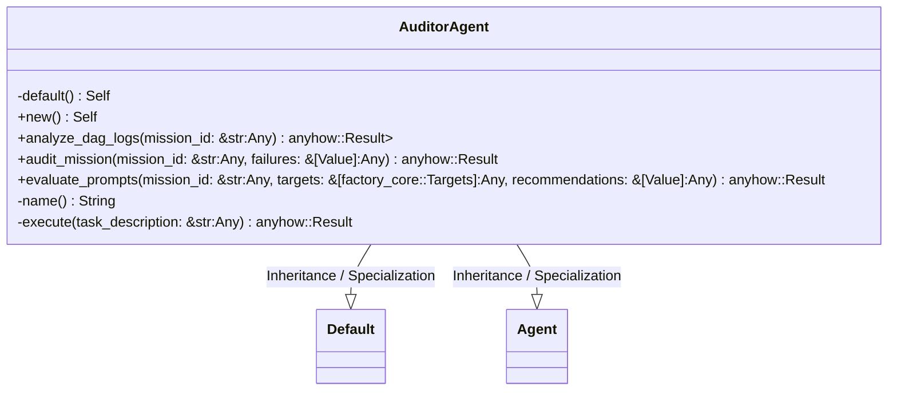
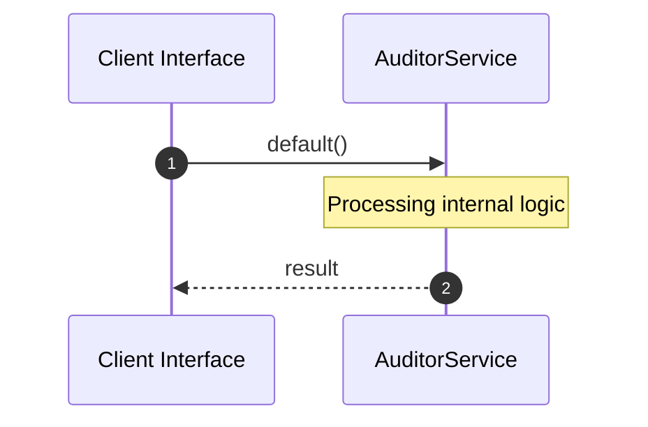

# File: auditor.rs

**Source Path:** `crates/factory-application/src/agents/auditor.rs`

## Overview

### Purpose
Provides implementation for auditor.rs.

### Responsibilities
* Handles logic related to auditor.

### Dependencies
* crate::Agent, async_trait::async_trait, super::*, serde_json::{Value, json}

## Public API & Architecture

### Exported Classes / Structs / Interfaces

#### AuditorAgent

**Overview:** Represents AuditorAgent.

**Public Methods:**

##### `new() -> Self`
Executes new.

##### `analyze_dag_logs(mission_id: &str (Any)) -> anyhow::Result<Vec<Value>>`
/// Queries Hatchet API for recent failed mission DAGs.

##### `audit_mission(mission_id: &str (Any), failures: &[Value] (Any)) -> anyhow::Result<Value>`
/// Uses LiteLLM to process failures and output recommendations.

##### `evaluate_prompts(mission_id: &str (Any), targets: &[factory_core::Targets] (Any), recommendations: &[Value] (Any)) -> anyhow::Result<String>`
/// Self-Improving Prompt Engineering evaluation loop.

/// Analyzes Hatchet failure recommendations against Target ground truths to propose a new system prompt.

### Exported Functions

None.

## Internal Architecture & Execution Flow

### Sequence Explanation

## Cross References
* **Parent module:** `crates/factory-application/src/agents`
* **Dependencies:** crate::Agent, async_trait::async_trait, super::*, serde_json::{Value, json}
