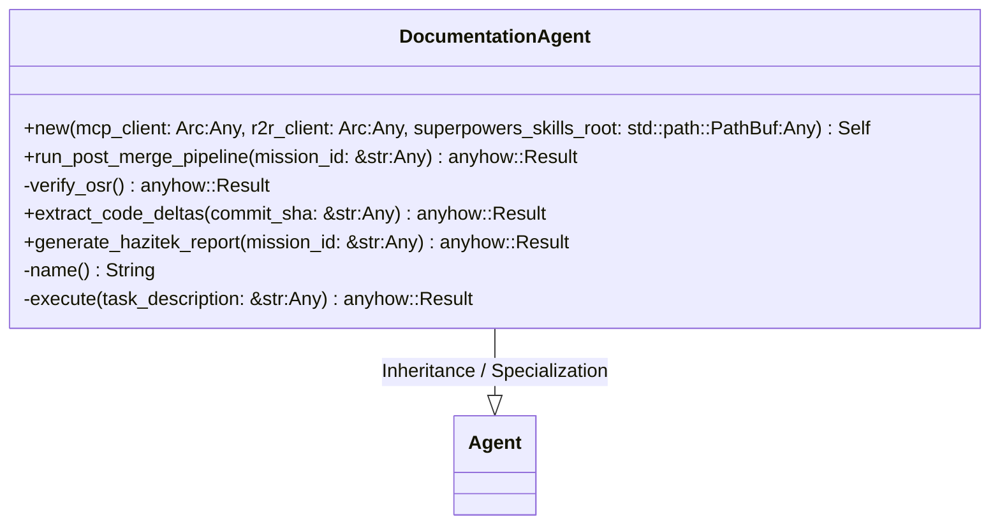
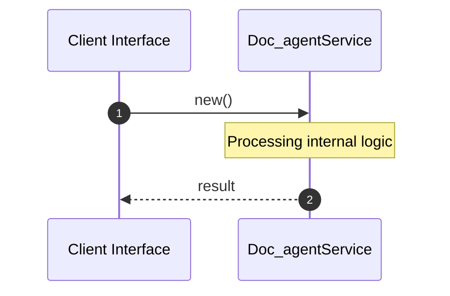

# File: doc_agent.rs

**Source Path:** `crates/factory-application/src/agents/doc_agent.rs`

## Overview

### Purpose
Provides implementation for doc_agent.rs.

### Responsibilities
* Handles logic related to doc_agent.

### Dependencies
* serde_json::{Value, json}, std::sync::Arc, super::*, factory_infrastructure::{MockMcpClient, MockR2rClient}, std::time::Duration, crate::Agent, async_trait::async_trait, factory_infrastructure::{McpClient, R2rClient}

## Public API & Architecture

### Exported Classes / Structs / Interfaces

#### DocumentationAgent

**Overview:** Represents DocumentationAgent.

**Public Methods:**

##### `new(mcp_client: Arc<dyn McpClient> (Any), r2r_client: Arc<dyn R2rClient> (Any), superpowers_skills_root: std::path::PathBuf (Any)) -> Self`
Executes new.

##### `run_post_merge_pipeline(mission_id: &str (Any)) -> anyhow::Result<Value>`
Executes run_post_merge_pipeline.

##### `extract_code_deltas(commit_sha: &str (Any)) -> anyhow::Result<String>`
Executes extract_code_deltas.

##### `generate_hazitek_report(mission_id: &str (Any)) -> anyhow::Result<factory_core::ComplianceReport>`
Executes generate_hazitek_report.

### Exported Functions

None.

## Internal Architecture & Execution Flow

### Sequence Explanation

## Cross References
* **Parent module:** `crates/factory-application/src/agents`
* **Dependencies:** serde_json::{Value, json}, std::sync::Arc, super::*, factory_infrastructure::{MockMcpClient, MockR2rClient}, std::time::Duration, crate::Agent, async_trait::async_trait, factory_infrastructure::{McpClient, R2rClient}
