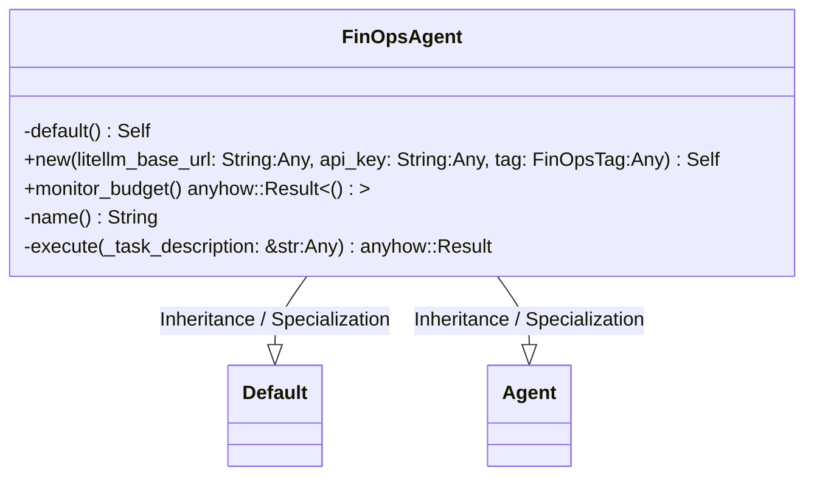
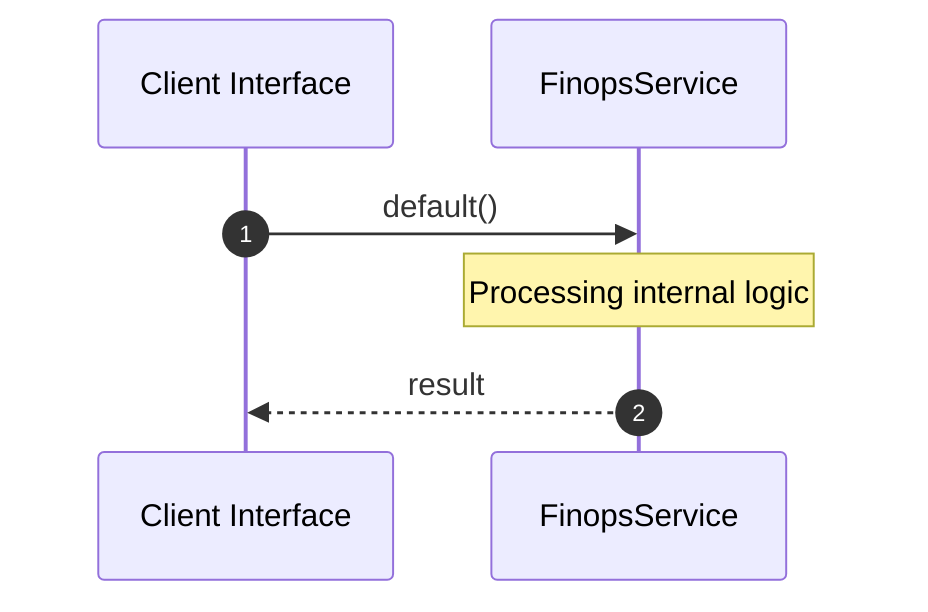

# File: finops.rs

**Source Path:** `crates/factory-application/src/agents/finops.rs`

## Overview

### Purpose
Provides implementation for finops.rs.

### Responsibilities
* Handles logic related to finops.

### Dependencies
* reqwest::Client, super::*, std::time::Duration, factory_core::FinOpsTag, serde_json::Value, async_trait::async_trait, crate::Agent

## Public API & Architecture

### Exported Classes / Structs / Interfaces

#### FinOpsAgent

**Overview:** Represents FinOpsAgent.

**Public Methods:**

##### `new(litellm_base_url: String (Any), api_key: String (Any), tag: FinOpsTag (Any)) -> Self`
Executes new.

##### `monitor_budget() -> anyhow::Result<()>`
Executes monitor_budget.

### Exported Functions

None.

## Internal Architecture & Execution Flow

### Sequence Explanation

## Cross References
* **Parent module:** `crates/factory-application/src/agents`
* **Dependencies:** reqwest::Client, super::*, std::time::Duration, factory_core::FinOpsTag, serde_json::Value, async_trait::async_trait, crate::Agent
